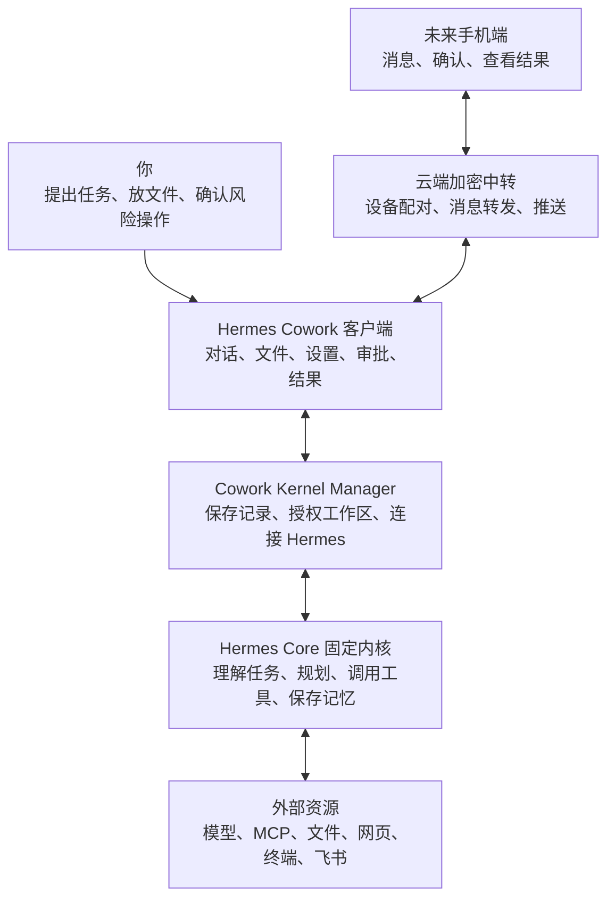

# Hermes Cowork 产品说明

阅读对象：用户、产品判断、下一阶段方向确认。

更新日期：2026-05-04。

## 1. Cowork 是什么

Hermes Cowork 是 Hermes Agent 的本机可视化工作台。

它不是另一个 Agent，也不是重新实现 Hermes。它的作用是把 Hermes 已经具备但原本隐藏在 CLI、TUI、配置文件、session、事件流和工具调用里的能力，变成普通用户可以理解和操作的客户端产品。

一句话：

```text
Hermes 负责思考和执行；Cowork 负责让你看得懂、控得住、能继续。
```

## 2. 当前产品阶段

Cowork 已经不是早期假前端阶段。现在的前端框架、三栏布局、工作区、对话、文件、设置、技能页、MCP、Cron、模型配置、审批、澄清、文件预览和批注都已经有基础实现。

但它还没有进入“完整客户端”阶段。当前最重要的问题不是继续堆 UI，而是把 Hermes 当前版本的真实能力系统释放出来。

当前阶段名称：

```text
Hermes 能力释放规划阶段
```

这意味着后续开发要先回答：

- Hermes 当前版本到底有什么能力？
- 这些能力在 Cowork 里应该出现在哪个用户入口？
- 这个入口是否连接了真实后端能力？
- 用户看到的信息是否能帮助决策，而不是暴露后台噪音？

## 3. 产品架构



这张图的产品含义：

- 你不直接面对 Hermes 的命令行和配置文件。
- Cowork 负责把任务、文件、模型、MCP、Skill、审批和结果变成界面。
- Cowork 本机后端只做连接、记录和管理，不压制 Hermes 的 Agent 能力。
- Hermes Core 是固定内核，负责真正的思考、规划、执行和记忆。
- 未来手机端只负责沟通和确认，真正执行仍在你的 Mac 上。

## 4. 已经具备的主要能力

- 对话任务、继续对话、停止任务和流式事件展示。
- 工作区授权、文件上传、文件预览、文件批注、产物卡片。
- 模型配置、Key 重填、Fallback、reasoning 入口。
- MCP 服务管理、测试、启停、工具级 include/exclude、Hermes MCP serve，以及基于本机 Hermes CLI 的原生命令覆盖状态。
- Skill 清单、详情、文件树、启停、上传、加入下一次任务。
- Hermes Cron 真实任务列表和基础操作。
- 审批卡和澄清卡，用来处理危险命令和信息不足的任务。
- 右侧工作区展示任务拆解、产物、上下文和过程资源。

## 5. 仍然需要补齐的能力

优先级最高：

- Session 全量前端化：搜索、重命名、删除、来源平台、模型、工具历史、继续对话。
- Skills / MCP / Toolsets 统一成“能力中心”，尤其优先覆盖 Hermes 原生 MCP 和 Skill 的市场与生态能力。
- Cron 表单重做：周期选择、工作区绑定、Skill 分类多选、运行产物和失败恢复。
- 官方 API Server / Runs API 能力评估，判断是否逐步替代当前私有 gateway bridge。

第二阶段：

- 模型系统补齐：Credential Pools、Fallback Providers、Auxiliary Providers、Provider Routing。
- 安全系统补齐：审批模式、永久 allowlist、checkpoint / rollback、YOLO 风险显示。
- Context 系统补齐：context files、context references、附件、批注、工作区文件和压缩策略统一。

第三阶段：

- Electron macOS 客户端。
- Kernel Manager 和 Hermes 固定内核融合。
- 语音输入、TTS 输出、图片视觉理解、浏览器自动化过程可视化。
- 手机端通过云端加密中转连接 Mac 主机。

## 6. 产品判断原则

界面上长期展示的信息必须对用户有决策价值。

应该展示：

- 当前任务在做什么。
- 需要你确认什么。
- 哪些文件、网页、工具、Skill、MCP 正在被用。
- 产出了什么文件或结论。
- 出错后你下一步该做什么。

不应该长期展示：

- 用户看不懂、也无法处理的后台日志。
- 只对开发者有用的 API 字段。
- 伪造的任务拆解。
- 和当前任务无关的历史工具噪音。

## 7. 你后续看什么

如果你想判断产品方向，看本文档。

如果你想看完整 Hermes 能力拆解，看 [`docs/hermes-capability-baseline.md`](docs/hermes-capability-baseline.md)。

如果你想看某个交互为什么这样设计，看 [`docs/product-decisions.md`](docs/product-decisions.md)。

如果只是让 Codex 继续开发，不需要你先读工程细节。
