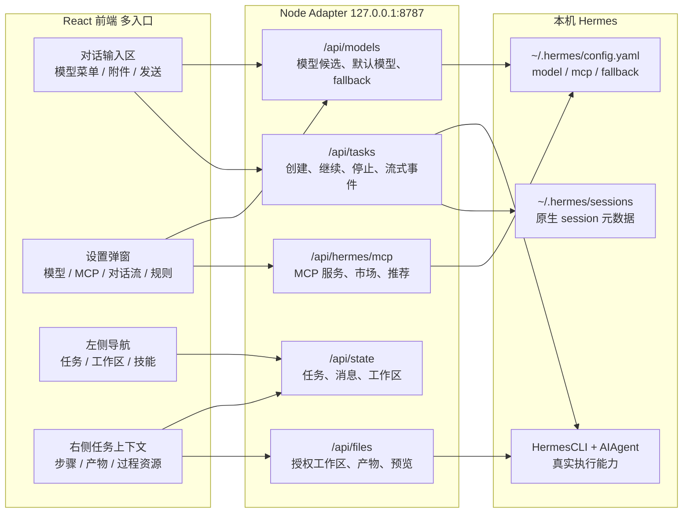

# Hermes Cowork 开发交接文档

## 1. 项目定位

Hermes Cowork 是一个本机 Web 工作台，用来作为开源 Hermes Agent 的前端。

核心原则：

- 不重做 Hermes 的 Agent 能力。
- 不重做文件整理、文档生成、飞书操作、数据分析、网页调研等业务能力。
- 前端负责连接、展示、授权、任务控制、文件入口、产物沉淀。
- 后端 Adapter 负责调用 Hermes、维护本地任务状态、管理授权工作区和文件预览。

## 2. 当前运行方式

项目目录：

```bash
/Users/lucas/Documents/Codex/2026-04-26/new-chat
```

启动：

```bash
cd /Users/lucas/Documents/Codex/2026-04-26/new-chat
npm run dev
```

访问：

```text
http://127.0.0.1:5173/
```

服务：

- 前端 Vite：`http://127.0.0.1:5173`
- 后端 Adapter：`http://127.0.0.1:8787`

注意：不能直接打开 `apps/web/index.html`，必须通过 Vite 服务访问。

前端 API 默认直连后端 Adapter：

```text
http://127.0.0.1:8787
```

可通过环境变量覆盖：

```bash
VITE_API_BASE=http://127.0.0.1:8787 npm run dev:web
```

这样页面请求不会依赖 Vite 的 `/api` 代理；如果 `5173` 只负责页面热更新，后端请求仍会稳定打到 `8787`。

## 3. 技术栈

前端：

- React
- TypeScript
- Vite
- lucide-react
- 原生 CSS

后端：

- Node.js
- Express
- TypeScript
- 本地 JSON 状态文件
- Hermes Python bridge

Hermes 对接：

- Hermes 安装位置：`/Users/lucas/.local/bin/hermes`
- Hermes 项目目录：`/Users/lucas/.hermes/hermes-agent`
- Hermes Python：`/Users/lucas/.hermes/hermes-agent/venv/bin/python`
- 当前 bridge 复用 Hermes `HermesCLI` 初始化路径，再嵌入 `AIAgent`

## 3.1 系统架构图

Hermes Cowork 的产品边界必须按下面这张图理解：前端可以有多个入口，但后端 Adapter 和 Hermes 本机配置才是真源。不要让某个入口单独维护一份模型、MCP、工作区或任务状态。



架构约束：

- 前端多个入口只能消费同一套 API，不允许各自拼静态清单。
- 写 Hermes 配置只能通过后端 Adapter 做备份、归一化和敏感信息遮蔽。
- UI 文案可以按场景重组，但状态含义必须来自同一份后端数据。
- 新增入口时，必须先确认它复用哪个 API、哪个状态字段、哪个后端归一化函数。

## 3.2 多入口一致性契约

凡是同一个能力在两个以上位置出现，都要在开发前先登记“共同真源”。这部分是防止后续重复出现“设置页正确、对话底部错误”这类问题的硬规则。

| 能力 | 前端入口 | 共同真源 | 必须复用的前端逻辑 |
| --- | --- | --- | --- |
| 模型候选与选择 | 对话底部模型菜单、设置 > 模型、本次任务模型列表、长期默认模型列表 | `/api/models`、`~/.hermes/config.yaml`、`readHermesModelCatalog()`、`listModelOptions()` | `modelGroupsForProvider()`、`groupModelOptionsForMenu()` |
| 模型服务配置 | 设置 > 模型、对话底部“配置模型服务” | `/api/models/configure`、`configureHermesModel()` | 同一个 `modelPanelOpen` 配置弹窗 |
| MCP 服务 | 设置 > MCP、自定义 > Connectors、MCP 市场弹窗 | `/api/hermes/mcp`、Hermes MCP config | 同一套 MCP server 状态、说明、图标和启停逻辑 |
| 任务运行状态 | 主对话区、右侧任务上下文、左侧最近任务 | `/api/state`、任务事件流、Hermes session 元数据 | `Task`、`executionView`、右侧步骤/产物/资源分层 |
| 产物与文件 | 主结果、右侧产物、工作区文件、附件入口 | `/api/artifacts`、`/api/workspaces/*/files` | 同一套文件预览、Finder 打开、下载逻辑 |
| Skills | 技能页、任务输入区预载技能、右侧参考信息 | `/api/skills`、本机 skill 目录 | 同一套 skill 名称、启停和文件查看逻辑 |

开发检查清单：

- 改一个入口前，先用 `rg` 搜索同一能力的其他入口。
- 改数据结构前，先改后端归一化函数，再让所有入口消费结果。
- 新增按钮、弹窗、菜单时，必须说明它读哪个 API、写哪个 API。
- 只允许 UI 层做展示分组，不允许 UI 层维护另一份业务真源。
- 每次修复“某入口不一致”后，把入口和共同真源补回本文档。

## 3.3 工作区产品规划（2026-04-29）

工作区的新定义：工作区不是一个筛选器，也不是一个普通项目卡片，而是用户授权给 Hermes 的本机文件夹，以及围绕这个文件夹产生的任务会话、文件、产物和上下文。左侧栏的工作区入口必须像目录一样存在；点击工作区进入文件管理页，点击工作区下的工作会话进入对话页。

参考依据：

- Web 端可以使用浏览器目录选择能力（MDN `showDirectoryPicker()`），但浏览器出于隐私不会稳定暴露绝对路径，不能完全满足 Hermes 后端需要的本机工作目录。
- Electron `dialog.showOpenDialog({ properties: ['openDirectory'] })` / Tauri dialog 这类 macOS 客户端能力可以调原生目录选择器，适合未来客户端化。
- VS Code Workspace、ChatGPT Projects、Claude Projects 都把“工作区/项目”理解成文件、会话和上下文的集合，而不是单一聊天记录。

工作区信息原则：

- 静态可见信息必须是用户能决策的信息：当前是否可工作、需要重新授权、有哪些文件可用、有哪些任务会话、下一步能做什么。
- 原始路径、mtime、session id、后台计数、配置细节默认隐藏到详情或 tooltip。
- 空状态必须给行动入口，例如“选择文件夹授权”“拖入文件”“新建对话”，不要展示无法处理的技术状态。
- 删除和归档的文案必须说清边界：归档/删除会话记录不删除工作区真实文件。

左侧栏结构：

```text
新建任务
技能

工作区                         +
  小红书 redcase                 ...
    优化小红书 CMO 逐字稿        归档 / 删除
  lucas                          ...
    根据录屏开发软件
    翻译桌面文件
```

- “+” 是授权工作区入口，默认打开 macOS Finder 目录选择，不让用户手填路径。
- 工作区行点击：进入该工作区的文件管理页。
- 工作区展开后展示该工作区内的活跃会话；会话点击进入对话页。
- 工作区行菜单：重命名、打开目录、重新授权、移除工作区。
- 会话行菜单：重命名、归档、删除。归档后从默认列表隐藏；删除只删 Cowork 任务记录和会话索引，不删工作区文件。

工作区文件管理页：

- 顶部只显示工作区名称和一个简短状态，例如“可工作”“目录不存在，需要重新授权”。
- 主区域是文件浏览器：面包屑、搜索、列表/网格切换、文件类型筛选、上传/拖入、新建任务。
- 文件行支持预览、在 Finder 中显示、作为下一次任务上下文、复制相对路径。
- 右侧轻量展示最近会话和最近产物；如果没有有效内容，不展示空卡片。
- 点击文件夹进入下级目录，点击文件按类型预览或提示用 Hermes 处理。

实现路线：

1. 已完成：Web 本地版新增 `POST /api/system/pick-directory`，由 Node Adapter 在 macOS 上调用系统目录选择器，返回用户选择的 POSIX 路径；前端只显示“选择文件夹”，不显示手动路径输入。
2. 已完成：保留当前 `/api/workspaces` 作为写入真源，并新增 `PATCH /api/workspaces/:id`、`DELETE /api/workspaces/:id`、`GET /api/workspaces/:id/tree`；工作区页开始消费目录树，不再只复用 flat file list。`GET /api/workspaces/:id/summary` 仍作为后续聚合接口。
3. 部分完成：前端已经让点击工作区进入文件管理页、点击会话进入对话页；下一阶段再把导航状态显式整理成 `activeSurface = workspace | task | custom | settings`。
4. 任务会话继续复用现有归档/删除 API；如果删除 API 缺少后端覆盖，要补齐 `DELETE /api/tasks/:taskId`，并保证不会碰工作区真实文件。
5. 客户端化阶段用 Tauri/Electron 原生目录选择替换 AppleScript，并在 macOS sandbox 场景使用安全书签保存目录授权。

验收标准：

- 新建工作区时弹出系统 Finder 选择目录，不要求用户输入路径。
- 左侧点击工作区显示文件管理页，点击会话显示对话页，不互相跳转。
- 工作区文件页首屏只展示状态、文件、任务入口和必要操作，不铺后台调试信息。
- 工作区文件页支持当前目录面包屑、当前目录搜索、文件夹进入、文件预览、Finder 定位和作为上下文发送。
- 会话可以归档和删除，操作后左侧列表即时更新；工作区文件不会被误删。
- 刷新页面后仍能恢复工作区列表、当前工作区和活跃会话。

## 4. 目录结构

```text
.
├── apps
│   ├── api
│   │   ├── src
│   │   │   ├── artifacts.ts
│   │   │   ├── hermes.ts
│   │   │   ├── hermes_bridge.py
│   │   │   ├── hermes_python.ts
│   │   │   ├── paths.ts
│   │   │   ├── server.ts
│   │   │   ├── store.ts
│   │   │   └── types.ts
│   │   └── tsconfig.json
│   └── web
│       ├── index.html
│       ├── src
│       │   ├── App.tsx
│       │   ├── lib/api.ts
│       │   ├── main.tsx
│       │   └── styles/app.css
│       ├── tsconfig.json
│       └── vite.config.ts
├── data
│   └── state.json
├── workspaces
│   └── default
├── package.json
└── README/开发文档
```

## 5. 关键文件说明

### 后端

`apps/api/src/server.ts`

- Express 服务入口。
- 提供任务、工作区、文件、产物 API。
- 执行 Hermes 任务。
- 维护运行中任务进程。
- 派生 `executionView`。
- 提供工作区文件列表、预览、Finder 定位。
- 提供 `/api/hermes/sessions` 只读索引：扫描 `~/.hermes/sessions/session_*.json`，只返回 session 元数据、模型、消息数、更新时间和 Cowork 任务关联，不返回原始消息正文。

`apps/api/src/hermes_bridge.py`

- Python bridge。
- 使用 Hermes 自带 venv 启动。
- 通过 `HermesCLI` 加载 Hermes 配置、provider、model、fallback、credentials。
- 初始化 `AIAgent`。
- 通过 NDJSON 事件回传给 Node。

当前事件前缀：

```text
HC_EVENT\t
```

已回传事件：

- `bridge.started`
- `step`
- `thinking`
- `status`
- `message.delta`
- `message.stream_end`
- `tool.progress`
- `tool.started`
- `tool.completed`
- `task.completed`
- `task.failed`

`apps/api/src/hermes_python.ts`

- Node 侧启动 `hermes_bridge.py`。
- 解析 `HC_EVENT` 事件。
- 返回 `finalResponse`、`sessionId`、`stdout`、`stderr`、`events`。
- Node 侧最终会对事件做二次增强：给工具事件补 `category` / `summary`，并从 stdout/stderr 中推断网页调研、文件读写、命令执行、MCP/工具调用和错误事件。推断事件会标记 `synthetic: true`，避免依赖 Hermes 当前 callbacks 暴露程度。
- Node 侧会生成 `executionView.activity` 作为前端主对话区的稳定展示层：它只包含桥接状态、推理轮次、思考摘要、工具/文件/搜索、产物、完成/失败/停止等用户可理解事件；`reasoning.available` 等内部进度不会作为工具展示，Hermes 原始思考动效文案会归一成“正在思考”。

`apps/api/src/store.ts`

- 本地 JSON 状态管理。
- 默认状态文件：`data/state.json`
- 默认授权工作区：`workspaces/default`

`apps/api/src/artifacts.ts`

- 任务前后文件快照。
- 扫描新增/修改文件并作为产物归属到任务。
- 支持常见办公与报告产物：docx、pdf、pptx、xlsx/xls/xlsm、csv/tsv、md/markdown、html、图片、json/jsonl、txt/log、yaml/xml、zip 等；超过 200MB 的文件不会自动挂为任务产物。
- 任务结束后会为每个识别到的产物追加 `artifact.created` 事件，前端“最近操作”和执行轨迹会把它当成文件阶段展示。

`apps/api/src/skills.ts`

- 扫描本机 skill：
  - `~/.agents/skills`
  - `~/.codex/skills/.system`
  - `~/.codex/plugins/cache`
  - `data/uploaded-skills`
- 解析 `SKILL.md` frontmatter 中的 `name` 与 `description`。
- 支持上传单个 `SKILL.md` 到 Cowork 本地目录。
- 支持列出 skill 目录内的文件和子文件，并安全读取 skill 根目录内的文本文件。
- 启用的 skill 名称会作为 Cowork 执行上下文传给 Hermes；被“使用技能”选中的 skill 会通过 bridge 预载完整内容。

`apps/api/src/models.ts`

- 读取 Hermes 当前默认模型、provider、base_url、api_mode、fallback、config/env 路径，不读取或展示 API 密钥。
- 解析 `hermes status` 和 `hermes auth list` 的模型凭据状态，返回 API key/OAuth/凭据池是否可用，但不返回 token/key 值；Hermes 原始英文状态会在后端转成中文摘要。
- 聚合 Hermes Provider、当前 custom endpoint、`custom_providers` 和 Cowork 本地模型选项，形成模型设置页的 Provider/模型候选列表；Provider 与模型候选优先读取 Hermes 内置 `hermes_cli.models.CANONICAL_PROVIDERS` 和 `_PROVIDER_MODELS`，同时合并 Cowork 已知版本补充（如 Xiaomi `mimo-v2.5-pro`），避免 Hermes 本机包或 Cowork 静态清单任一方滞后。
- 模型目录面向用户侧只展示中国大模型供应商：Xiaomi MiMo、Qwen OAuth、DeepSeek、Z.AI/GLM、Kimi/Moonshot、MiniMax、Alibaba DashScope；已有当前配置会保留显示，避免隐藏用户正在使用的服务。
- 支持“刷新官网模型”：后端重新读取 Hermes 内置模型目录，并抓取供应商公开页面补充新版本；当前已接入 Xiaomi MiMo 官网解析，刷新结果会写入 `data/model-catalog-supplements.json`，后续 `/api/models` 会自动合并这些补充模型。
- 支持把模型候选写回 Hermes `config.yaml` 的 `model.default`，写入前自动生成 `config.yaml.cowork-backup-*` 备份。
- 支持在 Cowork 内直接配置 Hermes 模型服务：服务商、默认模型、Base URL、API Key、API 模式会写入本机 Hermes `config.yaml` 的 `model` 配置块，写入前自动备份；API Key 不在前端回显。
- 配置模型服务或修改 Hermes 长期默认模型成功后，Cowork 会把本次任务模型切回 `auto`，确保后续对话跟随刚保存的 Hermes 默认模型，而不是继续沿用旧的临时模型选择。
- `custom_providers` 中名称与中国内置供应商相同的配置会合并回原供应商展示，例如 `xiaomi` 不再显示成 `custom:xiaomi`。
- 前端模型设置页打开或切换到“模型”时会自动刷新后端状态，并在展示层再次合并 `custom:<provider>` 与同名内置供应商，避免旧弹窗状态残留出两个 Xiaomi。
- 支持管理 Hermes `fallback_providers`，写入前自动生成 `config.yaml.cowork-backup-*` 备份；关闭备用模型时写回空列表。
- 模型设置页已从配置后台收敛为“用户能力”页面：默认展示 Hermes 默认大脑、本次任务临时模型、备用路线和模型服务状态；长期默认模型可写回 Hermes `config.yaml`，本次任务模型只影响 Cowork 发起的新任务，Provider/Base URL/凭据状态统一收进高级折叠区。
- 维护 Cowork 本地模型选项和当前选中模型。
- `Hermes 默认模型 · <当前模型>` 表示不传 `--model`，完全跟随 Hermes 当前 `config.yaml` 与路由。

`apps/api/src/hermes_update.ts`

- Hermes 是外部开源 runtime，Cowork 不直接复制或改写 Hermes 源码；Cowork 后端负责做 Adapter 和治理层。
- 读取本机 Hermes 版本、当前 tag/commit、GitHub 最新 tag、落后提交数、工作树是否有未提交改动。
- 维护 Cowork 已验证 Hermes 基线 tag，给前端返回“可继续使用 / 升级前需复测 / 暂不建议升级”的兼容性判断。
- 提供自动复测接口：检查 `hermes version/status`、Cowork 模型 Adapter、MCP Adapter，并通过 `runHermesPythonBridge` 发起一个真实 Hermes 小任务，验证模型、session 和事件桥接链路。
- 更新区域只做检测、自动复测和升级前守卫，不自动运行 `hermes update`；真正升级前必须先备份 Hermes 配置并跑模型、MCP、session、流式事件的 smoke test。

`apps/api/src/mcp.ts`

- 只读解析 Hermes 的 `/Users/lucas/.hermes/config.yaml`。
- 读取 `mcp_servers` 段并返回服务名称、传输方式、启动命令、参数、地址、认证方式、Header 名称、环境变量名。
- 为已配置 MCP 生成展示元数据：按名称、命令、参数和地址推断图片图标与中文功能描述；技术配置仍在详情里展示。
- 不返回环境变量值、Header 值和密钥值；前端只展示环境变量名/Header 名称，并标注敏感值已隐藏。
- 通过 `hermes mcp test <name>` 测试单个 MCP 服务，返回连接状态、耗时、工具数量和脱敏后的测试输出。
- 支持启用/禁用写回：只修改指定服务配置块内的 `enabled: true/false`，写入前会生成 `config.yaml.cowork-backup-*` 备份。
- 支持 GitHub 市场搜索：按关键词搜索 MCP 服务候选，返回仓库信息、星标、语言、推荐 Hermes 安装命令、命令置信度、图片图标和中文功能描述。
- 支持从市场安装：后端执行 `hermes mcp add <name> --command <cmd> --args ...`，执行前备份 Hermes 配置，成功后自动调用 `hermes mcp test <name>` 并返回测试结果。
- 支持手动配置 MCP：前端填写名称、连接方式、命令/参数/URL/环境变量，也支持 Hermes `--preset`、HTTP/SSE OAuth 和 Header 认证配置；写入前备份配置，成功后自动测试。
- 支持编辑已安装 MCP：前端复用配置弹窗，服务名锁定，命令/参数/URL/认证方式可修改；环境变量和 Header 值默认不回显，留空时保留原 `env`/`headers`，填写新值时替换对应配置；后端直接更新对应配置块，写入前备份，写入后自动测试。
- 支持工具级选择：前端在 MCP 详情里根据 `hermes mcp test <name>` 发现的工具列表生成开关；后端写入 `mcp_servers.<name>.tools.include/exclude`，等价覆盖 `hermes mcp configure <name>` 的核心配置能力，写入前备份，配置在新会话生效。
- 支持删除 MCP：前端删除按钮调用后端，后端备份配置后执行 `hermes mcp remove <name>` 并刷新列表。
- 支持工具列表展示：`hermes mcp test <name>` 输出中的工具名和说明会解析成结构化列表，在 MCP 详情里展示。
- 支持 `hermes mcp serve -v` 控制台：后端可启动/停止由 Cowork 管理的 Hermes stdio MCP Server 诊断进程，返回 PID、启动命令、工作目录和最近 stdout/stderr/system 日志；前端 MCP 设置页显示运行状态和日志。注意：这是 stdio MCP Server，外部 MCP Client 通常仍需配置同一条启动命令，而不是连接 HTTP 端口。
- 支持每日 MCP 推荐：根据最近任务、错误信息和卡点提取需求关键词，搜索 GitHub MCP 候选，并按文件与文档、浏览器自动化、数据分析、办公协作、网页调研、视觉理解、记忆知识库、研发协作、本机自动化等类别分组。后端运行时每天 00:10 后自动刷新一次，也支持前端手动刷新。
- 支持 Hermes 智能 MCP 推荐：`npm run mcp:recommend:ai` 会调用 Hermes 分析最近任务和卡点，再生成搜索词并刷新推荐库。
- 支持 macOS 常驻后台：设置页启用后写入两个 LaunchAgent：
  - `com.hermes-cowork.api.plist`：登录时启动 Hermes Cowork API 后台。
  - `com.hermes-cowork.daily-mcp-ai.plist`：每天 00:10 调用 Hermes 智能生成 MCP 推荐。

### 前端

`apps/web/src/App.tsx`

- 主 UI。
- 三栏布局：
  - 左侧：品牌、新建任务、技能、工作区目录树、工作区内会话、底部账户入口；工作区是授权目录入口，不是普通筛选器。
  - 中间：任务结果卡、当前轮对话、欢迎页、输入框、上传附件。
  - 右侧：任务总览、Hermes Session 对齐、任务进度、最近操作、产物、参考信息、调试信息。
- 左侧一级导航已按 Cowork 产品参考图整理为：新建任务、搜索、定时任务、项目、调度、任务模板、自定义。
- 左侧工作区下一阶段要回到目录树结构：工作区行代表授权文件夹，展开后展示该工作区内的工作会话；点击工作区进入文件管理页，点击会话进入对话页。
- 搜索页：支持搜索任务标题、prompt、错误、Hermes session、执行结果、技能名和标签。
- 定时任务页：接入真实后台服务状态，展示 Cowork API 后台、每日 MCP 推荐 LaunchAgent、日志目录、下一次日报生成时间，并可手动生成 MCP 推荐日报。
- 工作区页：点击左侧工作区进入，展示该授权目录的文件管理、最近会话、最近产物和可执行入口；项目页/搜索页只作为高级管理和跨工作区检索入口。
- 工作区第一阶段已落地：左侧工作区以目录树展示，工作区下挂活跃会话；点击工作区进入文件管理页，点击会话进入对话页；“授权文件夹”通过本机 API 调 macOS Finder 选择目录，不再展示手动路径输入表单。
- 工作区第二阶段已落地：后端新增目录树、重命名、重新授权和移除工作区 API；文件管理页接入面包屑、当前目录搜索、文件夹进入、文件预览、Finder 定位和作为上下文发送。移除工作区只删除 Cowork 记录和该工作区会话索引，不删除真实文件；`.DS_Store`、`.gitkeep` 等系统占位文件默认不展示。
- 调度页：根据真实 MCP 连接器和已启用 lark skills 汇总网页浏览器、飞书办公、数据与文件三类能力，并可跳转 Connectors 或 MCP 管理。
- 任务模板页：补充中文办公模板，覆盖文件整理、文档生成、飞书办公、数据分析、网页调研，并支持分类筛选。
- 自定义页：按 Cowork 产品参考图拆成 `Skills / Connectors` 二级结构。Skills 读取真实本机 skill，支持搜索、市场/已安装切换、启用/停用、上传 `SKILL.md`；Connectors 读取真实 Hermes MCP 服务，展示已安装/启用数量、配置路径、服务说明、传输方式和配置状态，并提供“从市场添加”和“打开 MCP 管理”入口。
- 技能详情弹窗：点击技能卡片后，可查看该 skill 的 `SKILL.md` 和配套子文件内容，并可将该 skill 加入下一次任务的预载技能。
- 对话区内联执行轨迹：用户消息后展示 Hermes 的“查看详情”，包含思考摘要、状态、工具/搜索/文件操作和完成/失败事件；当前阶段只在外层突出显示最后一条活动，完整过程默认折叠到“查看过程记录”，避免思考、工具和答案挤在一起。
- 对话区执行轨迹优先消费后端 `executionView.activity`，而不是只在前端从原始 `events` 猜测；旧事件推断逻辑只作为兼容回退。
- 任务状态卡：运行中展示实时同步提示；完成、失败、停止后收敛成轻量状态条，只保留状态、工作区、耗时、模型、Hermes Session、产物与引用，以及继续追问、重新运行、归档、删除等入口，不再把最终答案复制成顶部摘要卡。
- 对话历史降噪：任务完成后保留最后一次用户提问和最终 Hermes 回复作为主线内容，较早对话收进“较早对话”；最终答案不再折叠进过程记录，也不再只依赖顶部卡片展示。
- 任务停止：运行中的任务可在对话区 pending 消息和右侧“任务进度”直接停止；后端会向 Hermes 子进程发送 `SIGTERM`，记录 `task.stopped` 事件，并避免子进程退出码把用户主动停止误判为失败。
- 任务实时流：后端新增 `/api/tasks/:taskId/stream` SSE 事件流；前端选中运行任务时自动订阅该任务快照，实时更新 live response、执行轨迹、工具事件、产物和停止/完成状态，原轮询机制保留为兜底。运行消息和右侧任务总览会显示“连接中 / 实时同步 / 轮询兜底”等状态，帮助用户判断当前是否实时连接 Hermes。
- 输入框底部模型切换：默认项跟随 Hermes 当前模型，另支持显式选择当前供应商、fallback 供应商和已配置模型服务下的模型候选；候选必须来自 `/api/models`，不能单独读取旧的本次任务模型清单；创建任务时把选中模型传给后端。
- 右侧任务上下文：顶部“任务总览”展示状态、模型、工作区、运行时长、Hermes session、思考/工具/文件/产物计数和最近活动；新增 Hermes Session 卡，对齐 Cowork 任务与 Hermes 原生 session 文件；“任务进度”保留五阶段待办；“最近操作”展示最近的工具、搜索、文件和结果事件；参考信息按当前任务展示预载技能、联网/工具来源、当前工作区文件。
- 左下角账户菜单：点击 Lucas 弹出账户菜单，可进入设置弹窗。
- 设置弹窗：包含账号、通用、MCP、模型、对话流、外部应用授权、云端运行环境、命令、规则、关于等分类；通用、模型、对话流、规则页已按录屏补齐基础控件和本地交互骨架。MCP 页拆成“本地服务 / Hermes Server / 每日推荐 / 云端”四个二级 Tab，分别承载服务管理、`hermes mcp serve` 控制台、推荐日报和未来云端配置。
- 关于页新增 Hermes 后台更新区：读取本机 Hermes 版本、GitHub 最新 tag、Cowork 已验证基线、工作树状态和基础检查结果，先做升级风险判断；页面默认只展示升级结论、检查更新、运行复测和自动更新入口，版本路径、基础检查、升级建议、复测明细和命令输出全部收进折叠诊断区，避免后台信息铺满主界面。静态可见信息必须是用户可决策信息：当前无需更新且复测通过时显示“当前很好，无需操作”，本机仓库改动等维护信息只放在诊断详情；旧自动更新失败结果如果被新的成功复测覆盖，不再继续挂红色卡片。
- 设置弹窗已补响应式与内部滚动规则：桌面下固定弹窗高度、面板独立滚动；窄窗口下侧栏折为顶部网格，模型/MCP/定时任务等卡片栅格自动降列，避免内容撑出屏幕。
- 界面语言规范：Hermes Cowork 的按钮、标题、状态、表头、空状态和说明文案默认使用简体中文；GitHub、MCP、Hermes、OpenAI 等品牌/协议名、配置键、命令行片段和第三方返回内容可保留原文。
- 输入框键盘操作：`Enter` 发送，`Shift + Enter` 换行；点击“新建任务”和模板卡片后会自动聚焦输入框。

`apps/web/src/lib/api.ts`

- 前端 API client。
- 类型定义。

`apps/web/src/styles/app.css`

- 全部页面样式。

## 6. 本地数据结构

状态文件：

```text
data/state.json
```

包含：

- `workspaces`
- `tasks`
- `messages`
- `artifacts`
- `skillSettings`
- `modelSettings`

任务不会写入数据库，目前是 JSON 文件。后续如果任务多了，可以迁移 SQLite。

删除任务记录只会删除：

- Cowork task
- Cowork messages
- Cowork artifact index

不会删除：

- Hermes session
- 工作区真实文件
- Hermes 生成的实际产物

## 7. 当前 API

健康检查：

```http
GET /api/health
```

Hermes 运行时：

```http
GET /api/hermes/runtime
GET /api/hermes/update-status
POST /api/hermes/compatibility-test
POST /api/hermes/update
GET /api/hermes/mcp
GET /api/hermes/mcp/marketplace?q=...
GET /api/hermes/mcp/recommendations
GET /api/hermes/mcp/serve
POST /api/hermes/mcp/:serverId/test
POST /api/hermes/mcp/:serverId/enabled
POST /api/hermes/mcp/manual
POST /api/hermes/mcp/install
POST /api/hermes/mcp/recommendations/refresh
POST /api/hermes/mcp/recommendations/refresh-ai
POST /api/hermes/mcp/serve/start
POST /api/hermes/mcp/serve/stop
PATCH /api/hermes/mcp/:serverId
PATCH /api/hermes/mcp/:serverId/tools
DELETE /api/hermes/mcp/:serverId
```

Hermes 自动更新流程：

- `POST /api/hermes/update` 不会直接盲目升级；后端会先读取当前版本状态，并执行一次真实兼容性复测。
- 前端只有在检测到新版本且复测通过时才展示可用的“自动更新”操作；没有更新时只保留检查和复测，不再悬挂单独的更新说明卡片。
- 本机 Hermes 工作树有改动但没有可用更新时，不再判定为用户需要处理的阻塞状态；只有“有可用更新 + 工作树有本机改动”才阻止自动更新，并提示先交给维护者备份或清理。
- 前测通过后，Cowork 会把 `~/.hermes/config.yaml`、`~/.hermes/.env`、`~/.hermes/auth.json` 中存在的文件备份到 `data/hermes-update-backups/<update-id>/`。
- 备份完成后才调用 Hermes 官方命令 `hermes update`。
- 更新命令成功后，Cowork 会再次执行兼容性复测，覆盖 Hermes 命令、模型配置 Adapter、MCP 配置 Adapter 和真实 Bridge 小任务。
- 如果前测失败、本机 Hermes 工作树有风险、更新命令失败或后测失败，接口会返回失败阶段和备份目录，不继续隐藏错误。
- `apps/api/src/hermes_bridge.py` 是 Cowork 与 Hermes Python API 的薄适配层；它需要兼容 Hermes CLI 内部路由字段变化，例如 `route.label` 在 Hermes v0.11.0 中不再稳定存在，因此桥接代码不能强依赖该字段。

全量状态：

```http
GET /api/state
```

工作区：

```http
GET /api/workspaces
POST /api/workspaces
PATCH /api/workspaces/:workspaceId
DELETE /api/workspaces/:workspaceId
GET /api/workspaces/:workspaceId/files
GET /api/workspaces/:workspaceId/tree?path=...
POST /api/workspaces/:workspaceId/files
GET /api/workspaces/:workspaceId/files/preview?path=...
POST /api/workspaces/:workspaceId/files/reveal
POST /api/workspaces/:workspaceId/reveal
```

任务：

```http
GET /api/tasks
GET /api/tasks/export.md?ids=...
GET /api/tasks/:taskId
GET /api/tasks/:taskId/export.md
POST /api/tasks
POST /api/tasks/:taskId/messages
POST /api/tasks/:taskId/stop
POST /api/tasks/:taskId/pin
POST /api/tasks/:taskId/archive
POST /api/tasks/:taskId/tags
DELETE /api/tasks/:taskId
```

产物：

```http
GET /api/artifacts/:artifactId/preview
GET /api/artifacts/:artifactId/download
POST /api/artifacts/:artifactId/reveal
```

技能：

```http
GET /api/skills
GET /api/skills/:skillId/files
GET /api/skills/:skillId/files/content?path=...
POST /api/skills/:skillId/toggle
POST /api/skills/upload
```

模型：

```http
GET /api/models
POST /api/models/select
POST /api/models
POST /api/models/hermes-default
POST /api/models/catalog/refresh
POST /api/models/fallbacks
```

## 8. 当前功能清单

已完成：

- 本地 Web 工作台。
- 调用 Hermes Python bridge。
- 继承 Hermes CLI 配置与模型路由。
- 多轮任务继续同一个 Hermes session。
- 多轮任务默认继续同一个 Hermes session；如果用户在同一任务里切换了底部模型，Cowork 会开启新的 Hermes session，避免旧 session 继续沿用之前的模型和 provider。
- 自定义页：扫描真实本机 skill 并展示在 Skills 子页；Connectors 子页读取 Hermes MCP 配置中的真实服务，如 `csv-analyzer`、`sqlite`、`mimo-web-search`，用于把 MCP 从设置页逐步迁移到产品化连接器入口。
- Skill 执行接入：启用的 skill 会进入 Hermes 执行上下文；从 skill 详情点“使用技能”会把该 skill 预载到下一次任务。
- 模型切换：底部输入框可展开模型菜单，默认项显示 Hermes 当前模型；选择默认项时不传 `--model`，选择指定模型时任务创建和继续对话会携带该模型。
- 模型设置页已从 SOLO 静态壳改为 Hermes 覆盖页：围绕“默认大脑 / 本次任务模型 / 长期默认模型 / 备用路线 / 模型服务状态”组织信息，并可把候选模型写回 Hermes 默认模型；Provider、Base URL、config/env 路径和凭据状态作为高级信息折叠展示，不再把底层配置项作为主交互。
- 模型设置页已补齐直接配置闭环：“配置模型服务”弹窗可选择服务商、模型、Base URL、API Key 和 API 模式，保存后直接更新 Hermes 默认模型；服务商和模型下拉来自 Hermes 内置模型目录并合并 Cowork 版本补充，密钥只写入本机 Hermes 配置，前端不回显。
- 模型设置页新增“刷新官网模型”：用户不需要手动维护模型 ID，点击后后端会重新读取 Hermes 目录并从已接入的供应商官网补充新模型；供应商选择已收敛为中国大模型服务商。
- 备用模型页覆盖 Hermes `fallback_providers`：只列出已配置且不是当前 Provider 的候选，用户开关后写回 Hermes 配置；空状态会提示先去凭据页确认服务是否可用。
- 右侧参考信息已从静态展示改为任务派生信息。
- 左侧工作区规划已回正：授权目录必须作为左侧目录树存在，工作区下展示该目录内的工作会话；点击工作区进入文件管理页，跨工作区搜索和归档仍放在搜索/高级页面。
- 定时任务页不再是静态占位，已读取 `BackgroundServiceStatus` 和 `HermesMcpRecommendations`；调度页不再是静态占位，已根据 MCP/skills 派生当前可调用能力。
- 账户菜单与设置弹窗：左下角 Lucas 可展开菜单，并打开多分类设置页；通用/MCP/模型/对话流/规则已具备截图中的主要行控件、开关、选择器、空状态和二级添加模型弹窗。
- MCP 设置页已改为读取 Hermes 的真实 MCP 配置；开关会写回 Hermes `config.yaml` 的 `enabled` 字段。
- MCP 设置页已从单页堆叠整理为二级 Tab：本地服务、Hermes Server、每日推荐、云端；设置弹窗改成固定高度和内部滚动，避免长内容撑出屏幕。
- MCP 服务行支持展开查看启动参数、环境变量名、工具选择模式，并可点击“测试”调用 Hermes 原生命令验证连接和工具发现。
- MCP 详情支持工具级开关：测试发现工具后，可逐个启用/停用并写回 Hermes `tools.include`；全部启用时会移除工具筛选配置。
- MCP 设置页新增 “Hermes 作为 MCP Server” 控制台：覆盖 `hermes mcp serve -v` 的启动、停止、状态和最近日志查看。
- MCP 添加入口已拆成“从市场添加 / 手动配置”；“从市场添加”已接入 GitHub 搜索和市场弹窗，支持把带有明确启动命令的候选安装到 Hermes，安装后自动刷新列表并展示测试结果。
- MCP 服务行支持编辑和删除；编辑会自动备份 Hermes 配置，保留隐藏环境变量，保存后自动测试；展开详情后，测试结果会展示发现的工具列表。
- MCP 手动配置已补齐 Hermes `mcp add` 的高级入口：可填写 preset，可为 HTTP/SSE 服务选择无认证、OAuth 或 Header；已安装服务详情会展示认证方式和 Header 名称，但不读取 Header 值。
- MCP 设置页新增“每日 MCP 推荐日报”：只展示日报摘要、手动生成入口和后台权限开关；推荐的 MCP 候选统一进入 MCP 市场展示。
- MCP 市场新增“每日推荐 / 搜索市场”切换；每日推荐内容来自推荐日报，搜索市场仍走 GitHub 搜索。
- 左侧任务区下一阶段从 Recents 风格升级为“工作区目录 + 会话”结构；最近任务可以作为辅助入口，但不能取代工作区目录。
- 左侧栏工作区卡下一阶段改为工作区目录行：点击进入文件管理页，行内菜单承载打开目录、重命名、重新授权和移除工作区。
- 工作区管理第二阶段已补齐：后端支持工作区目录树读取、重命名、重新授权和移除；前端文件管理页支持面包屑、当前目录搜索、文件夹进入、文件预览、Finder 定位和作为上下文发送，并隐藏 `.DS_Store`、`.gitkeep` 等无决策价值文件。
- 左侧最近任务升级为任务卡：展示状态、更新时间、结果/产物提示；运行中和失败任务有更明确底色；完成任务可一键继续追问，失败/停止任务可一键重新运行，非运行任务可直接归档。
- 工作区首页规划已调整为文件管理页：文件列表、目录导航、预览和作为上下文发送是主角；最近任务、产物和常用 Skill 只作为辅助信息，避免把后台统计铺满界面。
- 工作区文件页已做第一版：顶部只显示可工作状态和行动入口；主区域展示工作区文件，支持作为上下文、预览、Finder 定位；右侧只在有内容时展示会话和产物。
- 新建任务首页已按录屏调整为标题 + 任务模板卡片 + 底部输入框。
- 主任务区已改为“主线答案优先”：完成任务只显示轻量状态条，最终回答保留在对话正文；当前对话保留最后一次用户提问和最终回复，其余历史折叠；失败/停止任务提供重试和继续入口。
- Hermes Session 覆盖已推进：后端读取 `~/.hermes/sessions` 原生 session 元数据；前端在主结果卡和右侧 Session 卡展示原生消息数、模型、更新时间和 Cowork 任务关联状态。
- 右侧工作区已按用户掌控感重新收敛为三块默认信息：任务步骤进度、任务产出物、当前/本轮过程资源；工具/网站/文件会随当前步骤刷新，Skill 作为常驻资源保留，Hermes Session、运行时和原始日志退入后台调试折叠区，更多操作也降级为辅助折叠项。
- 任务运行控制已产品化：运行中可从对话区或右侧进度直接停止，停止状态会进入执行轨迹和任务进度。
- 任务详情已补 SSE 实时同步：运行中的选中任务会通过事件流更新，减少等待轮询造成的延迟；任务总览和运行消息会显示事件流状态与最近同步时间。
- 任务执行过程已做降噪：主对话只展示当前这一轮运行的过程，不再把同一任务历史轮次混在一起；运行中和完成后都默认只露出最后一条关键活动，完整过程折叠到“查看过程记录”；实时输出区域取消内部滚动，让页面自然滚动；终止事件后的进程清理噪音不再进入最近操作；右侧任务上下文隐藏非运行状态下的实时同步卡片，最近操作和参考信息在任务结束后默认折叠，没有产物时不再展示空产物卡。
- 后端联调记录：2026-04-29 使用真实 Hermes 任务 `2afda9fd-b372-461e-98a2-03813d4c787a` 验证，`executionView.response` 返回“Hermes 后端事件分层验证成功。”，`executionView.activity` 返回来自 Hermes 的桥接启动、推理轮次、思考和任务完成事件，证明当前对话流不只是前端静态壳。
- 任务搜索。
- 任务工作区筛选：当前工作区 / 全部工作区。
- 任务范围筛选：活跃 / 归档 / 全部。
- 任务场景标签：文件整理 / 文档生成 / 飞书 / 数据分析 / 网页调研。
- 按任务标签筛选。
- 任务收藏置顶。
- 任务归档与恢复。
- 删除任务记录。
- 任务导出 Markdown。
- 当前筛选任务批量导出 Markdown。
- 停止运行中任务。
- 授权工作区管理。
- 上传附件到工作区。
- 拖拽文件到窗口上传到当前工作区。
- 多文件批量上传。
- 打开授权目录。
- 工作区文件列表。
- 工作区文件作为上下文插入输入框。
- 工作区文本文件预览。
- Markdown 文件渲染预览。
- CSV/TSV 文件表格预览。
- 工作区文件 Finder 定位。
- 产物识别。
- 产物识别增强：任务完成时会生成 `artifact.created` 事件，右侧“最近操作”和对话区过程流能直接显示新增产物。
- 产物下载。
- 文本产物预览。
- 产物 Finder 定位。
- Hermes 运行时状态面板：
  - bridge 模式
  - 当前模型
  - provider
  - gateway 状态
  - active sessions
  - 已配置消息平台
  - Hermes version/path
- Hermes 事件结构化展示：
  - 正文
  - 工具
  - 日志
  - 错误
  - 对话区内联“查看详情”执行轨迹
  - 待办进度
  - 步骤时间线
  - 工具调用卡片
  - 工具调用参数/返回可展开查看
  - 工具调用过滤
  - 工具参数/返回一键复制
  - 从 stdout/stderr 补充合成事件，降低对 Hermes 回调完整性的依赖

## 9. 重要实现细节

### 9.1 为什么不用纯 CLI

最初用：

```bash
hermes chat --quiet --source web-frontend -q "..."
```

问题：

- 工具调用不够结构化。
- 只能靠 stdout/stderr 猜测状态。
- 难以实时做步骤和工具卡片。

当前升级为：

```text
Node Adapter -> hermes_bridge.py -> HermesCLI -> AIAgent
```

好处：

- 保留 Hermes CLI 配置加载。
- 拿到 `AIAgent` callbacks。
- 能回传结构化事件。

### 9.2 为什么 bridge 必须走 HermesCLI

直接 `AIAgent()` 会绕过 Hermes CLI 的 provider/model/fallback/runtime credentials，容易出现模型配置错误。

现在 bridge 先创建 `HermesCLI`，再调用：

- `_ensure_runtime_credentials`
- `_resolve_turn_agent_config`
- `_init_agent`

然后把 callbacks 挂到 `cli.agent`。

### 9.3 工作区安全

所有工作区文件操作都必须经过：

```ts
ensureInsideWorkspace(filePath, workspacePath)
```

目的是防止 `..` 路径逃逸。

### 9.4 产物识别

任务开始前：

```ts
takeSnapshot(workspacePath)
```

任务结束后：

```ts
findChangedArtifacts(...)
```

通过新增/修改文件判断产物归属。

当前产物识别规则：

- 任务开始前记录工作区文件 `mtimeMs`。
- 任务结束后扫描新增或修改过的文件。
- 只记录常见办公、报告、表格、图片、文本和压缩包类型。
- 产物事件会进入 `task.events`，类型为 `artifact.created`，字段包含 `name`、`relativePath`、`artifactId`、`size`。

### 9.5 会话选择与轮询刷新

前端会定时调用 `/api/state` 刷新任务状态。轮询函数不能直接依赖首次渲染时闭包里的 `selectedTaskId`，否则用户点击靠下的会话后，下一次轮询可能仍按旧的 `undefined` 状态自动选回第一条任务。

当前实现用 `selectedTaskIdRef` 和 `selectedWorkspaceIdRef` 保存最新选择，只在首次进入且未选择任何会话时自动选第一条任务。用户手动选择会话后，轮询只刷新任务数据，不再改动当前会话。

### 9.6 对话区视觉原则

Hermes 的最终回答是主内容，默认用正文流展示，不使用大面积卡片、阴影或粗边框。过程信息是辅助内容：运行中可以显示当前动作，任务完成后只保留一行可展开的“查看过程记录”，避免思考过程和最终答案挤在一起。完成态不要在主对话区悬挂任务状态卡；状态、模型、耗时、Session、产物等信息归右侧任务上下文承载。不要在对话正文里放统计胶囊、阶段分栏等弱操作控件；数量摘要只显示真实发生过的类型。

界面里的轻浮层也要符合桌面产品习惯：全屏弹窗点击遮罩空白关闭；非遮罩浮层（例如底部模型选择器）点击触发器和浮层内部不关闭，点击浮层外任意位置自动收起。

### 9.7 流式输出信息架构

流式输出必须把 Hermes 的后端事件转成 Cowork 的用户语义层，而不是把 stdout/stderr、工具名和调试日志直接堆到对话区。

主对话区只承担三件事：

- 用户输入。
- Hermes 最终回答或正在生成的回答。
- 一条轻量过程摘要，例如“处理中 39 秒 / 已处理 2 分 14 秒”，展开后按类别查看过程。

过程摘要分组固定为：

- `思考与规划`：Hermes 推理轮次、状态判断、下一步计划。只保留摘要，不展示冗长 token 或内部 reasoning 原文。
- `网页与搜索`：网页检索、浏览器访问、链接读取。URL 在 UI 中显示为域名 chip。
- `文件活动`：读取、写入、生成产物、工作区路径。路径显示为短路径 chip。
- `工具调用`：MCP、命令、外部工具调用。命令和工具名以短 chip 显示。
- `结果`：任务完成、停止、产物就绪。
- `错误`：失败、超时、权限不足、工具异常。错误可以在主线摘要中出现，但详细堆栈放右侧调试信息。

后端兼容规则：

- Hermes 原始事件继续通过 `task.events` 和 `/api/tasks/:taskId/stream` 传递。
- `buildExecutionView` / `buildExecutionActivity` 是 Adapter 层，负责把 Hermes 事件规范化成 `ExecutionActivity.kind`，前端只消费这个稳定语义，不反向依赖 Hermes 内部日志格式。
- 前端多入口必须共享 `executionTraceRows`、`groupTraceRows`、`traceSummaryParts` 这组函数，避免对话区、右侧工作区和调试区各自解释一遍事件。
- `rawOutput`、`rawLog`、完整工具 payload 只能在调试页或右侧详情里出现，不进入主对话默认视图。
- 产物卡、文件变更卡、权限请求卡是独立对象，不能混在过程列表里。过程列表只回答“刚刚发生了什么”，对象卡回答“用户现在可以操作什么”。

视觉规则：

- 过程摘要默认折叠，权重低于最终回答。
- 运行中只显示当前动作和必要计数；进入下一阶段时，右侧非常驻资源可以刷新，主对话仍保留可追溯摘要。
- 完成后最终答案不能被折叠，答案永远是主内容；被折叠的是过程，不是答案。
- 等待 Hermes 返回正文时只显示轻量状态行，不能复用普通消息卡片样式。
- 对话区必须有底部滚动锚点：用户停留在底部时，SSE 新事件和新正文自动跟随；用户主动上翻时暂停跟随，避免打断阅读。
- 颜色只表达语义：绿色成功/结果，蓝色检索/链接，黄色文件/产物，红色异常，灰色过程。

### 9.8 模型配置原则

Hermes Cowork 的“配置模型服务”必须以 Hermes 本机配置为真源。`xiaomi`、`minimax`、`deepseek`、`qwen-oauth` 等 Hermes 原生供应商写入顶层 `model` 配置，不再写入 `custom_providers`，避免出现两个同名供应商、一个有 Key 一个空 Key 的状态。

模型 ID 是模型级选择，Base URL、API Key / Plan Key、API 模式是供应商级配置。同一供应商下新增或切换模型时，前端应自动带入已保存的 Base URL 和 API 模式，Key 不回显但允许留空复用；跨供应商切换时，后端必须清理旧供应商的 Base URL / API Key / API 模式，避免把小米 Key 误带到其他供应商。

小米 MiMo 模型目录需要覆盖 Token Plan 当前 8 个模型：`mimo-v2.5-pro`、`mimo-v2.5`、`mimo-v2.5-tts-voiceclone`、`mimo-v2.5-tts-voicedesign`、`mimo-v2.5-tts`、`mimo-v2-pro`、`mimo-v2-omni`、`mimo-v2-tts`。前端展示时按 `MiMo V2.5 系列` 和 `MiMo V2 系列` 两层分组，不再平铺混排。

对话输入框底部的快捷模型菜单和设置页必须共用 `/api/models` 的模型候选。后端 `listModelOptions` 需要把 Hermes 当前默认供应商、fallback 供应商、已配置 custom provider 的模型目录并入本次任务候选，避免设置页完整、对话底部仍显示旧的手动模型列表。

模型入口分两类：对话输入框底部的快捷模型菜单、设置页“本次任务用哪个模型”只展示已配置可直接使用的模型，包括 `Hermes 默认模型`、当前 Hermes 默认模型和用户添加的本机模型选项；不得展示 `source: catalog` 的 Hermes 模型目录项。完整模型目录只出现在“配置模型服务”弹窗和长期默认模型配置区，用来刷新官网模型、选择供应商、写入 Key 和保存到 Hermes。

配置或切换 Hermes 默认模型时，不能把旧默认模型从 Cowork 可选模型里挤掉。后端需要把“切换前的默认模型”和“切换后的默认模型”都写入 `modelSettings.customModels`，标记为 `source: custom`，让同一供应商已配置过的模型继续留在底部快捷菜单中。目录项仍然保留 `source: catalog`，只用于配置弹窗。

任务会记录 `modelConfigKey`。当用户仍选择“使用 Hermes 默认”但 Hermes 默认模型已经从 A 改成 B 时，继续对话不能复用旧 Hermes session，必须开启新的 Hermes session，确保新模型真实生效。

模型删除分两类处理：设置页“本次任务用哪个模型”里的删除按钮只移除 Cowork 已配置模型列表，也就是 `data/state.json` 里的本地记录；用户在设置里点击删除时，应直接移除该模型，不再弹出临时选项确认框。Hermes 模型服务删除会写回 `~/.hermes/config.yaml`，移除非当前默认的 `custom_providers` 配置和备用模型引用。当前默认模型服务不能直接删除，必须先切换到其他默认模型，避免把 Hermes 删除到不可执行状态。

## 10. 常用开发命令

安装依赖：

```bash
npm install
```

启动开发服务：

```bash
npm run dev
```

类型检查：

```bash
npm run typecheck
```

前端构建：

```bash
npm run build:web
```

健康检查：

```bash
curl http://127.0.0.1:8787/api/health
```

查看状态：

```bash
curl http://127.0.0.1:8787/api/state
```

查看 Hermes 运行时：

```bash
curl http://127.0.0.1:8787/api/hermes/runtime
```

## 11. 后续开发建议

优先级 1：

- 接 Hermes sessions 全文浏览、删除/重命名和双向同步。
- 支持选择 Hermes profile。
- 支持选择 model/provider/toolsets/skills。
- 按工具名/事件类型统计耗时与失败率。
- 支持 docx/pptx/xlsx/pdf 的高保真预览或转码预览。

优先级 2：

- 用 SQLite 替代 `data/state.json`。
- 支持自定义任务标签。
- 支持批量导出为 zip。
- 支持上传文件夹并保持目录结构。

优先级 3：

- Tauri 打包成 macOS 客户端。
- 客户端化后用 Tauri/Electron 原生文件夹选择和 macOS 安全书签保存授权；Web 本地版先用 Node Adapter 调系统目录选择器。
- 菜单栏常驻。
- 系统通知。
- 自动启动后端 Adapter。

## 12. 已知限制

- 当前不是 macOS 原生客户端，还是本地 Web。
- 工作区授权已改为左侧“+ / 授权文件夹”触发 macOS Finder 目录选择；当前仍是本地 Web + Node Adapter 方案，未来打包成客户端后要替换为 Tauri/Electron 原生授权和安全书签。
- 文件预览已经统一到右侧文件详情面板：点击工作区文件或任务产物时，右侧任务上下文会切换为文件预览、Finder 定位、复制路径和“作为上下文”操作。
- 当前预览覆盖文本类、小型无扩展文本文件、CSV/TSV 表格和 docx 正文抽取；docx 是正文级预览，不保留 Word 原版分页、字体和图片。
- pptx/xlsx/pdf 还没有高保真预览，后续应接文档渲染服务或系统 Quick Look。
- 任务状态存在 `data/state.json`，大规模数据不适合长期使用。
- Hermes session 已有只读元数据索引和 Cowork 任务关联；原生 session 删除、重命名、全文浏览和双向同步还没有接。
- 工具事件依赖 Hermes 当前 callbacks 暴露程度。

## 13. 相关文档

- `Hermes_前端对接版开发文档.md`
- `Hermes_前端开发缺口与MVP计划.md`
- `SOLO_MTC_产品开发文档.md`
- 桌面截图资料：`/Users/lucas/Desktop/Hermes_Cowork_录屏关键截图`
- 外部开源参考：`https://github.com/ComposioHQ/open-claude-cowork`
  - 结构：Electron 桌面壳 + Node/Express 后端 + Claude Agent SDK / Opencode Provider + Composio Tool Router / MCP。
  - 可借鉴：桌面化外壳、SSE 流式事件、Provider 抽象、工具调用可视化、会话恢复、中止任务。
  - 不照搬：Composio/Claude SDK 不是 Hermes Cowork 的后端真源；本项目仍以本机 Hermes 配置、模型、MCP、session 和执行日志为准。
