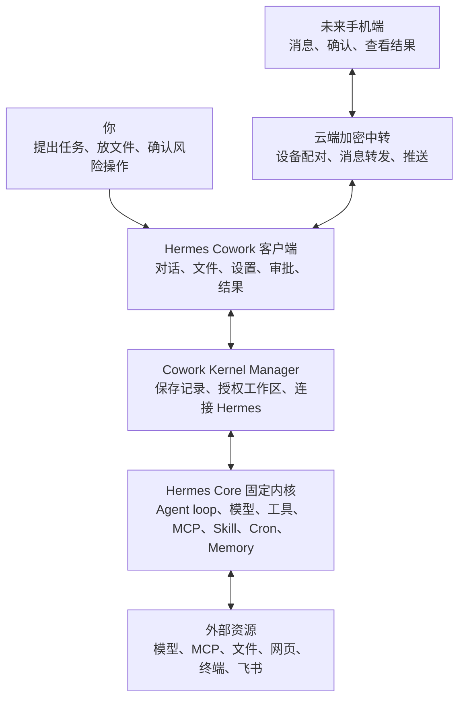

# Hermes Cowork 开发文档

文档状态：

- 这是 Cowork 的主开发入口，不再承载所有历史细节。
- 长实现说明已拆到 `docs/` 附录，主文档只保留产品定位、架构边界、当前路线、验证规则和阅读入口。
- 新开发、代码审查、GitHub 交接和新对话恢复上下文时，先读本文档，再按需要进入附录。
- 本轮文档整理日期：2026-05-04。

当前阶段结论：

- Hermes Cowork 已进入“Hermes 能力释放规划阶段”。前端框架基本成型，下一阶段重点是按 Hermes 当前固定内核的真实能力做系统产品化，而不是继续堆临时页面。
- Hermes 当前本机版本会作为 Cowork 固定 Agent 内核管理；后续不默认追随 upstream 主线更新，只有在 Cowork 兼容性复测通过后才吸收必要补丁。
- Cowork 不重写 Hermes Agent loop，也不做第二套 Agent；Cowork 的职责是把 Hermes 的任务、上下文、模型、工具、MCP、Skill、Cron、审批、回滚和产物能力变成可理解、可确认、可复测的本机客户端体验。
- 后续重功能开发必须先走“官网能力树 -> 本机 Hermes 代码 -> Cowork 覆盖矩阵 -> UI/后端实现”的链路，禁止发现一个问题就临时造一个前端状态。

## 0. 文档导航

| 场景 | 先看 | 说明 |
| --- | --- | --- |
| 想知道产品该怎么做 | 本文档 `1`、`3`、`4`、`5` | 快速理解 Cowork 和 Hermes 的关系、当前阶段和下一步。 |
| 想核对 Hermes 官方能力 | [`docs/hermes-capability-baseline.md`](docs/hermes-capability-baseline.md) | 官网能力树、本机固定内核基线、覆盖矩阵、长期路线。 |
| 想判断交互是否符合既定产品原则 | [`docs/product-decisions.md`](docs/product-decisions.md) | 工作区、对话、文件预览、批注、主题、三栏布局、多入口一致性。 |
| 想改代码或查 API | [`docs/engineering-reference.md`](docs/engineering-reference.md) | 目录结构、关键文件、数据结构、API、实现细节、命令、已知限制。 |
| 想重新跑验证 | 本文档 `7` | 只列最常用验证命令，详细命令见工程附录。 |

规则：主文档负责“方向和入口”，附录负责“细节和历史”。如果附录里的内容影响产品判断，要把结论同步回主文档；如果只是实现细节，不要再塞回主文档。

## 1. 产品定位

Hermes Cowork 是一个本机使用的 Hermes 前端工作台，未来会包装成 macOS 客户端，并逐步支持手机端通过云端加密中转连接本机 Mac。

核心原则：

- 不重做 Hermes 的 Agent 能力。
- 不重做文件整理、文档生成、飞书操作、数据分析、网页调研等业务能力。
- 前端负责连接、展示、授权、任务控制、文件入口、产物沉淀。
- Cowork 本机后端负责翻译任务、保存记录、管理授权工作区、连接固定 Hermes Core。
- 每个用户入口都必须能对应到一个 Hermes 后端能力、一个 Cowork Adapter API，以及一个可验证的测试点；三者缺一就不能算功能完成。

## 2. 当前运行方式

项目目录：

```bash
/Users/lucas/.hermes/hermes-agent/cowork
```

启动：

```bash
cd /Users/lucas/.hermes/hermes-agent/cowork
npm run dev
```

访问：

```text
http://127.0.0.1:5173/
```

服务：

- 前端 Vite：`http://127.0.0.1:5173`
- 后端 Adapter：`http://127.0.0.1:8787`

注意：不能直接打开 `apps/web/index.html`，必须通过 Vite 服务访问。

## 3. 架构边界

当前技术路线：

- 前端：React + TypeScript + Vite + lucide-react + 原生 CSS。
- 本机后端：Node.js + Express + TypeScript + 本地 JSON 状态文件。
- Hermes 通道：普通任务优先走 Hermes `tui_gateway` 常驻进程，必要时回退 Python bridge；官方 Dashboard/API 能力通过 adapter 做只读或并行探测。
- 客户端化路线：Electron macOS 壳 + Kernel Manager + 固定 Hermes Core runtime。



一句话边界：Cowork 是本机客户端和可视化工作台，Cowork 后端是 Kernel Manager，Hermes 当前版本是固定 Agent 内核。

## 4. Hermes 能力覆盖摘要

详细矩阵见 [`docs/hermes-capability-baseline.md`](docs/hermes-capability-baseline.md)。这里仅保留当前开发判断。

| Hermes 能力类 | Cowork 当前覆盖 | 下一步产品化动作 |
| --- | --- | --- |
| 入口与运行时 | gateway 优先、bridge 回退、Dashboard/API 探测 | 评估 API Server / Runs API 是否能逐步替代私有 bridge。 |
| Agent Loop | 已展示正文、过程、审批、澄清、产物、错误 | 过程 UI 继续只绑定 Hermes 事件，不做假任务步骤。 |
| Prompt / Context | 工作区、附件、文件批注、上下文资源已接入 | 统一 context files、context references、压缩策略和批注传递。 |
| 模型与 Provider | 模型配置、Key 重填、Fallback、reasoning 已有 | 补 Credential Pools、Auxiliary Providers、provider routing。 |
| Tools / Toolsets | 已开始并入技能页 | 工具、MCP、Skill 统一做“能力中心”，补工具级策略和统计。 |
| Skills | 清单、详情、文件树、启停、上传已做 | 补 Hub/外部目录治理、依赖、运行前预载、Agent 自动沉淀 Skill。 |
| MCP | 服务、测试、启停、工具 include/exclude、Hermes MCP serve 已做 | 取消非原生市场，优先覆盖 Hermes 原生 MCP 能力和生态入口。 |
| Cron / Automation | 已接真实 Hermes Cron | 补周期选择、工作区绑定、Skill 分类多选、运行产物、失败恢复。 |
| Gateway / Messaging / Mobile | 当前只做本机 gateway | 后续做手机端加密中转，本机 Mac 执行，云端不跑 Agent。 |
| 媒体与浏览器 | 文件/图片预览和批注已做 | 补视觉理解、浏览器过程可视化、语音输入、TTS 输出。 |
| 安全、审批与回滚 | 审批卡、澄清卡已接 | 补 checkpoint/rollback、allowlist、YOLO 风险说明、隔离状态。 |

## 5. 当前开发路线

优先级 1：把 Hermes 真实后端能力补齐到 Cowork 主链路。

- API Server / Runs API 能力评估：确认 runs、events、stop、approval、clarification、context usage 是否能覆盖当前 gateway bridge。
- Session 全量前端化：全文浏览、搜索、删除、重命名、来源平台、模型、工具调用历史、继续对话。
- Skills / MCP / Toolsets 统一技能页能力中心：特别注意 Hermes 原生 MCP 和 Skill 的市场、生态、安装、启停、权限和工具级能力。
- Cron 表单重做：周期选择、workdir、Skill 分类多选、运行产物、delivery target。

优先级 2：补产品安全和上下文闭环。

- 模型系统：credential pools、fallback providers、auxiliary providers、provider routing。
- 安全系统：approval modes、永久 allowlist、checkpoint / rollback、YOLO 风险显示。
- Context 系统：context files、context references、附件、批注、工作区文件和压缩策略统一。

优先级 3：客户端化和个人工作流深化。

- Electron 客户端与 Kernel Manager。
- Hermes 固定内核目录融合和回档机制。
- 语音输入、TTS 输出、图片视觉理解、浏览器自动化过程可视化。
- 手机端通过云端加密中转连接 Mac 主机。

## 6. 开发流程规则

后续任何 Hermes 能力开发按这个顺序执行：

1. 查 Hermes 官网能力树和当前文档基线。
2. 查本机固定 Hermes 代码、CLI help、Dashboard/API、测试或 release note。
3. 更新 Cowork 覆盖矩阵，明确用户入口、后端接口和验证方式。
4. 再做 UI/后端实现。
5. 验证真实后端链路，不用假数据证明功能完成。

多入口一致性规则：同一个能力如果出现在设置、对话框、技能页、工作区、右侧工作区或文件预览区，必须复用同一套状态和 API。不能只修一个入口。

静态信息规则：界面上长期展示的信息必须对用户有决策价值。只对开发者有用的调试信息放到日志、折叠项或工程文档，不直接堆到主 UI。

## 7. 常用验证

文档或轻量 UI 变更：

```bash
git diff --check
```

前端/后端 TypeScript 变更：

```bash
npm run -s typecheck
npm run -s build
```

Hermes 消息连接：

```bash
npm run -s test:hermes-connection
npm run -s smoke:hermes-real
```

任务拆解展示：

```bash
npm run -s test:task-decomposition
```

官方 Hermes API 探测：

```bash
curl -s http://127.0.0.1:8787/api/hermes/official-api | python3 -m json.tool
```

## 8. 已知边界

- 当前 Cowork 仍是本地 Web 形态，尚未完成 Electron 客户端化。
- Hermes 固定内核已备份在仓库 `baselines/hermes-core/`，但自动回档 UI 和一键升级复测仍未完整产品化。
- 官方 Runs API 仍处于并行评估，不能直接替换当前 `tui_gateway` 主链路。
- 部分 Hermes 后端能力已被探测到，但尚未前端化；以 [`docs/hermes-capability-baseline.md`](docs/hermes-capability-baseline.md) 的矩阵为准。
