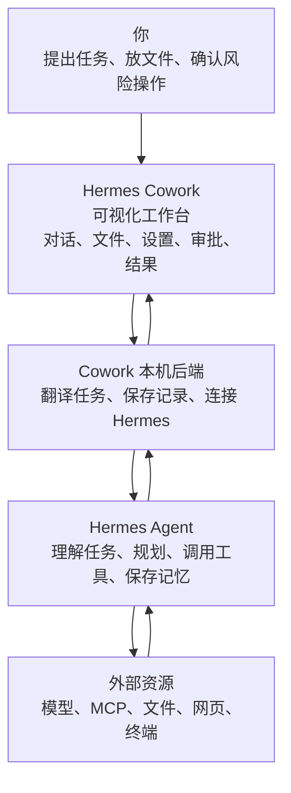
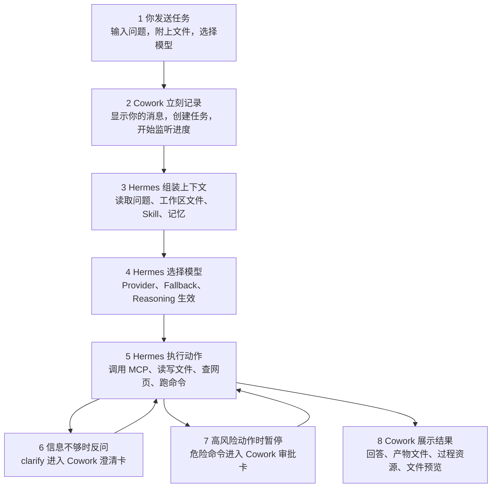
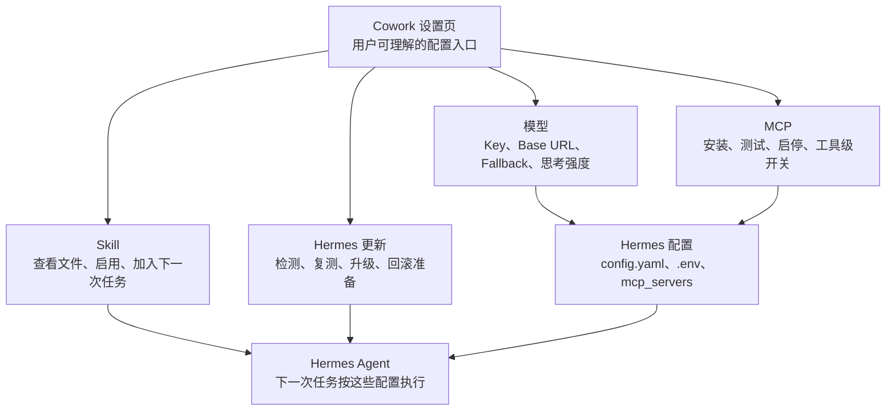

# Hermes Cowork 开发文档

文档状态：

- 这是仓库唯一主开发文档。
- 原阶段定版、架构体检、早期 MVP 文档已经合并到本文档。
- 新开发、代码审查、GitHub 交接和新对话恢复上下文时，都以本文档为准。
- `README.md` 只保留项目简介、运行命令和本文档入口。

当前阶段结论：

- Hermes Cowork 已经从静态前端原型推进到本机 Hermes 工作台原型。
- 当前主线不是扩散新功能，而是工程稳定、后端覆盖、信息降噪和客户端化准备。
- 文件编辑、主题化、客户端化和 Hermes 后端融合都属于重功能，必须先按本文档的模块边界推进。
- 技术路线定为 React + TypeScript UI、Node + TypeScript Local Adapter、SQLite 本地状态、Electron macOS 客户端壳、Hermes managed runtime。
- Hermes 暂不直接混入 Cowork 主目录，先作为 Cowork 管理的 runtime：负责安装、版本锁定、升级、回滚和兼容性复测。
- 本文档有两种读法：产品判断先看“架构覆盖、能力矩阵、开发方案解释区”；继续编码先看“关键文件说明、测试命令、后续开发建议”。

## 1. 项目定位

Hermes Cowork 是一个本机 Web 工作台，用来作为开源 Hermes Agent 的前端。

核心原则：

- 不重做 Hermes 的 Agent 能力。
- 不重做文件整理、文档生成、飞书操作、数据分析、网页调研等业务能力。
- 前端负责连接、展示、授权、任务控制、文件入口、产物沉淀。
- 后端 Adapter 负责调用 Hermes、维护本地任务状态、管理授权工作区和文件预览。
- Cowork 的每个用户入口都必须能对应到一个 Hermes 后端能力、一个 Cowork Adapter API，以及一个可验证的测试点；如果三者缺一，就不能算功能完成。

## 2. 当前运行方式

项目目录：

```bash
/Users/lucas/Documents/Codex/2026-04-26/new-chat
```

启动：

```bash
cd /Users/lucas/Documents/Codex/2026-04-26/new-chat
npm run dev
```

访问：

```text
http://127.0.0.1:5173/
```

服务：

- 前端 Vite：`http://127.0.0.1:5173`
- 后端 Adapter：`http://127.0.0.1:8787`

注意：不能直接打开 `apps/web/index.html`，必须通过 Vite 服务访问。

前端 API 默认直连后端 Adapter：

```text
http://127.0.0.1:8787
```

可通过环境变量覆盖：

```bash
VITE_API_BASE=http://127.0.0.1:8787 npm run dev:web
```

这样页面请求不会依赖 Vite 的 `/api` 代理；如果 `5173` 只负责页面热更新，后端请求仍会稳定打到 `8787`。

## 3. 技术栈

前端：

- React
- TypeScript
- Vite
- lucide-react
- 原生 CSS

后端：

- Node.js
- Express
- TypeScript
- 本地 JSON 状态文件
- Hermes Runtime Adapter：普通任务优先走 Hermes `tui_gateway` 常驻进程，必要时回退 Python bridge

Hermes 对接：

- Hermes 安装位置：`/Users/lucas/.local/bin/hermes`
- Hermes 项目目录：`/Users/lucas/.hermes/hermes-agent`
- Hermes Python：`/Users/lucas/.hermes/hermes-agent/venv/bin/python`
- 常驻运行通道：`tui_gateway.entry` JSON-RPC，按授权工作区启动，负责普通任务、流式输出、停止和上下文 usage。
- 回退运行通道：`hermes_bridge.py` 复用 Hermes `HermesCLI` 初始化路径，再嵌入 `AIAgent`；主要用于预加载 Cowork skill、上下文读取/压缩兜底和 gateway 不可用时的任务执行。

## 3.1 Cowork 与 Hermes 对应架构图

Hermes Cowork 的产品边界必须按下面这张图理解：Cowork 是 Hermes 的本机工作台，不替代 Hermes Agent。Cowork 的价值是把 Hermes 后端已经具备但原本隐藏在 CLI/TUI、配置文件、session、事件流里的能力，变成用户能看到、能确认、能复测、能继续操作的产品入口。

官网依据：

- Hermes 官网把 Hermes 定位为“会长期运行、能记住经验、能通过多平台入口工作的自主 Agent”，不是单个聊天 API：`https://hermes-agent.nousresearch.com/`
- Hermes 官方架构把系统分成入口层、`AIAgent`、提示词组装、模型选择、工具派发、Session 存储和工具后端：`https://hermes-agent.nousresearch.com/docs/developer-guide/architecture`
- Hermes MCP 文档说明 MCP 是外接工具服务器能力，Hermes 会在启动时发现并注册工具：`https://hermes-agent.nousresearch.com/docs/user-guide/features/mcp`
- Hermes 安全文档说明危险命令审批、人类确认、隔离和上下文文件扫描是后端安全模型的一部分：`https://hermes-agent.nousresearch.com/docs/user-guide/security`

下面不再使用一张“大而全”的图。那种图适合工程师追代码，但在 GitHub 上会被缩得很小，第一次看 AI Agent 架构时基本不可读。这里拆成三张小图，每张只回答一个问题。

### 3.1.1 总览图：Cowork 和 Hermes 各自负责什么



用一句话理解：

```text
你在 Cowork 里开车；Cowork 是方向盘、仪表盘和刹车；Hermes 是发动机和自动驾驶系统；模型、MCP、浏览器、文件和终端是 Hermes 可以调用的动力和工具。
```

### 3.1.2 任务图：一次对话怎么跑完



这张图对应主界面：

- 对话区显示 `T1`、`T2`、`T8`。
- 对话过程流显示 `T3`、`T4`、`T5` 的可读摘要。
- 澄清卡显示 `T6`：当用户目标缺少关键输入、多个方案需要用户选择时，Hermes 暂停并等待 Cowork 回答。
- 审批卡显示 `T7`：当 Hermes 准备执行危险命令或需要人工批准的动作时，Cowork 必须给出明确允许/拒绝入口。
- 右侧工作区显示产物、上下文资源和文件预览。

### 3.1.3 配置图：模型、MCP、Skill、更新在哪里生效



这张图对应设置页：

- 模型、MCP、更新最终都要落到 Hermes 自己的配置或 runtime 状态。
- Skill 更像“工作方法说明书”，会进入下一次任务的上下文。
- Cowork 不应该维护另一套假的模型、MCP 或 Skill 状态。

### 3.1.4 新手术语翻译表

| 官网或代码里的词 | 用人话理解 | Cowork 里应该对应什么 |
| --- | --- | --- |
| Entry Points | Hermes 可以从哪里被叫醒。CLI、Gateway、API、消息平台都是入口。 | Cowork 当前主要使用本机 Gateway/bridge，未来客户端也会成为入口。 |
| Gateway | 常驻通道。让 Hermes 不必每次都重新启动，可以持续接收任务和返回事件。 | Cowork 的实时流式输出、停止任务、审批回复都应该优先走 Gateway。 |
| AIAgent | Hermes 的大脑。它负责决定下一步想什么、用什么模型、调什么工具。 | Cowork 不重写它，只展示它的过程和结果。 |
| Prompt Builder | 任务资料打包器。把系统规则、用户问题、文件、Skill、记忆组装给模型。 | Cowork 的附件、工作区文件、Skill 预载都要进入这里。 |
| Provider Resolution | 模型调度器。决定这次用哪个模型、哪个供应商、哪个备用模型。 | Cowork 的模型设置、Key 重填、Fallback 和思考强度入口。 |
| Tool Dispatch | 工具派发器。Hermes 决定要读文件、跑命令、查网页、用浏览器或调 MCP 时经过这里。 | Cowork 的过程流、右侧资源、MCP 管理和工具调用展示。 |
| MCP | 外接工具插座。让 Hermes 使用 GitHub、数据库、文件系统、内部 API 等外部工具。 | 设置 > MCP、技能页 Connectors、过程资源里的工具调用。 |
| Session Storage | 工作记忆和历史记录。保存对话、任务状态、检索索引和上下文。 | 左侧会话、继续对话、上下文用量、手动压缩。 |
| Context Compression | 长对话压缩。对话太长时，把历史压缩成可继续使用的摘要。 | 右侧上下文资源里的用量、压缩建议和手动压缩按钮。 |
| Skills | 工作方法说明书。告诉 Hermes 某类任务应该怎么做。 | 技能页、Skill 文件预览、加入下一次任务。 |
| Clarify | 反问机制。Hermes 认为任务信息不足或需要用户选择方案时，先问清楚再继续。 | 对话区澄清卡，可选项按钮和自由输入，回答后回到同一轮 Hermes 任务。 |
| Approval | 安全刹车。危险命令执行前要求用户确认。 | 对话区审批卡，必须能允许一次、本会话允许、总是允许或拒绝。 |
| Sandbox | 隔离房间。让命令和代码在受控环境中运行，降低误伤本机风险。 | 设置和任务过程里只展示用户能处理的安全状态，不展示大量原始日志。 |

### 3.1.5 用户操作与 Hermes 后端能力的对应关系

| 你在 Cowork 做什么 | Cowork 要做什么 | Hermes 背后发生什么 | 如果没做 UI 会怎样 |
| --- | --- | --- | --- |
| 发一句任务 | 立刻显示你的消息，创建 Hermes task，订阅流式事件 | Gateway/Agent 开始一次任务循环 | 用户会以为消息丢了，或者长时间空白 |
| 拖入 PPT、Excel、Word、图片 | 先放进输入框附件，再上传到授权工作区 | Prompt Builder 把文件路径作为上下文给 Agent | 文件会变成后台上传，用户无法告诉 AI 要怎么处理 |
| 选择模型或重填 Key | 写入 Hermes 配置或 `.env`，刷新模型状态 | Provider Resolution 选择供应商、模型和备用路线 | Cowork 显示一个模型，Hermes 实际用另一个模型 |
| 添加 MCP | 写入 `mcp_servers`，测试连接，显示工具列表 | Hermes 启动时发现 MCP 工具并注册到工具派发器 | 用户不知道这个 MCP 能干什么，也不知道是否可用 |
| 打开 Skill | 展示 `SKILL.md` 和子文件，可加入下一次任务 | Skill 内容进入 Prompt Builder 或 Hermes skill 系统 | 用户不知道 Skill 具体做什么，也无法确认是否被用到 |
| 查看任务过程 | 把工具、网页、文件、审批、产物分成可读过程 | AIAgent 按“思考、行动、观察、继续”循环执行 | 原始日志会刷屏，用户看不到 Agent 当前在做哪一步 |
| 回答反问 | 弹出澄清卡，把选择或文字答案发回 Hermes | Hermes 的 `clarify` 工具解除阻塞，继续同一轮任务 | 任务会一直等待或超时，用户不知道 AI 在等自己补充什么 |
| 确认风险命令 | 弹出审批卡，把结果发回 Hermes | Hermes 的 Approval 层决定继续、拒绝或超时失败 | 任务会卡住或失败，用户不知道需要自己确认 |
| 继续追问 | 找到同一个 Hermes session 或按规则新开 session | Session Storage 继续同一上下文，或用新模型开新会话 | 上下文会错位，旧模型和新模型会混用 |
| 查看/打开产物 | 显示文件卡片、右侧预览、本机打开、Finder 定位 | 文件工具或 MCP 在工作区生成真实文件 | 结果只是一段文字，用户找不到生成物 |

架构约束：

- 前端多个入口只能消费同一套 API，不允许各自拼静态清单。
- 写 Hermes 配置只能通过后端 Adapter 做备份、归一化和敏感信息遮蔽。
- UI 文案可以按场景重组，但状态含义必须来自同一份后端数据。
- 新增入口时，必须先确认它复用哪个 API、哪个状态字段、哪个后端归一化函数。
- Hermes 的新增能力进入 Cowork 时，先补“覆盖矩阵”，再写 UI。审批能力漏开发就是因为没有先做这一步。

## 3.2 Hermes 能力覆盖矩阵

这张表是 Cowork 防止漏能力的主索引。后续任何新功能，都要先判断它是在覆盖 Hermes 后端能力，还是 Cowork 自己补充的桌面工作台能力。

| Hermes 后端能力 | Cowork 用户入口 | Cowork Adapter / 代码边界 | 当前覆盖状态 | 漏开发风险检查点 |
| --- | --- | --- | --- | --- |
| 任务执行、继续对话、停止、流式事件 | 对话区、输入框、左侧会话、右侧工作区 | `/api/tasks`、`/api/tasks/:id/stream`、`hermes_runtime.ts`、`hermes_gateway.ts`、`useTaskStream.ts` | 已接入 gateway 优先、bridge 回退、SSE 同步和轮询兜底 | 用户气泡是否立即出现；运行中是否实时更新；停止是否回写 Hermes；继续对话是否使用同一 session |
| Clarify / 澄清反问 | 对话区澄清卡、可选项按钮、自由输入框 | `/api/tasks/:id/clarify`、`ClarifyRequestCard.tsx`、`useTaskActions.ts`、`hermes_gateway.ts` | 已接入 gateway 事件、前端卡片和 fake gateway 链路测试；bridge fallback 无法继续澄清 | Hermes 返回 `clarify.request` 时必须弹卡片；回答后必须调用 `clarify.respond` 并继续原任务；不能降级成普通文字 |
| 人工审批、命令确认、interrupt | 对话区审批卡、运行中停止/继续入口 | `/api/tasks/:id/approval`、`ApprovalRequestCard.tsx`、`useTaskActions.ts` | 已补审批卡与测试，但仍需持续验证真实 Hermes 事件格式 | Hermes 返回 approval/request 时必须弹卡片；不能只显示一段失败文案；审批后要能恢复任务 |
| 模型、Provider、Key、Fallback、Reasoning | 输入框模型菜单、设置 > 模型、模型配置弹窗 | `/api/models`、`models.ts`、`modelApi.ts`、`useModelState.ts`、`useModelConfigForm.ts` | 已覆盖中国主流供应商、Key 重填、MiMo 分组、reasoning 设置 | 任一入口保存后另一个入口必须刷新；401 必须给重填 Key；本次模型和 Hermes 默认模型不能混淆 |
| MCP Server、工具列表、市场、工具级开关 | 设置 > MCP、技能页 Connectors、过程资源 | `/api/hermes/mcp`、`mcp.ts`、`mcpApi.ts`、`useMcpState.ts` | 已覆盖安装、测试、删除、启停、工具级 include/exclude、每日推荐 | 已安装服务必须显示说明和图标；市场推荐要分类；工具调用应在过程资源里出现 |
| Hermes Cron、定时任务、自动化输出 | 左侧定时任务页、未来任务产物区 | `/api/hermes/cron`、`hermes_cron.ts`、`features/scheduled` | 已覆盖真实 job 列表、新建、编辑、暂停/恢复、排队运行、删除、最近输出；运行由 Hermes gateway/tick 负责 | 任务必须写入 `~/.hermes/cron/jobs.json`；Cron 运行没有当前对话上下文，prompt 必须自包含；gateway 未运行时要给可处理提示 |
| Skills、Skill 文件、运行前预载 | 技能页、Skill 详情、输入区预载 Skill | `/api/skills`、`skills.ts`、`SkillsView.tsx`、`SkillDetailModal.tsx` | 已支持扫描、查看文件树、上传、启停、加入下一次任务；gateway 场景仍缺 Cowork skill 预载参数 | 点击 Skill 必须能看到 `SKILL.md` 和子文件；真正执行时要确认 Hermes 是否读到了 skill |
| Session、上下文用量、压缩 | 右侧上下文与资源、未来对话顶部风险提示 | `/api/tasks/:id/context`、`useTaskContext.ts`、`TaskInspectorCards.tsx` | 已有上下文 snapshot、资源合并、手动压缩入口 | 不展示无效 token 表格；文件大小/占比要帮助用户判断；压缩后当前任务要同步 |
| 工作区、附件、产物、文件预览 | 工作区页、输入框附件、消息文件卡片、右侧预览 | `/api/workspaces`、`/api/artifacts`、`file_preview.ts`、`workspaceApi.ts`、`FilePreviewPanel.tsx` | 已支持目录授权、附件上传、产物识别、文件卡片、右侧预览和本机打开 | 拖入文件必须先进入对话框；Office 预览要尽量接近本机打开；预览不能造成布局抖动 |
| Runtime 版本、升级、复测、回滚准备 | 设置 > 关于 > Hermes 后台更新 | `hermes_update.ts`、`HermesUpdatePanel.tsx`、`runtimeApi.ts` | 已有检测、复测、自动更新入口；仍未做完整 managed runtime 安装器 | 升级前后必须跑模型、MCP、session、流式事件 smoke；红色信息只能给可处理动作 |
| 错误、认证失败、后端异常 | 对话失败卡、模型设置、右侧状态 | `hermes_python.ts`、`hermes_gateway.ts`、`TaskFocusPanel.tsx` | 已做部分错误脱敏和 401 识别 | 不能只显示 Failed to fetch；用户必须知道下一步是重填 Key、重试、还是等待后端 |
| UI 主题、密度、层级、暗色模式 | 设置 > 外观、左下本机偏好菜单 | `tokens.css`、`useSettingsPreferences.ts`、`SettingsPages.tsx` | 已有亮色/暗色/系统、字体字号、强调色；暗色仍需继续统一 | 新样式必须使用 token；不要在组件里散写颜色和字号 |

覆盖状态定义：

- “已覆盖”表示已有用户入口、Adapter API 和基本验证，不表示没有体验问题。
- “部分覆盖”表示能用，但还有 Hermes 原生能力没有完整映射，或多入口一致性仍有风险。
- “未覆盖”必须写清是 Hermes 没有该能力，还是 Cowork 尚未对接。

## 3.3 开发方案解释区

这一部分面向产品判断。它解释当前每块功能为什么这样做、是否符合 Hermes 后端能力、后续还有什么升级空间。以后重功能开发前，先在这里补充方案，再进入具体代码。

### 3.3.1 对话与流式输出

当前方案：

- 对话区不再直接渲染 Hermes 原始 stdout，而是先把后端事件归类成 message parts：用户文本、Hermes 正文、文件卡片、审批卡、运行过程、变更摘要。
- 运行中过程显示在对话流里，右侧工作区只保留产品级任务拆解、产物和上下文资源。
- Hermes 没有返回产品级 plan 时，右侧任务拆解宁可空着，也不把工具调用清单伪装成任务计划。

为什么这样做：

- Hermes 后端事件有工具、状态、thinking、approval、message、artifact 等不同语义。直接显示会造成噪声，用户很难判断 Agent 到底在做什么。
- 产品层需要“对话主线”和“执行过程”分开：最终答案必须可读，过程信息必须可追踪但不抢主线。

可升级空间：

- 如果 Hermes 后续暴露明确的 plan / todo / reflection 结构化事件，Cowork 应把 plan 放入右侧任务拆解，把 todo/action 放入对话过程流。
- 如果 Hermes 暴露 token usage、step id、tool call id，可进一步让右侧资源和对话过程精准同步。

判断标准：

- 用户发出消息后，自己的气泡必须立刻出现。
- Hermes 运行中必须有可读进度，不允许长时间空白。
- 最终答案不应被折叠进过程记录。
- 审批、文件、产物不能只是文字，必须是可操作卡片。

### 3.3.2 文件、附件与预览

当前方案：

- 文件进入对话时，先作为本轮附件 chip 出现在输入框，再上传到当前授权工作区。
- 发送后，用户消息保留附件卡片；Hermes 产出文件时，Assistant 回复下方展示产物卡片。
- 点击文件卡片后，右侧工作区让位给文件预览区；顶部提供本机打开、Finder 定位、固定、全屏和关闭。

为什么这样做：

- 对用户来说，文件首先是“我要让 AI 处理的上下文”，不是单纯拖入工作区的后台上传结果。
- Web 预览很难 100% 等同本机 Office/WPS/Keynote 渲染，所以高保真优先级是：本机默认应用打开 > macOS Quick Look > Web 内联预览 > 文本兜底。

可升级空间：

- 做客户端化后，可用 Electron/Tauri 调用更稳定的文件选择、Quick Look、系统安全书签和本机打开。
- 文件编辑阶段要新增 `file_edit.ts` 或并列 API，支持备份、保存、版本和撤销，不能把编辑逻辑塞进预览模块。

判断标准：

- 拖文件到对话框时，必须进入输入框附件区，而不是只上传到工作区。
- 预览区不能导致三栏宽度抖动、外层页面滚动错乱或内容出界。
- Office 文件如果 Web 预览不可信，必须明确给“本机打开”作为主操作。

### 3.3.3 模型设置

当前方案：

- Hermes 的模型配置仍以 `~/.hermes/config.yaml` 和 `.env` 为真源。
- Cowork 只提供用户友好的配置入口：供应商、模型、Base URL、Key/Plan Key、fallback、reasoning。
- 输入框底部只显示已配置可用模型和本次运行参数；完整配置放在设置 > 模型。

为什么这样做：

- 模型不是 Cowork 自己发起的第三方 API 调用，真实执行仍由 Hermes 决定。
- 同一个供应商的 Key 和 Base URL 应该复用，用户不应为 MiMo 多个模型反复填写同一组凭据。

可升级空间：

- provider 模型目录继续做官网刷新和 Hermes 内置目录合并。
- 更细的 thinking / fast / reasoning 能力要先确认 Hermes 是否有稳定配置字段，再进入 UI。

判断标准：

- 设置页和输入框入口必须展示同一批模型。
- 保存模型后，下一次真实对话必须使用新模型或明确跟随 Hermes 默认模型。
- 401/invalid key 必须给重填入口，不能只报错。

### 3.3.4 MCP 与 Skills

当前方案：

- MCP 管理覆盖 Hermes `mcp_servers`：本地服务、市场安装、测试、删除、启停、工具级 include/exclude。
- Skills 管理覆盖本机 skill 文件：扫描、上传、启停、查看 `SKILL.md` 和子文件、加入下一次任务。

为什么这样做：

- MCP 是 Hermes 的外部工具连接层；Skill 是提示词和工作方法层。两者都影响 Agent 能力，但产品入口要分开。
- 用户看到的应是“这个工具/技能能做什么”，不是一堆命令、env、headers。

可升级空间：

- MCP 市场可以继续用 Hermes 每日推荐扩展，但推荐结果只进入市场，不额外增加复杂用户入口。
- gateway 目前不完整支持 Cowork 自定义 skill 预载时，应保留 bridge 回退或等待 Hermes 增加参数。

判断标准：

- 已安装 MCP 必须有功能说明、图标、连接状态和工具列表。
- Skill 详情必须能打开完整文件树。
- 任务过程中调用的 MCP/Skill 要进入过程资源，不要污染任务拆解。

### 3.3.5 定时任务与 Hermes Cron

当前方案：

- 定时任务页直接管理 Hermes Cron，而不是 Cowork 自己保存一套假任务。
- 后端 Adapter 通过 Hermes 自己的 `cronjob` 工具函数执行 create/update/pause/resume/run/remove，列表和输出读取 `~/.hermes/cron/jobs.json` 与 `~/.hermes/cron/output/<job_id>/`。
- 前端只展示对用户有决策意义的信息：是否自动执行、下次执行时间、绑定工作区、绑定 Skill、最近输出和可操作动作。
- 定时任务页不展示“页面边界”“下一步”这类开发解释；必要说明合并到自动运行状态卡里。
- 新建/编辑任务时，执行时间使用“每天 / 每周 / 每月 / 每隔 / 高级”的周期选择器，前端生成 Hermes 能识别的 schedule 字符串，不让普通用户直接填写 `every 1d` 或 cron 表达式。
- 绑定 Skill 使用类目选择器、搜索和多选列表，不再把所有 skill 平铺成标签；类目由 skill 名称、描述和路径推断，用于支撑后续大量 skill 的管理。

为什么这样做：

- Hermes Cron 运行在后台，不继承当前聊天上下文，也不能临场反问用户，所以 Cowork 必须让任务说明自包含。
- “运行一次”在 Hermes 语义上是把 job 排到下一次 scheduler tick；如果 gateway 没运行，任务不会自动触发，所以界面必须显示 gateway 状态，而不是假装已经执行。

可升级空间：

- 后续可以把每日 MCP 推荐日报迁移为一个真实 Hermes Cron job，而不是单独 LaunchAgent。
- 可以增加输出文件卡片和右侧预览，把 cron 输出纳入任务产物体系。
- 可以增加 delivery 配置页，把 Feishu/Slack/Email 等投递目标从高级字段变成可配置渠道。

判断标准：

- 新建/编辑/删除必须真实改变 Hermes cron 数据，不允许只改 Cowork 状态。
- 定时任务 prompt 需要提示用户写清目标、目录、输入来源和输出格式。
- gateway 未运行时，静态提示只能告诉用户下一步动作，不展示无用日志。

### 3.3.6 工作区与本机客户端化

当前方案：

- 工作区是用户授权给 Hermes 的本机文件夹，不是聊天分类。
- 点击工作区进入文件管理页；点击工作区内会话进入对话页。
- 当前 Web 版通过 Node Adapter 调 macOS 能力；后续客户端化再用 Electron/Tauri 管理窗口、目录授权、托盘、后台常驻和自动更新。

为什么这样做：

- Hermes 的能力依赖本机文件和本机命令，工作区必须表达“哪些文件允许 AI 读写”。
- 纯 Web 对本机文件权限、系统弹窗、Office 高保真预览和后台常驻支持有限，客户端化是必要方向。

可升级空间：

- managed runtime：Cowork 管理 Hermes 安装、版本锁定、升级、回滚和兼容性复测。
- 文件编辑：在授权目录内支持主流文本/Markdown/表格的安全编辑，Office 先走本机应用打开和产物回收。

判断标准：

- 授权工作区必须通过 Finder 选择，不要求用户手填路径。
- 归档/删除会话不能误删真实文件。
- 升级 Hermes 前后必须自动复测 Cowork 的核心链路。

### 3.3.7 UI 主题与信息披露

当前方案：

- 全局视觉以 `tokens.css` 为真源，设置 > 外观只修改主题 token，不直接改组件内部样式。
- 静态可见信息必须能帮助用户做决策；后台日志、原始 payload、诊断细节进入折叠或高级页。

为什么这样做：

- AI Agent 产品的信息量天然很大，如果不做分层，用户会看到大量“看不懂也处理不了”的后台信息。
- 主题化只有建立字号、颜色、密度、组件状态的统一 token，后续客户端化和暗色模式才不会反复返工。

可升级空间：

- 增加主题 profile：办公密度、宽松密度、深色高对比。
- 给每个页面建立视觉层级检查表：页面标题、区域标题、主操作、次操作、状态、空态、诊断。

判断标准：

- 主界面默认只展示任务目标、过程、产物、上下文资源和下一步动作。
- 红色/错误信息必须告诉用户下一步能做什么。
- 暗色和亮色都必须来自同一套语义 token。

## 3.4 多入口一致性契约

凡是同一个能力在两个以上位置出现，都要在开发前先登记“共同真源”。这部分是防止后续重复出现“设置页正确、对话底部错误”这类问题的硬规则。

| 能力 | 前端入口 | 共同真源 | 必须复用的前端逻辑 |
| --- | --- | --- | --- |
| 模型候选与选择 | 对话底部模型菜单、设置 > 模型、本次任务模型列表、长期默认模型列表 | `/api/models`、`~/.hermes/config.yaml`、`readHermesModelCatalog()`、`listModelOptions()` | `modelGroupsForProvider()`、`groupModelOptionsForMenu()` |
| 模型服务配置与重填 Key | 设置 > 模型、对话底部“重填当前 Key / 模型服务设置” | `/api/models`、`/api/models/configure`、`configureHermesModel()`、`parseHermesAuthList()` | 同一个 `modelPanelOpen` 配置弹窗，入口必须能预选当前 provider 和模型 |
| MCP 服务 | 设置 > MCP、自定义 > Connectors、MCP 市场弹窗 | `/api/hermes/mcp`、Hermes MCP config | 同一套 MCP server 状态、说明、图标和启停逻辑 |
| 任务运行状态 | 主对话区、右侧任务上下文、左侧工作区会话树 | `/api/state`、任务事件流、Hermes session 元数据 | `Task`、`executionView`、右侧步骤/产物/资源分层 |
| 上下文用量、过程资源与压缩 | 右侧任务上下文、未来对话框上方风险提示 | `/api/tasks/:taskId/context`、`/api/tasks/:taskId/context/compress`、任务 events、工作区文件索引 | `ContextResourcesCard`，合并展示上下文用量、文件大小/占比、网页、工具和 Skill；不再单独展示来源/阈值/消息数表格 |
| 产物与文件 | 主结果、右侧产物、工作区文件、附件入口 | `/api/artifacts`、`/api/workspaces/*/files` | 同一套文件预览、Finder 打开、下载逻辑 |
| 对话附件 | 输入框附件 chip、用户消息附件、右侧上下文文件 | `/api/workspaces/:id/files`、`Message.attachments`、任务创建/继续请求的 `attachments` | 附件先上传到授权工作区，再作为消息附件和 Hermes prompt 文件路径进入任务 |
| Skills | 技能页、任务输入区预载技能、右侧参考信息 | `/api/skills`、本机 skill 目录 | 同一套 skill 名称、启停和文件查看逻辑 |

开发检查清单：

- 改一个入口前，先用 `rg` 搜索同一能力的其他入口。
- 改数据结构前，先改后端归一化函数，再让所有入口消费结果。
- 新增按钮、弹窗、菜单时，必须说明它读哪个 API、写哪个 API。
- 只允许 UI 层做展示分组，不允许 UI 层维护另一份业务真源。
- 每次修复“某入口不一致”后，把入口和共同真源补回本文档。

## 3.5 工作区产品规划（2026-04-29）

工作区的新定义：工作区不是一个筛选器，也不是一个普通项目卡片，而是用户授权给 Hermes 的本机文件夹，以及围绕这个文件夹产生的任务会话、文件、产物和上下文。左侧栏的工作区入口必须像目录一样存在；点击工作区进入文件管理页，点击工作区下的工作会话进入对话页。

参考依据：

- Web 端可以使用浏览器目录选择能力（MDN `showDirectoryPicker()`），但浏览器出于隐私不会稳定暴露绝对路径，不能完全满足 Hermes 后端需要的本机工作目录。
- Electron `dialog.showOpenDialog({ properties: ['openDirectory'] })` / Tauri dialog 这类 macOS 客户端能力可以调原生目录选择器，适合未来客户端化。
- VS Code Workspace、ChatGPT Projects、Claude Projects 都把“工作区/项目”理解成文件、会话和上下文的集合，而不是单一聊天记录。

工作区信息原则：

- 静态可见信息必须是用户能决策的信息：当前是否可工作、需要重新授权、有哪些文件可用、有哪些任务会话、下一步能做什么。
- 原始路径、mtime、session id、后台计数、配置细节默认隐藏到详情或 tooltip。
- 空状态必须给行动入口，例如“选择文件夹授权”“拖入文件”“新建对话”，不要展示无法处理的技术状态。
- 删除和归档的文案必须说清边界：归档/删除会话记录不删除工作区真实文件。

左侧栏结构：

```text
新建任务

工作区                         +
  小红书 redcase                 ...
    优化小红书 CMO 逐字稿        归档 / 删除
  lucas                          ...
    根据录屏开发软件
    翻译桌面文件

技能
定时任务
调度
```

- 工作区标题右侧“+”是新增工作区入口，默认打开 macOS Finder 目录选择，不让用户手填路径。
- 工作区行点击：进入该工作区的文件管理页。
- 工作区展开后展示该工作区内的活跃会话；会话点击进入对话页。
- 工作区行菜单：重命名、打开目录、重新授权、移除工作区。
- 会话行菜单：归档、删除。归档后从当前会话列表移入该工作区下的“已归档”折叠区，可恢复；删除只删 Cowork 任务记录和会话索引，不删工作区文件。
- 工作区下方的全局入口只保留高频且已确定的能力：技能、定时任务、调度。技能排第一；搜索和模板暂不作为左侧主入口；最近任务不再重复展示，工作区会话树就是主要会话入口。

工作区文件管理页：

- 顶部只显示工作区名称和一个简短状态，例如“可工作”“目录不存在，需要重新授权”。
- 主区域是文件浏览器：面包屑、搜索、列表/网格切换、文件类型筛选、上传/拖入、新建任务。
- 文件行支持预览、在 Finder 中显示、作为下一次任务上下文、复制相对路径。
- 右侧轻量展示最近会话和最近产物；如果没有有效内容，不展示空卡片。
- 点击文件夹进入下级目录，点击文件按类型预览或提示用 Hermes 处理。

实现路线：

1. 已完成：Web 本地版新增 `POST /api/system/pick-directory`，由 Node Adapter 在 macOS 上调用系统目录选择器，返回用户选择的 POSIX 路径；前端只显示“选择文件夹”，不显示手动路径输入。
2. 已完成：保留当前 `/api/workspaces` 作为写入真源，并新增 `PATCH /api/workspaces/:id`、`DELETE /api/workspaces/:id`、`GET /api/workspaces/:id/tree`；工作区页开始消费目录树，不再只复用 flat file list。`GET /api/workspaces/:id/summary` 仍作为后续聚合接口。
3. 部分完成：前端已经让点击工作区进入文件管理页、点击会话进入对话页；下一阶段再把导航状态显式整理成 `activeSurface = workspace | task | custom | settings`。
4. 任务会话继续复用现有归档/删除 API；如果删除 API 缺少后端覆盖，要补齐 `DELETE /api/tasks/:taskId`，并保证不会碰工作区真实文件。
5. 客户端化阶段用 Tauri/Electron 原生目录选择替换 AppleScript，并在 macOS sandbox 场景使用安全书签保存目录授权。

验收标准：

- 新建工作区时弹出系统 Finder 选择目录，不要求用户输入路径。
- 左侧点击工作区显示文件管理页，点击会话显示对话页，不互相跳转。
- 工作区文件页首屏只展示状态、文件、任务入口和必要操作，不铺后台调试信息。
- 工作区文件页支持当前目录面包屑、当前目录搜索、文件夹进入、文件预览、Finder 定位和作为上下文发送。
- 会话可以归档和删除，操作后左侧列表即时更新；工作区文件不会被误删。
- 刷新页面后仍能恢复工作区列表、当前工作区和活跃会话。

## 3.6 可调三栏布局原则（2026-04-30）

Hermes Cowork 的主界面是桌面式三栏：左侧工作区导航、中间任务对话、右侧工作区/任务上下文。三栏宽度不是一次性写死的视觉参数，而是用户可以持续调节的工作环境偏好。

- 左侧导航和右侧工作区之间必须有可拖拽分隔线，拖动后写入 `localStorage`，刷新后保留。
- 左侧导航用于工作区、会话和全局入口，默认窄而稳定；右侧工作区用于任务步骤、产物、过程资源和文件预览，默认可以占更大空间。
- 中间对话区保持可读宽度，不随屏幕无限扩张；当右侧工作区变宽时，对话区应收缩到够用状态。
- 三个区域必须按自身容器宽度自适应，而不是只按浏览器总宽度适配：窄对话区要图标化顶部和底部按钮，窄右侧工作区要折叠卡片操作、资源 Tab 和产物按钮。
- 文件预览模式复用右侧工作区宽度，拖宽右侧后应优先给预览内容更多空间。
- 低于窄屏断点时隐藏右侧工作区，避免三栏挤压成不可读状态。

## 3.7 UI 层级与主题化原则（2026-05-01）

当前 UI 进入主题化第一阶段。目标不是局部换色，而是建立全局层级：同一级信息在不同区域必须使用同一套字号、颜色、边框和阴影 token。

视觉真源：

- `apps/web/src/styles/tokens.css` 是全局设计 token 真源。
- `apps/web/src/styles/base.css` 负责把 token 接到 body、字体、代码字体、focus、基础背景。
- `apps/web/src/features/settings/SettingsPages.tsx` 的 `AppearanceSettingsSection` 是用户可见的外观后台。
- `apps/web/src/features/settings/useSettingsPreferences.ts` 负责把外观设置持久化到 `localStorage`，并写入 `document.documentElement` 的 CSS 变量。

层级定义：

| 层级 | token | 使用位置 |
| --- | --- | --- |
| 页面主标题 | `--text-display` / `--text-title` | 工作区页标题、当前任务标题、设置页标题 |
| 区域标题 | `--text-section` | 左侧品牌、右侧卡片标题、Markdown 二级/三级标题 |
| 正文 | `--text-body` | 消息正文、设置项标题、文件列表主信息 |
| 说明 | `--text-caption` | 路径、状态说明、设置项 detail、按钮辅助信息 |
| 辅助微文案 | `--text-micro` | 时间、数量、压缩后的状态补充 |
| 代码/路径/命令 | `--font-code` + `--code-font-size` | Markdown 代码块、命令片段、本机路径 |

外观后台第一阶段已落地：

- 设置弹窗新增 `外观` 分类，主题选择从 `通用` 移入 `外观`。
- 支持亮色、暗色、跟随系统。
- 支持强调色、浅色背景、浅色前景、UI 字体、代码字体、半透明侧边栏、对比度、UI 字号、代码字号、字体平滑。
- 强调色、字体、字号会即时写入 CSS 变量并持久化。
- 暗色模式暂不使用浅色背景/前景配置覆盖，避免黑字压暗底；后续如要支持暗色自定义，应新增独立的暗色主题字段。
- UI 细节第二轮已收敛：顶部长标题最多展示两行，输入框高度降低，外观预览改为真实三栏结构，不再展示开发者代码 diff；右侧任务拆解在 Hermes 未返回产品级计划时显示空态，不显示无意义进度条。
- UI 细节第三轮已收敛：失败/停止任务顶部卡片压缩成状态条，错误详情最多两行；右侧空态降低视觉重量；左侧工作区和会话选中态统一使用 surface/token；发送按钮改为强调色，模型选择入口使用中性 surface。
- UI 细节第四轮已收敛：默认三栏比例调整为左侧约 286px、右侧约 32% 且上限按主区保留空间约束；默认右侧宽度从过宽工作区收窄到约 560px，主对话区拿回阅读空间；整体背景改为近白工作台，不再使用可见网格；右侧资源 Tab 在 550px 级别保持单行。
- UI 细节第五轮已收敛：左下角从“账号菜单”改为本机偏好菜单，去掉管理账号和退出登录；弹出层支持点击外部空白区域关闭；菜单内主题切换直接写入同一份外观主题配置，和设置 > 外观保持一致。

开发约束：

- 新组件优先使用 token，不要再写散落的 `font-size: 13px`、`#fffdf7`、`#d8d1bd` 这类局部常量。
- 旧变量 `--ink`、`--panel`、`--line`、`--moss` 等保留为兼容层，新增样式应优先使用 `--foreground`、`--surface`、`--border`、`--accent`。
- 卡片半径默认不超过 `--radius-card`，按钮和输入框用 `--radius-control`。
- UI 静态信息必须能帮助用户决策；后台状态、原始日志、技术细节进折叠详情或设置诊断区。
- 后续做完整主题后台时，应把 token 分成基础色、语义色、字号、密度和组件态五类，不要让设置页直接散改组件 CSS。

## 4. 目录结构

```text
.
├── apps
│   ├── api
│   │   ├── src
│   │   │   ├── artifacts.ts
│   │   │   ├── file_preview.ts
│   │   │   ├── hermes.ts
│   │   │   ├── hermes_bridge.py
│   │   │   ├── hermes_gateway.ts
│   │   │   ├── hermes_python.ts
│   │   │   ├── hermes_runtime.ts
│   │   │   ├── mcp.ts
│   │   │   ├── models.ts
│   │   │   ├── paths.ts
│   │   │   ├── server.ts
│   │   │   ├── store.ts
│   │   │   └── types.ts
│   │   └── tsconfig.json
│   └── web
│       ├── index.html
│       ├── src
│       │   ├── App.tsx
│       │   ├── features
│       │   │   ├── chat
│       │   │   ├── file-preview
│       │   │   ├── markdown
│       │   │   ├── settings
│       │   │   ├── skills
│       │   │   └── workspace
│       │   ├── lib
│       │   │   ├── api.ts
│       │   │   └── http.ts
│       │   ├── main.tsx
│       │   └── styles
│       │       ├── app.css
│       │       ├── base.css
│       │       ├── chat.css
│       │       ├── file-preview.css
│       │       ├── sidebar.css
│       │       ├── settings.css
│       │       ├── shell.css
│       │       ├── tokens.css
│       │       └── workspace.css
│       ├── tsconfig.json
│       └── vite.config.ts
├── data
│   └── state.json
├── workspaces
│   └── default
├── package.json
└── README/开发文档
```

## 5. 关键文件说明

### 后端

`apps/api/src/server.ts`

- Express 服务入口。
- 提供任务、工作区、文件、产物 API。
- 执行 Hermes 任务，实际入口是 `runHermesRuntimeTask()`。
- 维护运行中任务句柄 `HermesRuntimeHandle`，而不是直接假设每个任务都是一个子进程；停止任务时调用 handle 的 `stop()`。
- 派生 `executionView`。
- 提供工作区文件列表、预览、Finder 定位。
- 提供 `/api/hermes/sessions` 只读索引：扫描 `~/.hermes/sessions/session_*.json`，只返回 session 元数据、模型、消息数、更新时间和 Cowork 任务关联，不返回原始消息正文。
- 提供 `/api/tasks/:taskId/context` 和 `/api/tasks/:taskId/context/compress`：前者读取当前任务对应 Hermes session 的上下文用量，后者调用 Hermes 原生手动压缩能力并把新 session 状态写回任务事件。

`apps/api/src/file_preview.ts`

- 后端文件预览服务模块，已从 `server.ts` 抽离。
- 对外提供 `readPreviewBody()`、`sendInlineFile()` 和 `sendQuickLookPreview()`。
- 负责文本、Markdown、CSV、HTML、JSON 的正文级预览，PDF、图片、音视频、HTML 等 raw inline 响应的 MIME / Content-Disposition，以及 Office 文件的 macOS Quick Look HTML 高保真预览包生成。
- 后续文件编辑能力必须先扩展这个模块或新增并列 `file_edit.ts`，不要把解析、写入、备份逻辑重新塞回 `server.ts`。

`apps/api/src/hermes_runtime.ts`

- Cowork 与 Hermes 运行时的统一入口。
- 默认 `HERMES_COWORK_RUNTIME=auto`：普通任务优先使用 `tui-gateway`；如果 gateway 不可用，或任务需要预加载 Cowork 选中的 skill，则回退到 `python-bridge`。
- 支持 `HERMES_COWORK_RUNTIME=gateway` 强制使用 gateway，支持 `HERMES_COWORK_RUNTIME=bridge` 强制使用旧 bridge。
- 对 server 暴露统一的 `HermesRuntimeHandle`，让停止任务不依赖具体实现。

`apps/api/src/hermes_gateway.ts`

- Node 侧 Hermes `tui_gateway.entry` JSON-RPC 客户端。
- 按工作区路径维护常驻 gateway 进程，启动环境使用 `TERMINAL_CWD` 绑定授权工作区。
- 支持 `session.create`、`session.resume`、`prompt.submit`、`session.interrupt`、`session.close`。
- 把 Hermes gateway 的 `message.delta`、`message.complete`、`tool.start`、`tool.complete`、`thinking.delta`、`status.update` 等事件归一成 Cowork 的 `HermesBridgeEvent`。
- `thinking.delta` / `reasoning.delta` 不直接透传给前端，避免 token 级思考一词一词闪烁；gateway 会聚合成“正在分析问题边界 / 正在规划下一步 / 正在评估工具结果”等可读阶段事件。
- 从 `message.complete.usage` 合成 `context.updated`，让右侧上下文用量能跟随 gateway 任务更新。

`apps/api/src/hermes_bridge.py`

- Python bridge，当前定位是回退通道和少数深度兼容通道。
- 使用 Hermes 自带 venv 启动。
- 通过 `HermesCLI` 加载 Hermes 配置、provider、model、fallback、credentials。
- 初始化 `AIAgent`。
- 通过 NDJSON 事件回传给 Node。
- 需要预加载 Cowork skill 内容时仍走 bridge，因为 Hermes `tui_gateway` 当前没有 Cowork 自定义 skill 预载参数。

当前事件前缀：

```text
HC_EVENT\t
```

已回传事件：

- `bridge.started`
- `step`
- `thinking`
- `status`
- `message.delta`
- `message.stream_end`
- `tool.progress`
- `tool.started`
- `tool.completed`
- `context.updated`
- `context.compressed`
- `task.completed`
- `task.failed`

`apps/api/src/hermes_python.ts`

- Node 侧启动 `hermes_bridge.py`。
- 解析 `HC_EVENT` 事件。
- 返回 `finalResponse`、`sessionId`、`stdout`、`stderr`、`events`。
- 额外提供 `runHermesContextCommand()`，只用于上下文读取和压缩，不创建新的用户任务。
- Node 侧最终会对事件做二次增强：给工具事件补 `category` / `summary`，并从 stdout/stderr 中推断网页调研、文件读写、命令执行、MCP/工具调用和错误事件。推断事件会标记 `synthetic: true`，避免依赖 Hermes 当前 callbacks 暴露程度。
- Node 侧会生成 `executionView.activity` 作为前端主对话区的稳定展示层：它只包含桥接状态、推理轮次、思考摘要、工具/文件/搜索、产物、完成/失败/停止等用户可理解事件；`reasoning.available` 等内部进度不会作为工具展示，Hermes 原始思考动效文案会归一成“正在思考”。
- 如果 Hermes bridge 以非 0 退出，Node 侧必须优先读取 `task.failed.error` / `status` 事件里的真实后端错误，再退回 stderr；不能只显示 `(Hermes 没有返回内容)`。错误进入 `task.error`、对话消息和 `executionView.errors` 前要做密钥脱敏，避免 API Key 片段泄露。

`apps/api/src/store.ts`

- 本地 JSON 状态管理。
- 默认状态文件：`data/state.json`
- 默认授权工作区：`workspaces/default`

`apps/api/src/artifacts.ts`

- 任务前后文件快照。
- 扫描新增/修改文件并作为产物归属到任务。
- 支持常见办公与报告产物：docx、pdf、pptx、xlsx/xls/xlsm、csv/tsv、md/markdown、html、图片、json/jsonl、txt/log、yaml/xml、zip 等；超过 200MB 的文件不会自动挂为任务产物。
- 任务结束后会为每个识别到的产物追加 `artifact.created` 事件，前端“最近操作”和执行轨迹会把它当成文件阶段展示。

`apps/api/src/skills.ts`

- 扫描本机 skill：
  - `~/.agents/skills`
  - `~/.codex/skills/.system`
  - `~/.codex/plugins/cache`
  - `data/uploaded-skills`
- 解析 `SKILL.md` frontmatter 中的 `name` 与 `description`。
- 支持上传单个 `SKILL.md` 到 Cowork 本地目录。
- 支持列出 skill 目录内的文件和子文件，并安全读取 skill 根目录内的文本文件。
- 启用的 skill 名称会作为 Cowork 执行上下文传给 Hermes；被“使用技能”选中的 skill 会通过 bridge 预载完整内容。

`apps/api/src/models.ts`

- 读取 Hermes 当前默认模型、provider、base_url、api_mode、fallback、config/env 路径，不读取或展示 API 密钥。
- 解析 `hermes status` 和 `hermes auth list` 的模型凭据状态，返回 API key/OAuth/凭据池是否可用，但不返回 token/key 值；Hermes 原始英文状态会在后端转成中文摘要。
- 聚合 Hermes Provider、当前 custom endpoint、`custom_providers` 和 Cowork 本地模型选项，形成模型设置页的 Provider/模型候选列表；Provider 与模型候选优先读取 Hermes 内置 `hermes_cli.models.CANONICAL_PROVIDERS` 和 `_PROVIDER_MODELS`，同时合并 Cowork 已知版本补充（如 Xiaomi `mimo-v2.5-pro`），避免 Hermes 本机包或 Cowork 静态清单任一方滞后。
- 模型目录面向用户侧只展示中国大模型供应商：Xiaomi MiMo、Qwen OAuth、DeepSeek、Z.AI/GLM、Kimi/Moonshot、MiniMax、Alibaba DashScope；已有当前配置会保留显示，避免隐藏用户正在使用的服务。
- 支持“刷新官网模型”：后端重新读取 Hermes 内置模型目录，并抓取供应商公开页面补充新版本；当前已接入 Xiaomi MiMo 官网解析，刷新结果会写入 `data/model-catalog-supplements.json`，后续 `/api/models` 会自动合并这些补充模型。
- 支持把模型候选写回 Hermes `config.yaml` 的 `model.default`，写入前自动生成 `config.yaml.cowork-backup-*` 备份。
- 支持在 Cowork 内直接配置 Hermes 模型服务：服务商、默认模型和 API 模式会写入本机 Hermes `config.yaml` 的 `model` 配置块；DeepSeek、Xiaomi MiMo、MiniMax、Kimi、Z.AI/GLM、Alibaba 等 Hermes 原生 API Key 供应商的 Key 写入 `~/.hermes/.env` 对应环境变量（如 `DEEPSEEK_API_KEY`、`XIAOMI_API_KEY`），Base URL 同步写入对应 `*_BASE_URL`；写入前自动备份 `config.yaml`，API Key 不在前端回显。
- 配置模型服务或修改 Hermes 长期默认模型成功后，Cowork 会把本次任务模型切回 `auto`，确保后续对话跟随刚保存的 Hermes 默认模型，而不是继续沿用旧的临时模型选择。
- `custom_providers` 中名称与中国内置供应商相同的配置会合并回原供应商展示，例如 `xiaomi` 不再显示成 `custom:xiaomi`。
- 前端模型设置页打开或切换到“模型”时会自动刷新后端状态，并在展示层再次合并 `custom:<provider>` 与同名内置供应商，避免旧弹窗状态残留出两个 Xiaomi。
- 支持管理 Hermes `fallback_providers`，写入前自动生成 `config.yaml.cowork-backup-*` 备份；关闭备用模型时写回空列表。
- 模型设置页已从配置后台收敛为“用户能力”页面：默认展示 Hermes 默认大脑、本次任务临时模型、备用路线和模型服务状态；长期默认模型可写回 Hermes `config.yaml`，本次任务模型只影响 Cowork 发起的新任务，Provider/Base URL/凭据状态统一收进高级折叠区。
- 维护 Cowork 本地模型选项和当前选中模型。
- `Hermes 默认模型 · <当前模型>` 表示不传 `--model`，完全跟随 Hermes 当前 `config.yaml` 与路由。
- 底部模型入口不是单纯的模型列表，而是“本次运行参数”入口：模型选择只展示已配置模型，思考强度直接写入 Hermes `agent.reasoning_effort`，可选值按用户语言映射为“智能/低/中/高/超高”；“显示原始思考”直接写入 `display.show_reasoning`。不要在前端做未接后端的速度或 thinking 假开关；速度类体验由低思考强度间接实现。
- `agent.reasoning_effort` 的后端真源来自 Hermes 官方配置，支持 `none/minimal/low/medium/high/xhigh`；Cowork 当前主入口展示用户最常用的 5 档，保留已有配置读取能力，后续若做高级模式再暴露 `none/minimal`。
- 模型运行失败排查顺序：先看 `task.failed.error` 是否为 401/认证失败，再看 `hermes auth list` 的 provider 凭据池状态，最后才检查模型 ID/Base URL。DeepSeek 和 Xiaomi MiMo 这类多 provider 场景下，切换底部“本次任务模型”不会自动修复 provider 凭据；如果 Hermes 返回 401，用户需要在模型设置里重填对应 provider 的 Key/Plan Key。

`apps/api/src/hermes_update.ts`

- Hermes 是外部开源 runtime，Cowork 不直接复制或改写 Hermes 源码；Cowork 后端负责做 Adapter 和治理层。
- 读取本机 Hermes 版本、当前 tag/commit、GitHub 最新 tag、落后提交数、工作树是否有未提交改动。
- 维护 Cowork 已验证 Hermes 基线 tag，给前端返回“可继续使用 / 升级前需复测 / 暂不建议升级”的兼容性判断。
- 提供自动复测接口：检查 `hermes version/status`、Cowork 模型 Adapter、MCP Adapter，并通过 `runHermesPythonBridge` 发起一个真实 Hermes 小任务，验证模型、session 和事件桥接链路。
- 更新区域只做检测、自动复测和升级前守卫，不自动运行 `hermes update`；真正升级前必须先备份 Hermes 配置并跑模型、MCP、session、流式事件的 smoke test。

`apps/api/src/mcp.ts`

- 只读解析 Hermes 的 `/Users/lucas/.hermes/config.yaml`。
- 读取 `mcp_servers` 段并返回服务名称、传输方式、启动命令、参数、地址、认证方式、Header 名称、环境变量名。
- 为已配置 MCP 生成展示元数据：按名称、命令、参数和地址推断图片图标与中文功能描述；技术配置仍在详情里展示。
- 不返回环境变量值、Header 值和密钥值；前端只展示环境变量名/Header 名称，并标注敏感值已隐藏。
- 通过 `hermes mcp test <name>` 测试单个 MCP 服务，返回连接状态、耗时、工具数量和脱敏后的测试输出。
- 支持启用/禁用写回：只修改指定服务配置块内的 `enabled: true/false`，写入前会生成 `config.yaml.cowork-backup-*` 备份。
- 支持 GitHub 市场搜索：按关键词搜索 MCP 服务候选，返回仓库信息、星标、语言、推荐 Hermes 安装命令、命令置信度、图片图标和中文功能描述。
- 支持从市场安装：后端执行 `hermes mcp add <name> --command <cmd> --args ...`，执行前备份 Hermes 配置，成功后自动调用 `hermes mcp test <name>` 并返回测试结果。
- 支持手动配置 MCP：前端填写名称、连接方式、命令/参数/URL/环境变量，也支持 Hermes `--preset`、HTTP/SSE OAuth 和 Header 认证配置；写入前备份配置，成功后自动测试。
- 支持编辑已安装 MCP：前端复用配置弹窗，服务名锁定，命令/参数/URL/认证方式可修改；环境变量和 Header 值默认不回显，留空时保留原 `env`/`headers`，填写新值时替换对应配置；后端直接更新对应配置块，写入前备份，写入后自动测试。
- 支持工具级选择：前端在 MCP 详情里根据 `hermes mcp test <name>` 发现的工具列表生成开关；后端写入 `mcp_servers.<name>.tools.include/exclude`，等价覆盖 `hermes mcp configure <name>` 的核心配置能力，写入前备份，配置在新会话生效。
- 支持删除 MCP：前端删除按钮调用后端，后端备份配置后执行 `hermes mcp remove <name>` 并刷新列表。
- 支持工具列表展示：`hermes mcp test <name>` 输出中的工具名和说明会解析成结构化列表，在 MCP 详情里展示。
- 支持 `hermes mcp serve -v` 控制台：后端可启动/停止由 Cowork 管理的 Hermes stdio MCP Server 诊断进程，返回 PID、启动命令、工作目录和最近 stdout/stderr/system 日志；前端 MCP 设置页显示运行状态和日志。注意：这是 stdio MCP Server，外部 MCP Client 通常仍需配置同一条启动命令，而不是连接 HTTP 端口。
- 支持每日 MCP 推荐：根据最近任务、错误信息和卡点提取需求关键词，搜索 GitHub MCP 候选，并按文件与文档、浏览器自动化、数据分析、办公协作、网页调研、视觉理解、记忆知识库、研发协作、本机自动化等类别分组。后端运行时每天 00:10 后自动刷新一次，也支持前端手动刷新。
- 支持 Hermes 智能 MCP 推荐：`npm run mcp:recommend:ai` 会调用 Hermes 分析最近任务和卡点，再生成搜索词并刷新推荐库。
- 支持 macOS 常驻后台：设置页启用后写入两个 LaunchAgent：
  - `com.hermes-cowork.api.plist`：登录时启动 Hermes Cowork API 后台。
  - `com.hermes-cowork.daily-mcp-ai.plist`：每天 00:10 调用 Hermes 智能生成 MCP 推荐。
- 支持 Hermes Cron 管理：`/api/hermes/cron` 读取 Hermes 本机 cron job、gateway 状态和输出目录；新增/编辑/暂停/恢复/排队运行/删除都通过 Hermes 自己的 `cronjob` 工具函数落到 `~/.hermes/cron/jobs.json`，输出读取 `~/.hermes/cron/output/<job_id>/`。

### 前端

`apps/web/src/App.tsx`

- 主 UI。
- 仍是应用壳和主要状态容器，但已经把 file-preview、markdown、workspace、chat、settings/models、settings/mcp、skills 的核心视图、状态和部分 API 边界拆到 feature 模块；当前不要再把文件编辑、模型设置、MCP 设置、技能管理等重功能直接堆回 `App.tsx`。
- 三栏布局：
  - 左侧：品牌、新建任务、工作区目录树、工作区内会话、技能、定时任务、调度、底部本机偏好入口；工作区是授权目录入口，不是普通筛选器。
  - 中间：当前轮对话、最终回答、轻量过程摘要、输入框、上传附件。输入框不能膨胀成主画布，默认保持三行左右的可写高度；输入框底部操作按桌面工具条处理，工作区、模型、发送等高频动作优先 icon 化，完整含义放在 `title/aria-label`。
  - 右侧：只默认展示任务拆解、任务产出物、上下文与资源。Hermes Session、运行时、原始日志、标签编辑、导出等维护入口不作为默认静态卡片展示。
- 左侧一级导航已收敛为：新建任务、工作区目录树、技能、定时任务、调度、本机偏好。搜索和模板暂不放主导航，避免和工作区会话树重复。
- 左侧工作区已经回到目录树结构：工作区行代表授权文件夹，展开后展示该工作区内的工作会话；点击工作区进入文件管理页，点击会话进入对话页。
- 搜索页：支持搜索任务标题、prompt、错误、Hermes session、执行结果、技能名和标签；当前作为内部能力保留，暂不在左侧主入口展示。
- 定时任务页：已升级为 Hermes Cron 管理页，展示真实 job 列表、gateway 自动执行状态、下次执行、绑定工作区/Skill、最近输出，并支持新建、编辑、暂停/恢复、排队运行和删除。这个页面只解释“哪些任务会按时间执行”和“自动执行是否开启”；Cowork 后台保活属于系统设置，MCP 推荐日报属于 MCP 设置/市场，不再混在定时任务主页面里。
- 工作区页：点击左侧工作区进入，展示该授权目录的文件管理、最近会话、最近产物和可执行入口；项目页/搜索页只作为高级管理和跨工作区检索入口。
- 工作区第一阶段已落地：左侧工作区以目录树展示，工作区下挂活跃会话；点击工作区进入文件管理页，点击会话进入对话页；“授权文件夹”通过本机 API 调 macOS Finder 选择目录，不再展示手动路径输入表单。
- 工作区第二阶段已落地：后端新增目录树、重命名、重新授权和移除工作区 API；文件管理页接入面包屑、当前目录搜索、文件夹进入、文件预览、Finder 定位和作为上下文发送。移除工作区只删除 Cowork 记录和该工作区会话索引，不删除真实文件；`.DS_Store`、`.gitkeep` 等系统占位文件默认不展示。
- 调度页：根据真实 MCP 连接器和已启用 lark skills 汇总网页浏览器、飞书办公、数据与文件三类能力，并可跳转 Connectors 或 MCP 管理。
- 任务模板页：补充中文办公模板，覆盖文件整理、文档生成、飞书办公、数据分析、网页调研，并支持分类筛选。
- 自定义页：按 Cowork 产品参考图拆成 `Skills / Connectors` 二级结构。Skills 读取真实本机 skill，支持搜索、市场/已安装切换、启用/停用、上传 `SKILL.md`；Connectors 读取真实 Hermes MCP 服务，展示已安装/启用数量、配置路径、服务说明、传输方式和配置状态，并提供“从市场添加”和“打开 MCP 管理”入口。
- 技能详情弹窗：点击技能卡片后，可查看该 skill 的 `SKILL.md` 和配套子文件内容，并可将该 skill 加入下一次任务的预载技能。
- 对话区内联执行轨迹：用户消息后展示 Hermes 的“查看详情”，包含思考摘要、状态、工具/搜索/文件操作和完成/失败事件；当前阶段只在外层突出显示最后一条活动，完整过程默认折叠到“查看过程记录”，避免思考、工具和答案挤在一起。
- 对话区执行轨迹优先消费后端 `executionView.activity`，而不是只在前端从原始 `events` 猜测；旧事件推断逻辑只作为兼容回退。
- 任务状态卡：运行中展示实时同步提示；完成、失败、停止后收敛成轻量状态条，只保留状态、工作区、耗时、模型、Hermes Session、产物与引用，以及继续追问、重新运行、归档、删除等入口，不再把最终答案复制成顶部摘要卡。
- 对话历史降噪：任务完成后保留最后一次用户提问和最终 Hermes 回复作为主线内容，较早对话收进“较早对话”；最终答案不再折叠进过程记录，也不再只依赖顶部卡片展示。
- 对话正文 Markdown 渲染已升级为标准管线：前端使用 `react-markdown + remark-gfm` 渲染 Hermes 回复和 Markdown 文件预览，支持标题、分隔线、表格、任务列表、删除线、自动链接、嵌套列表和代码块；不渲染原始 HTML，链接只允许 `http/https/mailto`、站内相对路径和锚点，避免模型输出的 HTML/JS 在前端执行。
- 运行中过程展示已升级：运行中的 Hermes 回复区会固定显示“实时执行”面板，展示当前思考/规划、工具行动、文件/网页活动和步骤条；最终答案未开始输出时也要明确告诉用户“过程先在上方实时更新”。运行中不再依赖上方折叠过程记录。
- 任务停止：运行中的任务可在对话区 pending 消息和右侧“任务进度”直接停止；后端会向 Hermes 子进程发送 `SIGTERM`，记录 `task.stopped` 事件，并避免子进程退出码把用户主动停止误判为失败。
- 任务实时流：后端新增 `/api/tasks/:taskId/stream` SSE 事件流；前端选中运行任务时自动订阅该任务快照，实时更新 live response、执行轨迹、工具事件、产物和停止/完成状态，原轮询机制保留为兜底。运行消息和右侧任务总览会显示“连接中 / 实时同步 / 轮询兜底”等状态，帮助用户判断当前是否实时连接 Hermes。
- 输入框底部模型切换：默认项跟随 Hermes 当前模型，另支持显式选择当前供应商、fallback 供应商和已配置模型服务下的模型候选；候选必须来自 `/api/models`，不能单独读取旧的本次任务模型清单；创建任务时把选中模型传给后端。
- 输入框附件第一版已落地：支持从对话框选择或拖入 PPT、Word、Excel/CSV、PDF、图片、Markdown/TXT 等主流文件；文件会先进入本轮对话附件区，再上传到当前授权工作区，输入框展示附件 chip；发送任务时附件写入 `Message.attachments`，并把本机路径附加到 Hermes 实际 prompt 中。对话流里的用户消息会显示附件卡片；未点击时只作为流式对话中的轻量文件卡片存在，点击后右侧工作区切换为文件预览。
- Hermes 回复中的文件展示分两层：真实任务产物在最新 Hermes 回复下方显示为文件卡片；正文里只是提到或引用某个文件名时，文件名渲染为彩色文件引用，不再用普通灰色代码样式。能匹配到当前任务附件、产物或工作区文件的引用应可点击并打开右侧预览。
- 对话区显示规则：Cowork 不机械复刻 Hermes 的 Markdown 结构，而是按信息类型选择组件。文件清单、上传确认、产物列表必须展示为文件卡片；正文里的单个文件名展示为彩色文件引用；只有真正需要二维比较、指标矩阵或结构化数据分析时才保留 Markdown 表格。前端会识别“文件名/类型”这类文件清单表格并转成文件卡片，避免用户在对话里阅读无意义表格。
- 对话文件卡片已升级为可操作对象：主区域点击打开右侧预览，右侧图标提供“本机应用打开”“Finder 定位”“作为下一轮上下文”。这套动作同时覆盖用户附件、Hermes 输出产物和正文中能匹配到的文件引用；不能匹配到真实文件的引用仍只展示为被动文件卡，不暴露无效操作。
- 文件预览交互第一版已按“对话流卡片 -> 右侧预览区”收敛：点击附件、工作区文件或任务产物后，右侧任务上下文让位给预览区；预览顶部提供批注、本机默认应用打开、Finder 定位、固定预览、全屏预览和关闭。固定预览用于避免切换目录时自动收起，关闭预览会恢复右侧工作区。预览顶部不再放“作为上下文”“复制路径”等低频文字按钮。
- 文件预览批注第一版已落地：点击顶部批注按钮后，可在当前预览文件上点击生成编号标记和批注卡；批注按文件路径保存到浏览器本机状态，暂不写入 Hermes 后端，也暂不自动进入下一轮 prompt。后续需要把批注升级为可发送给 Hermes 的结构化上下文。
- 文件预览布局稳定性已修正：右侧预览打开时会自动保证预览列的最小可用宽度，`app-shell`、中间工作区、右侧 inspector 和预览面板统一锁定在视口高度内滚动，避免外层页面和预览内层同时滚动导致出界、底部抖动或宽度跳动。
- 右侧任务上下文：默认顺序固定为任务拆解、任务产出物、上下文与资源。任务拆解不能写死固定五步，只能展示产品级计划：少量、面向用户目标、能表达“先做什么、再做什么、交付什么”的步骤。Hermes `todo` 如果只是运行清单（例如读取文件、调用工具、检索资料、整理结果，或超过 6 步的操作流），必须放到对话区过程流，不进入任务拆解。Hermes 未暴露产品级拆解时，任务拆解显示空态，不能再从 thinking/status/tool/artifact/complete 事件推导假步骤。工具调用、网页、文件、Skill 归入“上下文与资源”或过程记录，不污染任务拆解。Plan、ReAct、Reflection、Result 只作为每步后面的中文小标签（计划/行动/校验/结果），不能在顶部铺成静态模式条；表情化 thinking、后台心跳、`The user is`、`reasoning.available`、`Hermes 已返回最终结果` 等原始事件不能作为用户可见步骤或说明。
- 左下角本机偏好菜单：点击 Lucas 弹出本机菜单，可切换语言展示项、循环切换主题、进入设置弹窗；点击菜单外空白区域会关闭。
- 设置弹窗：包含本机、通用、外观、MCP、模型、对话流、外部应用授权、云端运行环境、命令、规则、关于等分类；外观页是主题后台，负责主题模式、强调色、浅色背景/前景、字体、字号、半透明侧栏和字体平滑；通用、模型、对话流、规则页已按录屏补齐基础控件和本地交互骨架。MCP 页拆成“本地服务 / Hermes Server / 每日推荐 / 云端”四个二级 Tab，分别承载服务管理、`hermes mcp serve` 控制台、推荐日报和未来云端配置。
- 关于页新增 Hermes 后台更新区：读取本机 Hermes 版本、GitHub 最新 tag、Cowork 已验证基线、工作树状态和基础检查结果，先做升级风险判断；页面默认只展示升级结论、检查更新、运行复测和自动更新入口，版本路径、基础检查、升级建议、复测明细和命令输出全部收进折叠诊断区，避免后台信息铺满主界面。静态可见信息必须是用户可决策信息：当前无需更新且复测通过时显示“当前很好，无需操作”，本机仓库改动等维护信息只放在诊断详情；旧自动更新失败结果如果被新的成功复测覆盖，不再继续挂红色卡片。
- 设置弹窗已补响应式与内部滚动规则：桌面下固定弹窗高度、面板独立滚动；窄窗口下侧栏折为顶部网格，模型/MCP/定时任务等卡片栅格自动降列，避免内容撑出屏幕。
- 界面语言规范：Hermes Cowork 的按钮、标题、状态、表头、空状态和说明文案默认使用简体中文；GitHub、MCP、Hermes、OpenAI 等品牌/协议名、配置键、命令行片段和第三方返回内容可保留原文。
- 输入框键盘操作：`Enter` 发送，`Shift + Enter` 换行；点击“新建任务”和模板卡片后会自动聚焦输入框。

`apps/web/src/features/app/appStateApi.ts`

- 全局 App state API service，已从 `apps/web/src/lib/api.ts` 抽离。
- 负责读取 `/api/state`，即工作区、任务、消息、产物、skill 设置和模型设置的聚合快照。
- 后续扩展“局部 state patch / 增量刷新 / 多窗口同步 / 本地缓存恢复”时，先在这里确认 API 边界，再由 `useAppState.ts` 消费。

`apps/web/src/features/app/useAppState.ts`

- 全局 App state hook，已从 `App.tsx` 抽离。
- 负责 `AppState`、当前工作区、当前任务、刷新后默认任务选择、工作区 fallback 和相关 ref 同步。
- 后续修复“刷新后跳错会话”“工作区删除后选中状态异常”“多入口选中任务不同步”时，优先检查这里和 `useTaskSelection.ts`。

`apps/web/src/features/app/useAppBootstrap.ts`

- 应用启动初始化 hook，已从 `App.tsx` 抽离。
- 负责首轮加载 Hermes runtime、更新状态、Hermes sessions、MCP、MCP serve、MCP 推荐、后台服务、Skills 和 Models。
- 后续修复“打开应用初始数据没加载”“启动时多个模块刷新顺序不清楚”“后台服务状态初始展示异常”等问题时，优先检查这里。

`apps/web/src/features/layout/usePanelLayout.ts`

- 三栏布局状态 hook，已从 `App.tsx` 抽离。
- 负责左右侧栏折叠状态、左右面板宽度、拖拽调整、窗口 resize 后的宽度约束和本地持久化。
- 后续继续优化“两个侧栏隐藏后主对话区与右侧工作区比例”“三栏自动适应区域大小”“拖拽手感和最小宽度”时，优先改这里和 `apps/web/src/styles/shell.css`。

`apps/web/src/features/layout/AppSidebar.tsx`

- 左侧栏组件，已从 `App.tsx` 抽离。
- 负责品牌区、新建任务入口、工作区树、技能/定时任务/调度入口和本机偏好菜单展示。
- 只通过 props 消费任务、工作区、本机偏好菜单和导航动作；后续调整左侧栏层级、入口排序、工作区会话展示时，优先改这里和 `SidebarWorkspaceNode.tsx`。

`apps/web/src/features/layout/SecondaryViews.tsx`

- 次级页面组件集合，已从 `App.tsx` 抽离。
- 负责搜索页、调度页、任务模板页，以及模板图标渲染。
- 后续调整“任务搜索”“调度入口能力归类”“任务模板沉淀方式”时，优先改这里；不要把这些次级页重新写回 `App.tsx`。定时任务已经迁移到 `features/scheduled`。

`apps/web/src/features/scheduled/`

- 负责 Hermes Cron 定时任务页、Cron API service 和定时任务状态 hook。
- 后续调整定时任务列表、新建/编辑弹窗、周期选择器、Skill 类目多选、Cron 输出展示、gateway 状态提示和每日 MCP 推荐迁移时，优先改这里。

`apps/web/src/features/file-preview/FilePreviewPanel.tsx`

- 前端文件预览 feature 模块，已从 `App.tsx` 抽离。
- 对外导出 `FilePreviewPanel`、`Preview`、`FilePreviewTarget`、`FilePreviewState`、`previewKind()`、`isInlinePreviewKind()`。
- 负责文件详情面板、PDF/HTML/image/media iframe 或原生预览、Office Quick Look iframe、Markdown/CSV/表格预览、文件批注，以及预览顶部轻量操作栏（批注、本机打开、Finder 定位、下载、固定、全屏、关闭）。
- 后续文件编辑 UI 先在这个 feature 里扩展“查看 / 编辑 / 历史”，再通过后端文件 API 写入，不要在 `App.tsx` 里新增编辑器。

`apps/web/src/features/file-preview/useFilePreview.ts`

- 文件预览状态 hook，已从 `App.tsx` 抽离。
- 负责打开任务产物预览、打开工作区文件预览、inline 文件直接就绪、文本预览请求、预览错误状态和关闭预览。
- 后续做“主流文件高保真预览”“可编辑文件”“预览刷新/保存后回写”时，优先从这里扩展预览状态机。

`apps/web/src/features/file-preview/artifactApi.ts`

- 任务产物 API service，已从 `apps/web/src/lib/api.ts` 抽离。
- 负责 artifact 下载 URL、raw URL、本机默认应用打开、Finder reveal 和正文预览请求。
- 后续扩展“产物重命名 / 产物删除 / 产物版本 / 文件编辑后的产物刷新”时，先在这里确认 API 边界，再由 file-preview、workspace 和右侧任务产物卡消费。

`apps/web/src/features/markdown/MarkdownContent.tsx`

- Markdown 渲染模块，已从 `App.tsx` 抽离。
- 统一使用 `react-markdown + remark-gfm`，并保留链接白名单，避免模型输出 HTML/JS 被执行。
- 对话正文和文件预览都应复用这个组件；对话正文可传入 `fileReferences`，将 inline code 中的文件名渲染为彩色文件引用并支持点击预览。

`apps/web/src/features/workspace/SidebarWorkspaceNode.tsx`

- 左侧工作区树节点模块，已从 `App.tsx` 抽离。
- 负责工作区标题、会话列表、归档折叠、打开文件夹、重命名、重新授权、刷新、删除等入口展示。
- 只通过 props 接收工作区、当前任务、展开状态和回调，不直接访问全局状态，后续可继续下沉到 workspace feature。

`apps/web/src/features/workspace/ProjectsView.tsx`

- 工作区文件管理页模块，已从 `App.tsx` 抽离。
- 负责点击工作区后的主页面：授权目录标题、文件区、会话区、产物区、其他工作区切换、文件预览侧栏。
- 只接收工作区、会话、产物、文件树、预览状态和回调；页面内不直接请求后端，后续再把工作区数据加载拆到 API service/hook。

`apps/web/src/features/workspace/WorkspaceBrowser.tsx`

- 工作区文件浏览器模块，已从 `App.tsx` 抽离。
- 负责面包屑、搜索、文件/文件夹列表、创建文件夹、上传、删除、打开预览等 UI。
- 后续文件编辑、版本历史和 Finder 打开都应从这里进入文件预览/编辑 feature，不要重新在 `App.tsx` 写一套文件列表。

`apps/web/src/features/workspace/previewTargets.ts`

- 工作区和产物预览目标转换模块，已从 `App.tsx` 抽离。
- 统一把 `WorkspaceFile` / `Artifact` 转成 `FilePreviewTarget`，并集中维护 raw URL 生成逻辑。
- 后续新增文件编辑、下载、打开外部应用时，先复用这个 preview target contract。

`apps/web/src/features/workspace/workspaceApi.ts`

- 工作区前端 API service，已从总 `lib/api.ts` 分离。
- 负责授权/重新授权工作区、移除工作区、上传文件、读取 flat 文件列表、读取目录树、本机默认应用打开、Finder 显示、workspace 文件 raw URL 和预览内容读取。
- 后续文件编辑写入、历史版本、权限检查、目录批量操作都优先加在这里，而不是回到总 `lib/api.ts`。

`apps/web/src/features/workspace/useWorkspaceFiles.ts`

- 工作区文件状态 hook，已从 `App.tsx` 抽离。
- 负责当前工作区 flat 文件列表、目录树、当前目录路径、文件搜索词、工作区切换时重置目录和关闭预览，以及上传/产物变化后的刷新。
- 后续做文件编辑、文件删除、创建文件夹、版本历史、主流文件预览刷新时，优先从这里接状态，不要在 `App.tsx` 新增第二套文件树状态。

`apps/web/src/features/workspace/useWorkspaceActions.ts`

- 工作区动作 hook，已从 `App.tsx` 抽离。
- 负责新增工作区、重命名、重新授权、移除、上传文件、本机默认应用打开、Finder 显示、工作区文件/任务产物 Reveal、把预览目标加入对话上下文等动作状态。
- 后续修复“新增/重新授权入口不一致”“默认工作区移除规则”“上传后文件列表刷新”“文件预览上下文引用”“工作区动作错误提示”等问题时，优先改这里和 `workspaceApi.ts`。

`apps/web/src/features/workspace/useWorkspaceDropzone.ts`

- 工作区拖拽上传 hook，已从 `App.tsx` 抽离。
- 负责拖入文件时的深度计数、遮罩显示、dropEffect 和落下后调用上传动作。
- 后续做“拖入文件直接作为上下文”“上传进度”“拖拽区域细分”时，优先改这里和 `useWorkspaceActions.ts`。

`apps/web/src/features/chat/MessageBody.tsx`

- 对话消息正文渲染模块，已从 `App.tsx` 抽离。
- 现在是轻量 wrapper：只负责接收 message props、调用 `buildMessageParts()`，再交给 `MessagePartList` 渲染。
- 后续优化流式输出样式、消息分段、引用块和代码块时，先从这里进入。

`apps/web/src/features/chat/MessageParts.tsx`

- 对话区 message parts 渲染层，负责把一条消息归类为 `user_text`、`assistant_text`、`file_cards` 等结构化 part。
- Assistant 回复不再直接等同于 Markdown。`buildMessageParts()` 会先识别文件清单表格，把它转成 `file_cards`，真正的数据表格继续留在 `assistant_text` 中由 `MarkdownContent` 渲染。
- 运行中的人工审批已接入 `approval_card`：`buildApprovalMessageParts()` 只在存在未解决的 `approval.request` 时生成审批 part，渲染仍复用 `ApprovalRequestCard`，但入口不再散落在 `App.tsx`。
- 运行中的实时执行面板已接入 `tool_card`，完成后的过程摘要已接入 `activity_group`；两者复用 `executionTraceModel` 的稳定语义层和 `ExecutionTracePanels` 的现有 UI，不再在 `ChatExecutionViews.tsx` 里各自构造。
- 变更摘要已接入 `diff_card`：当前前端可识别 Assistant 回复中的“X 个文件已更改 +A -D”与后续文件路径增删行，转成独立变更卡；后续如果 Hermes/Cowork 后端提供结构化 diff 事件，应把入口切到后端真源。
- 后续新增 message part 时，应优先扩展这里的 part 类型和 renderer，不要在 `App.tsx` 或多个组件里分散判断。

`apps/web/src/features/chat/ChatComposer.tsx`

- 对话输入框和底部模型/运行参数入口，已从 `App.tsx` 抽离。
- 负责预载 Skill 条、附件 chip、输入框、工作区入口、模型菜单、思考强度、显示原始思考开关、重填 Key、模型服务设置、发送/停止按钮。
- 附件入口只负责选择文件和展示上传后的本轮附件；文件上传、消息持久化、Hermes prompt 拼接仍由 App/API 层处理，避免输入组件持有业务真源。
- 对话正文引用文件时使用 `MarkdownContent` 的 file reference contract；不要让 Hermes 回复里的文件名继续以普通 `code` 灰色样式出现。
- 只通过 props 接收模型列表、Hermes reasoning 状态和任务运行状态；后续优化模型选择和思考强度入口时，优先改这里。

`apps/web/src/features/chat/useConversationBehavior.ts`

- 对话区 DOM 行为 hook，已从 `App.tsx` 抽离。
- 负责输入框 ref、对话滚动 ref、自动跟随到底部、用户手动滚动后的跟随判定、输入框聚焦、提交表单和 `Enter` 发送 / `Shift+Enter` 换行键盘行为。
- 后续修复“流式输出不自动下滑”“切换会话后位置不对”“键盘发送行为异常”“聚焦输入框不稳定”等问题时，优先改这里。

`apps/web/src/features/chat/ChatExecutionViews.tsx`

- 对话执行展示 wrapper，已从 `App.tsx` 抽离。
- 负责普通消息 + 完成后内联执行轨迹、运行中实时执行面板、stream 状态中文文案。
- 后续修复“流式过程展示 / 结束后 trace / stream 状态文案 / 运行中过程和最终答案分层”等问题时，优先改这里、`ExecutionTracePanels.tsx` 和 `executionTraceModel.ts`，不要把执行展示逻辑重新写回 `App.tsx`。

`apps/web/src/features/chat/ApprovalRequestCard.tsx`

- Hermes 命令人工审批卡片模块。
- 负责从 `task.events` 中识别最新未处理的 `approval.request`，展示命令、说明和“允许本次 / 本会话允许 / 总是允许 / 拒绝”四个操作。
- 只负责 UI 和选择回调；真正审批通过 `chatApi.respondTaskApproval()` 调 Cowork 后端，再由后端转发给 Hermes gateway 的 `approval.respond`。

`apps/web/src/features/chat/ExecutionTracePanels.tsx`

- 运行过程 UI 面板，已从 `App.tsx` 抽离。
- 负责运行中的“实时执行”卡片、完成后的内联过程记录、trace icon 和 trace detail token 高亮。

`apps/web/src/features/chat/executionTraceModel.ts`

- 执行轨迹语义层，已从 `App.tsx` 抽离。
- 负责 Hermes 事件过滤、thinking 噪声过滤、任务拆解推导、Plan/ReAct/Reflection/Result 标签、运行中 trace、完成后 trace、上下文资源快照和任务耗时统计。
- 后续修复“思考单词刷屏”“用户气泡和上下文错位”“任务拆解命名奇怪”“资源未实时更新”等问题时，优先改这里。

`apps/web/src/features/chat/TaskInspectorCards.tsx`

- 右侧工作区任务卡模块，已从 `App.tsx` 抽离。
- 负责任务拆解、任务产出物、上下文与资源三张默认卡片。
- 后续优化右侧工作区的信息层级、资源实时更新、产物预览入口时，优先改这里；它依赖 `executionTraceModel.ts` 给出的语义数据，不直接解析原始后台噪声。

`apps/web/src/features/chat/ToolEventsPanel.tsx`

- 工具事件与后台详情面板模块，已从 `App.tsx` 抽离。
- 负责旧的工具卡片、事件时间线和 payload 展示能力；当前不作为用户默认静态信息展示，只作为需要时可接回的诊断/高级面板。
- 后续如果要恢复“过程详情”或开发者诊断入口，应从这里接入，而不是在 `App.tsx` 里重新写一套工具 payload UI。

`apps/web/src/features/chat/TaskFocusPanel.tsx`

- 失败/停止后的任务焦点卡，已从 `App.tsx` 抽离。
- 负责继续追问、重新运行、归档/取消归档、删除入口。

`apps/web/src/features/chat/messageUtils.ts`

- 对话消息可见性和结果文本规则模块，已从 `App.tsx` 抽离。
- 负责较早对话收起、最新用户消息定位和任务结果文本兜底选择。
- 后续修复“用户气泡消失”“旧上下文展示错位”等问题时，先检查这里的规则。

`apps/web/src/features/chat/useTaskSelection.ts`

- 对话/任务选择派生状态 hook，已从 `App.tsx` 抽离。
- 负责当前工作区、当前任务、运行中任务、侧栏工作区任务分组、任务过滤、归档统计、当前消息可见/隐藏集合、关联 Hermes session 的统一派生。
- 后续如果要改“工作区和最近重复”“归档显示位置”“任务列表搜索/筛选”“多入口选中任务不同步”，优先改这里，不要在 `App.tsx` 里再写第二套过滤和分组规则。

`apps/web/src/features/chat/useTaskStream.ts`

- Hermes 任务运行流 hook，已从 `App.tsx` 抽离。
- 负责运行中任务 SSE 连接、实时 task payload 合并回调、连接状态、最近同步时间，以及 getState 轮询兜底。
- 后续修复“流式输出不更新”“任务区和对话区不同步”“上下文资源延迟刷新”“事件流失败后如何降级”等问题时，优先改这里和后端 stream API。

`apps/web/src/features/chat/useTaskContext.ts`

- 当前任务上下文资源 hook，已从 `App.tsx` 抽离。
- 负责读取 Hermes context snapshot、上下文加载/错误/压缩状态、手动刷新和手动压缩。
- 后续修复“上下文资源和本轮过程资源重叠”“上下文中文件占比不清楚”“压缩后资源区不同步”等问题时，优先改这里和 `TaskInspectorCards.tsx`。

`apps/web/src/features/chat/taskContextApi.ts`

- 任务上下文 API service，已从 `apps/web/src/lib/api.ts` 抽离。
- 负责读取 Hermes context snapshot 和触发当前任务上下文压缩。
- 后续扩展“手动压缩策略 / 文件占比明细 / 上下文资源实时刷新 / 压缩历史”时，先在这里确认 API 边界，再由 `useTaskContext.ts` 和 `TaskInspectorCards.tsx` 消费。

`apps/web/src/features/chat/useTaskActions.ts`

- 对话任务动作 hook，已从 `App.tsx` 抽离。
- 负责发送新任务/继续已有任务、停止任务、回复 Hermes 命令审批、删除任务、置顶任务、归档/恢复任务、标签切换，以及提交中/停止中/审批中的局部状态。
- 后续修复“发送后会话选中错位”“停止按钮状态不一致”“审批卡状态不一致”“归档和删除入口行为不统一”“标签筛选和任务状态不同步”等问题时，优先改这里。

`apps/web/src/features/chat/chatApi.ts`

- Chat task API service，已从 `apps/web/src/lib/api.ts` 抽离。
- 负责创建任务、继续追问、停止、命令审批回复、删除、置顶、归档、标签、任务导出 URL 和 SSE stream URL。
- 后续新增“任务重试 / 恢复归档 / 多 Agent 调度任务 / 更细粒度运行控制 / clarify 与 secret 交互”时，先在这里定义前端 API 边界，再由 hook 或页面消费。

`apps/web/src/features/chat/taskState.ts`

- 对话任务状态合并工具，已从 `App.tsx` 抽离。
- 负责把 Hermes stream 回来的 task payload 合并进全局 `AppState`，并按 id 去重、按创建时间排序 messages/artifacts。
- 后续如果 stream payload 需要增量 patch、事件去重、artifact 去重策略调整，优先改这里。

`apps/web/src/features/settings/models.tsx`

- 模型设置 feature 模块，已从 `App.tsx` 抽离。
- 负责“设置 > 模型”的完整页面、底部入口共用的模型候选分组规则、Hermes provider 归一化、MiMo 版本分组、模型凭据状态展示，以及“配置或重填模型 Key”弹窗。
- 后续修复“设置入口和对话底部入口模型表不一致”“同供应商多模型重复填 Key”“MiMo 新模型分组”“删除模型服务”等问题时，优先改这里和 `apps/api/src/models.ts`，不要在 `App.tsx` 里新增第二套模型 UI。

`apps/web/src/features/settings/useModelState.ts`

- 模型设置数据 hook，已从 `App.tsx` 抽离。
- 负责模型列表、当前选中模型、Hermes 当前模型概览、模型目录、刷新目录状态、模型通知和模型错误状态。
- 提供统一的 `applyModelResponse()`，后续所有模型 API 返回的 `ModelListResponse` 都应通过这里更新，避免多入口模型状态不一致。

`apps/web/src/features/settings/useModelConfigForm.ts`

- 模型配置表单 hook，已从 `App.tsx` 抽离。
- 负责“配置模型服务”弹窗开关、供应商切换时复用已保存 Base URL/API 模式、模型字段状态、保存中状态、提交后选回 `auto` 并刷新模型列表。
- 后续修复“底部入口和设置入口模型表不一致”“同供应商重复填 Key”“新增模型后当前模型丢失”等问题时，优先检查这里和 `useModelState.ts`。

`apps/web/src/features/settings/modelApi.ts`

- 模型设置 API service，已从 `apps/web/src/lib/api.ts` 抽离。
- 负责模型列表、刷新模型目录、本次模型选择、删除模型、设置 Hermes 默认模型、配置模型服务、思考强度、删除 provider 和 fallback provider 写入。
- 后续修复“模型配置入口不一致”“同供应商多模型凭据复用”“模型官网刷新”“Hermes 默认模型和本次任务模型分层”等问题时，先在这里确认 API 调用边界，再让 `useModelState.ts` / `useModelConfigForm.ts` / `models.tsx` 消费。

`apps/web/src/features/settings/useModelActions.ts`

- 模型设置动作 hook，已从 `App.tsx` 抽离。
- 负责本次模型选择、配置 reasoning、设置 Hermes 默认模型、删除 Cowork 已配置模型、更新 fallback providers 和删除 Hermes provider 配置。
- 后续修复“模型操作后状态没有刷新”“删除模型影响当前选择”“reasoning 设置入口不一致”等问题时，优先改这里和 `modelApi.ts`。

`apps/web/src/features/settings/mcp.tsx`

- MCP 设置 feature 模块，已从 `App.tsx` 抽离。
- 负责“设置 > MCP”的本地服务、Hermes Server、每日推荐、云端四个 Tab，以及 MCP 市场、手动配置/编辑、服务详情、工具开关、连接器摘要。
- 后续修复“MCP 页面拥挤”“市场分类与推荐日报”“已安装 MCP 说明/图标/工具级开关”“Hermes mcp serve 诊断”等问题时，优先改这里和 `apps/api/src/mcp.ts`，不要在 `App.tsx` 里新增第二套 MCP UI。

`apps/web/src/features/settings/useMcpState.ts`

- MCP 设置数据和动作 hook，已从 `App.tsx` 抽离。
- 负责读取 Hermes MCP 配置、测试/启停/删除 MCP、手动新增和编辑、工具级选择、Hermes MCP serve 状态、每日推荐日报、后台服务安装状态。
- 后续修复“MCP 状态刷新不一致”“市场安装后已安装列表不同步”“serve 状态误报”“推荐日报后台开关异常”等问题时，优先检查这里和 `apps/api/src/mcp.ts`。

`apps/web/src/features/settings/mcpApi.ts`

- MCP 设置 API service，已从 `apps/web/src/lib/api.ts` 抽离。
- 负责 Hermes MCP 配置读取、市场搜索/安装、推荐日报、后台常驻服务、手动新增/编辑、工具选择、serve 启停、测试、删除和启停写入。
- 后续扩展“市场分类”“每日推荐权限开关”“云端 MCP”“工具级策略”等能力时，先在这里确认 API 调用边界，再由 `useMcpState.ts` / `mcp.tsx` 消费。

`apps/web/src/features/settings/SettingsModal.tsx`

- 设置弹窗主体，已从 `App.tsx` 抽离。
- 负责设置左侧导航、设置 tab 路由，以及向各设置页面传入共同状态。
- 后续修复“设置弹窗层级混乱”“设置页响应式布局”“设置页主题化”等问题时，优先改这里；具体页面内容优先改 `SettingsPages.tsx`、`models.tsx` 或 `mcp.tsx`。

`apps/web/src/features/settings/SettingsPages.tsx`

- 设置页二级页面集合，已从 `SettingsModal.tsx` 抽离。
- 负责账号、通用、对话流、外部应用授权、云端运行环境、命令、规则和关于页内容；模型页和 MCP 页仍分别在 `models.tsx`、`mcp.tsx`。
- 后续修复“通用/对话流/规则页交互”“规则创建”“对话流偏好入口”“关于页 Hermes 更新包裹层”等问题时，优先改这里。

`apps/web/src/features/settings/settingsControls.tsx`

- 设置区通用控件集合，已从 `SettingsModal.tsx` 抽离。
- 负责 `SettingsSection`、`SettingsBlock`、`SettingsControlRow`、`SelectControl`、`SettingsSubtabs`、`InlineAddControl`、`Toggle` 和 `InfoGrid`。
- 后续做设置页主题化、控件尺寸层级、键盘可访问性和统一表单行为时，优先改这里，再让各设置页面复用。

`apps/web/src/features/settings/settingsTypes.ts`

- 设置区共享类型和默认值，已从 `App.tsx` 抽离。
- 负责 `SettingsTab`、`SettingsPrefs`、规则范围、MCP 范围引用，以及 `defaultSettingsPrefs`。
- 后续做设置持久化、设置迁移、后台可配置默认值时，优先改这里和对应后端配置 API。

`apps/web/src/features/settings/useSettingsPreferences.ts`

- 设置偏好状态 hook，已从 `App.tsx` 抽离。
- 负责界面语言、主题、隐私模式、设置偏好对象和规则新增。
- 后续做“UI 主题化 / 设置持久化 / 设置迁移 / 后台可操作配置”时，优先改这里和 `settingsTypes.ts`，不要把设置偏好状态重新堆回 `App.tsx`。

`apps/web/src/features/settings/HermesUpdatePanel.tsx`

- “关于 Hermes Cowork > Hermes 后台更新”面板，已从 `App.tsx` 抽离。
- 负责 Hermes 版本检查、升级结论、复测结果、自动更新结果、诊断详情和 GitHub 入口展示。
- 后续修复“升级前复测”“自动更新按钮状态”“旧失败信息残留”“诊断信息过多”等问题时，优先改这里和 `apps/api/src/hermes_runtime.ts`。

`apps/web/src/features/settings/useHermesRuntimeState.ts`

- Hermes runtime、版本更新、兼容性复测、自动更新和 Hermes session 数据 hook，已从 `App.tsx` 抽离。
- 负责读取 runtime 信息、刷新升级状态、执行升级前后复测、触发自动更新、同步 Hermes sessions 给任务选择逻辑。
- 后续修复“后台更新页状态不一致”“自动更新后状态未刷新”“Hermes session 关联异常”“runtime 报错显示”等问题时，优先改这里和 `apps/api/src/hermes_update.ts` / `apps/api/src/hermes_runtime.ts`。

`apps/web/src/features/settings/runtimeApi.ts`

- Hermes runtime / 更新 API service，已从 `apps/web/src/lib/api.ts` 抽离。
- 负责读取 Hermes runtime、更新状态、兼容性复测、自动更新和 Hermes session 索引。
- 后续扩展“后端 managed runtime 安装 / 版本锁定 / 回滚 / 多电脑迁移检查”时，先在这里确认 API 边界，再由 `useHermesRuntimeState.ts` 和 `HermesUpdatePanel.tsx` 消费。

`apps/web/src/features/skills/SkillsView.tsx`

- 技能主页面模块，已从 `App.tsx` 抽离。
- 负责 Skills / Connectors 二级结构、技能市场/已安装切换、技能搜索、技能卡片、刷新、上传和跳转 MCP 管理入口。
- 后续修复“左侧技能入口层级”“技能市场分类”“Connectors 和 MCP 设置入口一致性”等问题时，优先改这里。

`apps/web/src/features/skills/SkillDetailModal.tsx`

- 技能详情弹窗模块，已从 `App.tsx` 抽离。
- 负责 Skill 基础信息、文件树、`SKILL.md`/子文件预览、复制内容、启用/禁用和加入下一次任务。
- 后续做 skill 文件编辑、版本查看、依赖文件说明、运行前预载策略时，优先从这里扩展。

`apps/web/src/features/skills/useSkillsState.ts`

- 技能区状态和动作 hook，已从 `App.tsx` 抽离。
- 负责 Skill 列表刷新、启用/停用、上传、打开 Skill、读取 Skill 文件、选择 `SKILL.md` 或子文件，以及 Skill 详情弹窗状态。
- 后续修复“skill 区域文件不完整”“点击 skill 后看不到 skill.md 和子文件”“skill 启用状态不同步”等问题时，优先改这里。

`apps/web/src/features/skills/skillsApi.ts`

- Skills API service，已从 `apps/web/src/lib/api.ts` 抽离。
- 负责 Skill 列表、启停、上传、文件树读取和 Skill 文件内容读取。
- 后续扩展“skill 文件编辑 / skill 版本 / skill 市场安装 / 运行前预载策略”时，先在这里确认 API 边界，再由 `useSkillsState.ts` 和技能页面消费。

`apps/web/src/features/skills/skillFormatters.ts`

- 技能区格式化和小工具模块，已从 `App.tsx` 抽离。
- 负责 skill 来源中文名、路径缩写、文件大小、文件时间和复制到剪贴板。
- 后续如果技能区需要更完整的文件元信息展示，先从这里统一格式化规则。

`apps/web/src/lib/http.ts`

- 前端通用 HTTP 基础层，已从 `lib/api.ts` 分离。
- 统一维护 `API_BASE`、`apiUrl()`、`request()`、`parseError()` 和 JSON header。
- 后续按 feature 拆 API service 时，都复用这里，不重复写 fetch 错误处理。

`apps/web/src/lib/api.ts`

- 前后端共享协议类型文件，不再直接发起 feature 请求。
- feature 相关请求已经迁入对应 feature API service；后续不要把模型、MCP、Skill、文件预览、任务执行、runtime、全局 state 等请求重新加回这里。

`apps/web/src/styles/app.css`

- 全局样式入口。
- 当前通过 `@import` 汇入主题 token、基础 reset、shell、sidebar、chat、settings、workspace 和 file-preview 样式模块。
- 仍保留少量尚未模块化的通用页面、技能页、调度页、右侧 inspector 基础样式和它们的响应式规则。

`apps/web/src/styles/tokens.css`

- 主题 token 第一层，已从 `app.css` 抽离。
- 当前保存颜色、阴影、字体和基础变量。
- 后续主题化、密度、字号 profile 先改这里，不要散落到业务组件 CSS。

`apps/web/src/styles/base.css`

- 全局 reset 和基础可访问性样式，已从 `app.css` 抽离。
- 负责 `box-sizing`、`body` 背景、全局字体继承、按钮默认样式和 `focus-visible`。

`apps/web/src/styles/shell.css`

- 三栏 shell 布局样式，已从 `app.css` 抽离。
- 负责 `app-shell`、左右侧栏折叠、文件预览模式、拖拽分隔线和拖拽上传遮罩。
- 第一批 `app-shell` 响应式断点已经迁入。
- 后续优化三栏宽度、自适应和客户端窗口行为时，优先改这里。

`apps/web/src/styles/sidebar.css`

- 左侧栏样式第一刀，已从 `app.css` 抽离。
- 负责品牌区、工作区树、会话行、左侧任务列表和侧边栏按钮的基础样式。
- 第一批 sidebar 容器查询和移动端断点已经迁入。
- 后续整理左侧工具栏和工作区层级时，优先改这里。

`apps/web/src/styles/chat.css`

- 对话区样式第一刀，已从 `app.css` 抽离。
- 负责执行过程、工具事件、主对话、消息 Markdown、输入框、对话底部模型菜单、右侧任务上下文卡片。
- 第一批对话区响应式断点已经迁入。

`apps/web/src/styles/settings.css`

- 设置区样式第一刀，已从 `app.css` 抽离。
- 负责设置弹窗、模型设置、MCP 设置、市场弹窗、模型配置弹窗和通用 modal 外壳。
- 第一批设置、模型、Hermes 更新相关响应式断点已经迁入。

`apps/web/src/styles/workspace.css`

- 工作区样式第一刀，已从 `app.css` 抽离。
- 负责工作区主容器、工作区文件页、目录浏览器、工作区切换卡片、工作区空状态和项目页通用壳。
- 第一批工作区响应式断点已经迁入。

`apps/web/src/styles/file-preview.css`

- 文件预览样式第一刀，已从 `app.css` 抽离。
- 负责右侧文件预览 inspector、预览面板、文档/Markdown/CSV/表格/图片/音视频/嵌入式预览。
- 第一批文件预览响应式断点已经迁入；`app-shell.file-preview-mode` 布局规则归 shell 模块维护。

## 6. 本地数据结构

状态文件：

```text
data/state.json
```

包含：

- `workspaces`
- `tasks`
- `messages`
- `artifacts`
- `skillSettings`
- `modelSettings`

任务不会写入数据库，目前是 JSON 文件。后续如果任务多了，可以迁移 SQLite。

删除任务记录只会删除：

- Cowork task
- Cowork messages
- Cowork artifact index

不会删除：

- Hermes session
- 工作区真实文件
- Hermes 生成的实际产物

## 7. 当前 API

健康检查：

```http
GET /api/health
```

Hermes 运行时：

```http
GET /api/hermes/runtime
GET /api/hermes/update-status
POST /api/hermes/compatibility-test
POST /api/hermes/update
GET /api/hermes/mcp
GET /api/hermes/mcp/marketplace?q=...
GET /api/hermes/mcp/recommendations
GET /api/hermes/mcp/serve
POST /api/hermes/mcp/:serverId/test
POST /api/hermes/mcp/:serverId/enabled
POST /api/hermes/mcp/manual
POST /api/hermes/mcp/install
POST /api/hermes/mcp/recommendations/refresh
POST /api/hermes/mcp/recommendations/refresh-ai
POST /api/hermes/mcp/serve/start
POST /api/hermes/mcp/serve/stop
PATCH /api/hermes/mcp/:serverId
PATCH /api/hermes/mcp/:serverId/tools
DELETE /api/hermes/mcp/:serverId
```

Hermes 自动更新流程：

- `POST /api/hermes/update` 不会直接盲目升级；后端会先读取当前版本状态，并执行一次真实兼容性复测。
- 前端只有在检测到新版本且复测通过时才展示可用的“自动更新”操作；没有更新时只保留检查和复测，不再悬挂单独的更新说明卡片。
- 本机 Hermes 工作树有改动但没有可用更新时，不再判定为用户需要处理的阻塞状态；只有“有可用更新 + 工作树有本机改动”才阻止自动更新，并提示先交给维护者备份或清理。
- 前测通过后，Cowork 会把 `~/.hermes/config.yaml`、`~/.hermes/.env`、`~/.hermes/auth.json` 中存在的文件备份到 `data/hermes-update-backups/<update-id>/`。
- 备份完成后才调用 Hermes 官方命令 `hermes update`。
- 更新命令成功后，Cowork 会再次执行兼容性复测，覆盖 Hermes 命令、模型配置 Adapter、MCP 配置 Adapter 和真实 Bridge 小任务。
- 如果前测失败、本机 Hermes 工作树有风险、更新命令失败或后测失败，接口会返回失败阶段和备份目录，不继续隐藏错误。
- `apps/api/src/hermes_bridge.py` 是 Cowork 与 Hermes Python API 的薄适配层；它需要兼容 Hermes CLI 内部路由字段变化，例如 `route.label` 在 Hermes v0.11.0 中不再稳定存在，因此桥接代码不能强依赖该字段。

全量状态：

```http
GET /api/state
```

工作区：

```http
GET /api/workspaces
POST /api/workspaces
PATCH /api/workspaces/:workspaceId
DELETE /api/workspaces/:workspaceId
GET /api/workspaces/:workspaceId/files
GET /api/workspaces/:workspaceId/tree?path=...
POST /api/workspaces/:workspaceId/files
GET /api/workspaces/:workspaceId/files/preview?path=...
POST /api/workspaces/:workspaceId/files/reveal
POST /api/workspaces/:workspaceId/reveal
```

任务：

```http
GET /api/tasks
GET /api/tasks/export.md?ids=...
GET /api/tasks/:taskId
GET /api/tasks/:taskId/export.md
POST /api/tasks
POST /api/tasks/:taskId/messages
POST /api/tasks/:taskId/stop
POST /api/tasks/:taskId/pin
POST /api/tasks/:taskId/archive
POST /api/tasks/:taskId/tags
DELETE /api/tasks/:taskId
```

产物：

```http
GET /api/artifacts/:artifactId/preview
GET /api/artifacts/:artifactId/download
POST /api/artifacts/:artifactId/reveal
```

技能：

```http
GET /api/skills
GET /api/skills/:skillId/files
GET /api/skills/:skillId/files/content?path=...
POST /api/skills/:skillId/toggle
POST /api/skills/upload
```

模型：

```http
GET /api/models
POST /api/models/select
POST /api/models
POST /api/models/hermes-default
POST /api/models/catalog/refresh
POST /api/models/fallbacks
```

## 8. 当前功能清单

已完成：

- 本地 Web 工作台。
- 调用 Hermes Python bridge。
- 继承 Hermes CLI 配置与模型路由。
- 多轮任务继续同一个 Hermes session。
- 多轮任务默认继续同一个 Hermes session；如果用户在同一任务里切换了底部模型，Cowork 会开启新的 Hermes session，避免旧 session 继续沿用之前的模型和 provider。
- 自定义页：扫描真实本机 skill 并展示在 Skills 子页；Connectors 子页读取 Hermes MCP 配置中的真实服务，如 `csv-analyzer`、`sqlite`、`mimo-web-search`，用于把 MCP 从设置页逐步迁移到产品化连接器入口。
- Skill 执行接入：启用的 skill 会进入 Hermes 执行上下文；从 skill 详情点“使用技能”会把该 skill 预载到下一次任务。
- 模型切换：底部输入框可展开模型菜单，默认项显示 Hermes 当前模型；选择默认项时不传 `--model`，选择指定模型时任务创建和继续对话会携带该模型。
- 模型设置页已从 SOLO 静态壳改为 Hermes 覆盖页：围绕“默认大脑 / 本次任务模型 / 长期默认模型 / 备用路线 / 模型服务状态”组织信息，并可把候选模型写回 Hermes 默认模型；Provider、Base URL、config/env 路径和凭据状态作为高级信息折叠展示，不再把底层配置项作为主交互。
- 模型设置页已补齐直接配置闭环：“配置模型服务”弹窗可选择服务商、模型、Base URL、API Key 和 API 模式，保存后直接更新 Hermes 默认模型；服务商和模型下拉来自 Hermes 内置模型目录并合并 Cowork 版本补充，密钥只写入本机 Hermes 配置，前端不回显。
- 模型设置页新增“刷新官网模型”：用户不需要手动维护模型 ID，点击后后端会重新读取 Hermes 目录并从已接入的供应商官网补充新模型；供应商选择已收敛为中国大模型服务商。
- 备用模型页覆盖 Hermes `fallback_providers`：只列出已配置且不是当前 Provider 的候选，用户开关后写回 Hermes 配置；空状态会提示先去凭据页确认服务是否可用。
- 右侧参考信息已从静态展示改为任务派生信息。
- 左侧工作区规划已回正：授权目录必须作为左侧目录树存在，工作区下展示该目录内的工作会话；点击工作区进入文件管理页，跨工作区搜索和归档仍放在搜索/高级页面。
- 定时任务页不再是静态占位，已升级为 Hermes Cron 真实管理入口：读取 `~/.hermes/cron/jobs.json`、gateway 状态和输出目录，支持 job 新建、编辑、暂停/恢复、排队运行和删除。页面边界已收敛为 Hermes Cron 本身，不再展示 `BackgroundServiceStatus` 或 `HermesMcpRecommendations`，避免把后台服务和 MCP 市场推荐误认为用户创建的定时任务。调度页不再是静态占位，已根据 MCP/skills 派生当前可调用能力。
- 账户菜单与设置弹窗：左下角 Lucas 可展开菜单，并打开多分类设置页；通用/MCP/模型/对话流/规则已具备截图中的主要行控件、开关、选择器、空状态和二级添加模型弹窗。
- MCP 设置页已改为读取 Hermes 的真实 MCP 配置；开关会写回 Hermes `config.yaml` 的 `enabled` 字段。
- MCP 设置页已从单页堆叠整理为二级 Tab：本地服务、Hermes Server、每日推荐、云端；设置弹窗改成固定高度和内部滚动，避免长内容撑出屏幕。
- MCP 服务行支持展开查看启动参数、环境变量名、工具选择模式，并可点击“测试”调用 Hermes 原生命令验证连接和工具发现。
- MCP 详情支持工具级开关：测试发现工具后，可逐个启用/停用并写回 Hermes `tools.include`；全部启用时会移除工具筛选配置。
- MCP 设置页新增 “Hermes 作为 MCP Server” 控制台：覆盖 `hermes mcp serve -v` 的启动、停止、状态和最近日志查看。
- MCP 添加入口已拆成“从市场添加 / 手动配置”；“从市场添加”已接入 GitHub 搜索和市场弹窗，支持把带有明确启动命令的候选安装到 Hermes，安装后自动刷新列表并展示测试结果。
- MCP 服务行支持编辑和删除；编辑会自动备份 Hermes 配置，保留隐藏环境变量，保存后自动测试；展开详情后，测试结果会展示发现的工具列表。
- MCP 手动配置已补齐 Hermes `mcp add` 的高级入口：可填写 preset，可为 HTTP/SSE 服务选择无认证、OAuth 或 Header；已安装服务详情会展示认证方式和 Header 名称，但不读取 Header 值。
- MCP 设置页新增“每日 MCP 推荐日报”：只展示日报摘要、手动生成入口和后台权限开关；推荐的 MCP 候选统一进入 MCP 市场展示。
- MCP 市场新增“每日推荐 / 搜索市场”切换；每日推荐内容来自推荐日报，搜索市场仍走 GitHub 搜索。
- 左侧任务区已从“最近任务”风格升级为“工作区目录 + 会话”结构；最近任务不再作为侧栏重复区，工作区会话树承担主要会话入口。
- 左侧栏工作区已经改为工作区目录行：点击进入文件管理页，行内菜单承载打开目录、重命名、重新授权和移除工作区。
- 工作区管理第二阶段已补齐：后端支持工作区目录树读取、重命名、重新授权和移除；前端文件管理页支持面包屑、当前目录搜索、文件夹进入、文件预览、Finder 定位和作为上下文发送，并隐藏 `.DS_Store`、`.gitkeep` 等无决策价值文件。
- 左侧工作区下方的全局入口已收敛为技能、定时任务、调度；技能排第一，搜索和模板暂不进入主导航。
- 工作区首页规划已调整为文件管理页：文件列表、目录导航、预览和作为上下文发送是主角；最近任务、产物和常用 Skill 只作为辅助信息，避免把后台统计铺满界面。
- 工作区文件页已做第一版：顶部只显示可工作状态和行动入口；主区域展示工作区文件，支持作为上下文、预览、Finder 定位；右侧只在有内容时展示会话和产物。
- 新建任务首页已按录屏调整为标题 + 任务模板卡片 + 底部输入框。
- 主任务区已改为“主线答案优先”：完成任务只显示轻量状态条，最终回答保留在对话正文；当前对话保留最后一次用户提问和最终回复，其余历史折叠；失败/停止任务提供重试和继续入口。
- Hermes Session 覆盖已推进：后端读取 `~/.hermes/sessions` 原生 session 元数据；前端在主结果卡和右侧 Session 卡展示原生消息数、模型、更新时间和 Cowork 任务关联状态。
- Hermes 上下文覆盖已接入：后端通过 Hermes `context_compressor` 和 session 数据返回上下文用量，前端已把上下文管理与过程资源合并成“上下文与资源”；文件按工作区索引匹配大小并计算文件占比，网页、工具、Skill 按任务 events 派生，任务运行结束后仍可调用 Hermes 原生 `/compress` 手动压缩当前 session。
- 右侧工作区已按用户掌控感重新收敛为三块默认信息：任务拆解、任务产出物、上下文与资源；任务拆解只展示产品级结构化计划，最多展示 3-6 个与用户目标直接相关的步骤。Hermes 返回的工具级 todo/执行清单放入对话区过程流；工具/网站/文件放入上下文与资源或过程记录，Skill 作为常驻资源保留，Hermes Session、运行时、阈值、原始日志等退入后台诊断或按需动作，不作为默认静态信息铺开。
- Web 版布局已支持侧栏收起：顶部右侧按钮、右侧“工作区”标题图标都可隐藏/恢复任务上下文面板，主对话区会真实扩宽；左侧导航也可收起并通过左上角按钮恢复；点击产物或工作区文件预览时会自动展开右侧文件详情。
- 侧栏收起后重新校准了默认信息权重：任务页默认把更多宽度分给右侧工作区，右侧列必须铺满到窗口边缘，避免露出无意义背景空白；对话输入框限制到适合流式对话的最大宽度和三行左右高度，底部按钮 icon 化；“更多操作”“后台调试”不进入右侧默认信息流；工作区文件页突破通用 980px 页面宽度，预览模式改为“窄文件列表 + 宽文件预览”，文档预览宽度提升到 860px，并保留窄屏单列回退。
- 左侧栏已完成一次信息架构降噪：去掉和工作区会话树重复的“最近”区，去掉低价值主入口“搜索”和未定版的“模板”；工作区下方只保留“技能、定时任务、调度”，其中技能排第一；底部从账户区改为本机偏好入口，移除“Hermes 命令行”、管理账号和退出登录等不符合本机产品定位的信息。
- 左侧工作区语义已澄清：会话“归档”只从当前列表收起，不删除内容，并进入同一工作区的“已归档”折叠区；“重新授权”是重新选择本机文件夹，不是刷新页面；Default Workspace 是兜底工作区，不能移除，只能重新授权到别的目录。
- 重新授权工作区后，工作区名称应跟随新授权文件夹名更新；后端 PATCH `/api/workspaces/:id` 在只收到 path 时也会用路径 basename 兜底更新名称。
- 任务运行控制已产品化：运行中可从对话区或右侧进度直接停止，停止状态会进入执行轨迹和任务进度。
- 任务详情已补 SSE 实时同步：运行中的选中任务会通过事件流更新，减少等待轮询造成的延迟；任务总览和运行消息会显示事件流状态与最近同步时间。
- 任务执行过程已做降噪：主对话只展示当前这一轮运行的过程，不再把同一任务历史轮次混在一起；运行中和完成后都默认只露出最后一条关键活动，完整过程折叠到“查看过程记录”；实时输出区域取消内部滚动，让页面自然滚动；终止事件后的进程清理噪音不再进入最近操作；右侧任务上下文隐藏非运行状态下的实时同步卡片，最近操作和参考信息在任务结束后默认折叠，没有产物时不再展示空产物卡。
- 后端联调记录：2026-04-29 使用真实 Hermes 任务 `2afda9fd-b372-461e-98a2-03813d4c787a` 验证，`executionView.response` 返回“Hermes 后端事件分层验证成功。”，`executionView.activity` 返回来自 Hermes 的桥接启动、推理轮次、思考和任务完成事件，证明当前对话流不只是前端静态壳。
- 任务搜索。
- 任务工作区筛选：当前工作区 / 全部工作区。
- 任务范围筛选：活跃 / 归档 / 全部。
- 任务场景标签：文件整理 / 文档生成 / 飞书 / 数据分析 / 网页调研。
- 按任务标签筛选。
- 任务收藏置顶。
- 任务归档与恢复。
- 删除任务记录。
- 任务导出 Markdown。
- 当前筛选任务批量导出 Markdown。
- 停止运行中任务。
- 授权工作区管理。
- 上传附件到工作区。
- 拖拽文件到窗口上传到当前工作区。
- 多文件批量上传。
- 打开授权目录。
- 工作区文件列表。
- 工作区文件作为上下文插入输入框。
- 工作区文本文件预览。
- Markdown 文件渲染预览。
- CSV/TSV 文件表格预览。
- 主流文件预览：PDF、图片、音视频、HTML 原样内嵌预览；doc/docx/rtf、ppt/pptx/ppsx、xls/xlsx/xlsm 优先走 macOS Quick Look 生成的 HTML 高保真预览包，不再用抽文本/抽表格冒充原版预览。
- 工作区文件 Finder 定位。
- 产物识别。
- 产物识别增强：任务完成时会生成 `artifact.created` 事件，右侧“最近操作”和对话区过程流能直接显示新增产物。
- 产物下载。
- 文本产物预览。
- 产物 Finder 定位。
- Hermes 运行时状态面板：
  - bridge 模式
  - 当前模型
  - provider
  - gateway 状态
  - active sessions
  - 已配置消息平台
  - Hermes version/path
- Hermes 事件结构化展示：
  - 正文
  - 工具
  - 日志
  - 错误
  - 对话区内联“查看详情”执行轨迹
  - 待办进度
  - 步骤时间线
  - 工具调用卡片
  - 工具调用参数/返回可展开查看
  - 工具调用过滤
  - 工具参数/返回一键复制
  - 从 stdout/stderr 补充合成事件，降低对 Hermes 回调完整性的依赖

## 9. 重要实现细节

### 9.1 为什么不用纯 CLI

最初用：

```bash
hermes chat --quiet --source web-frontend -q "..."
```

问题：

- 工具调用不够结构化。
- 只能靠 stdout/stderr 猜测状态。
- 难以实时做步骤和工具卡片。

当前升级为双通道 Runtime Adapter：

```text
普通任务：
Node Adapter -> hermes_runtime.ts -> hermes_gateway.ts -> Hermes tui_gateway JSON-RPC -> AIAgent

回退任务：
Node Adapter -> hermes_runtime.ts -> hermes_bridge.py -> HermesCLI -> AIAgent
```

好处：

- 普通任务不再每轮新启一个 HermesCLI 进程，开始向常驻 gateway 迁移。
- 仍保留 Hermes CLI 配置加载、模型路由、fallback、credential 行为。
- gateway 能直接复用 Hermes 原生 session、usage、interrupt、model switch 等后端能力。
- bridge 仍可承接 gateway 还没暴露的 Cowork skill 预载能力。

### 9.2 为什么 bridge 必须走 HermesCLI

直接 `AIAgent()` 会绕过 Hermes CLI 的 provider/model/fallback/runtime credentials，容易出现模型配置错误。

现在 bridge 先创建 `HermesCLI`，再调用：

- `_ensure_runtime_credentials`
- `_resolve_turn_agent_config`
- `_init_agent`

然后把 callbacks 挂到 `cli.agent`。

### 9.3 Runtime Adapter 边界

Cowork 不能把“所有 Hermes 后端能力”都理解成 CLI 命令。当前边界如下：

- 任务执行、流式输出、停止、普通 session resume：优先走 `tui_gateway`。
- Hermes 澄清反问：只在 `tui_gateway` 路径内支持。后端运行时 handle 暴露 `clarify(answer)`，Cowork API `/api/tasks/:taskId/clarify` 转发到 Hermes gateway 的 `clarify.respond`；bridge fallback 不具备可继续澄清能力。
- Hermes 命令人工审批：只在 `tui_gateway` 路径内支持。后端运行时 handle 暴露 `approve(choice)`，Cowork API `/api/tasks/:taskId/approval` 转发到 Hermes gateway 的 `approval.respond`；bridge fallback 不具备可继续审批能力。
- 模型、MCP、更新、doctor、配置迁移：仍可走 Hermes CLI 或配置文件 API，因为这些是管理动作，不需要常驻对话进程。
- Cowork 手动预载 skill：暂时走 `hermes_bridge.py`，直到 Hermes gateway 暴露等价参数。
- 上下文读取/压缩：已有 bridge 路径；gateway 任务结束时会从 `message.complete.usage` 同步 `context.updated`。
- 如果 gateway 启动失败，`hermes_runtime.ts` 会发出 `runtime.fallback` 事件，并自动使用 bridge 完成本轮任务。

后续升级原则：不要在 `server.ts` 里直接新增某个具体通道调用；新增 Hermes 执行能力必须先进入 `hermes_runtime.ts`，再由它决定 gateway、bridge 或 CLI 管理命令。

### 9.4 工作区安全

所有工作区文件操作都必须经过：

```ts
ensureInsideWorkspace(filePath, workspacePath)
```

目的是防止 `..` 路径逃逸。

### 9.5 产物识别

任务开始前：

```ts
takeSnapshot(workspacePath)
```

任务结束后：

```ts
findChangedArtifacts(...)
```

通过新增/修改文件判断产物归属。

当前产物识别规则：

- 任务开始前记录工作区文件 `mtimeMs`。
- 任务结束后扫描新增或修改过的文件。
- 只记录常见办公、报告、表格、图片、文本和压缩包类型。
- 产物事件会进入 `task.events`，类型为 `artifact.created`，字段包含 `name`、`relativePath`、`artifactId`、`size`。

### 9.6 会话选择与轮询刷新

前端会定时调用 `/api/state` 刷新任务状态。轮询函数不能直接依赖首次渲染时闭包里的 `selectedTaskId`，否则用户点击靠下的会话后，下一次轮询可能仍按旧的 `undefined` 状态自动选回第一条任务。

当前实现用 `selectedTaskIdRef` 和 `selectedWorkspaceIdRef` 保存最新选择，只在首次进入且未选择任何会话时自动选第一条任务。用户手动选择会话后，轮询只刷新任务数据，不再改动当前会话。

### 9.7 对话区视觉原则

Hermes 的最终回答是主内容，默认用正文流展示，不使用大面积卡片、阴影或粗边框。过程信息是辅助内容：运行中可以显示当前动作，任务完成后只保留一行可展开的“查看过程记录”，避免思考过程和最终答案挤在一起。完成态不要在主对话区悬挂任务状态卡；状态、模型、耗时、Session、产物等信息归右侧任务上下文承载。不要在对话正文里放统计胶囊、阶段分栏等弱操作控件；数量摘要只显示真实发生过的类型。

界面里的轻浮层也要符合桌面产品习惯：全屏弹窗点击遮罩空白关闭；非遮罩浮层（例如底部模型选择器）点击触发器和浮层内部不关闭，点击浮层外任意位置自动收起。

### 9.8 流式输出信息架构

流式输出必须把 Hermes 的后端事件转成 Cowork 的用户语义层，而不是把 stdout/stderr、工具名和调试日志直接堆到对话区。

主对话区只承担三件事：

- 用户输入。
- Hermes 最终回答或正在生成的回答。
- 一条轻量过程摘要，例如“处理中 39 秒 / 已处理 2 分 14 秒”，展开后按类别查看过程。

对话区不是 Markdown 容器，而是 message parts 时间线。Hermes 可以返回 Markdown，后端也可以返回事件，但 Cowork 前端必须先把信息归类，再选择组件。当前参考产品截图体现出一套稳定规律：用户消息是轻量气泡；Assistant 回复默认是文档式正文流；过程、命令、文件、变更、审批、产物都不是普通段落，而是独立对象；对象默认折叠或半展开，只暴露用户当下能判断或能操作的信息。

Message part 类型固定为：

- `user_text`：用户输入气泡。靠右、短宽度、保留原话；用户附带文件时在气泡下方显示附件 chip 或文件卡片，不把文件塞进正文。
- `assistant_text`：Hermes 最终回答或阶段性自然语言总结。用正文流展示，不套大卡片；支持标题、列表、引用、代码块、真正的数据表格。
- `run_summary`：运行摘要行，例如“已处理 8m57s / 已探索 5 个文件 / 已运行 2 条命令”。它是进度锚点，低权重、可展开；不能把每个工具事件都铺成正文。
- `activity_group`：过程证据组，例如“已探索 2 个文件”“已运行 1 条命令”“上下文已自动压缩”。默认显示一行摘要，展开后才看文件名、命令名、链接域名；不显示完整 stdout/stderr。
- `file_card`：用户上传、Hermes 引用、Hermes 生成的文件对象。显示文件名、类型、大小或来源，以及“打开/预览/定位/作为上下文”等动作；文件清单表格必须转成文件卡片。
- `diff_card`：代码或文档变更对象。显示“X 个文件已更改 +A -D”，列表只露文件路径和增删数；行内可展开，支持查看更改、撤销、审核。diff 不是 Markdown 表格。
- `clarify_card`：阻塞式任务澄清。显示 Hermes 的问题、候选选项和自由输入框；回答后调用 `clarify.respond`，继续原任务；不能退化成普通正文或错误文本。
- `approval_card`：阻塞式人工审批。显示动作、风险、命令摘要和允许/拒绝入口；审批请求不能退化成普通错误文本。
- `tool_card`：正在运行的终端、浏览器、MCP、飞书等工具对象。运行中可显示当前工具名和状态，完成后收敛成 activity_group；只有失败或需要用户处理时才提升为可见卡片。
- `artifact_card`：任务产物对象。出现在最终回答附近和右侧“任务产出物”，可点击预览；不要把产物只写成正文里的文件名。
- `reference_chip`：正文里的文件名、路径、URL、commit、命令名等短引用。引用在句子里保持轻量彩色 chip；点击能打开对应文件、网页、diff 或上下文详情。
- `debug_detail`：原始事件、完整命令输出、payload、日志。只进后台诊断或展开详情，不进入默认对话流。

过程摘要分组固定为：

- `思考与规划`：Hermes 推理轮次、状态判断、下一步计划。只保留摘要，不展示冗长 token 或内部 reasoning 原文。
- `网页与搜索`：网页检索、浏览器访问、链接读取。URL 在 UI 中显示为域名 chip。
- `文件活动`：读取、写入、生成产物、工作区路径。路径显示为短路径 chip。
- `工具调用`：MCP、命令、外部工具调用。命令和工具名以短 chip 显示。
- `结果`：任务完成、停止、产物就绪。
- `错误`：失败、超时、权限不足、工具异常。错误可以在主线摘要中出现，但详细堆栈只能放后台诊断或按需日志，不进入右侧默认工作区。

后端兼容规则：

- Hermes 原始事件继续通过 `task.events` 和 `/api/tasks/:taskId/stream` 传递。
- `buildExecutionView` / `buildExecutionActivity` 是 Adapter 层，负责把 Hermes 事件规范化成 `ExecutionActivity.kind`，前端只消费这个稳定语义，不反向依赖 Hermes 内部日志格式。
- `thinking.delta` / `reasoning.delta` 是 token 级内部流，只能作为短暂状态或被聚合，不写入持久 `task.events`，不生成一行一词的 UI。用户可见层只显示“正在思考 / 正在检索 / 正在调用工具 / 正在整理结果”等阶段摘要。
- `message.delta` 只负责累积最终回答，gateway 不再同时通过 stdout 和 event 双通道推送同一段 token，避免每个 token 触发两次渲染。
- `task.events` 是用户可理解的运行证据，不是完整后端日志。事件必须经过去重、降噪和上限裁剪；完整 payload、原始命令、调试输出只能进入后台诊断。
- `clarify.request` 是阻塞交互对象，不是任务拆解，也不是错误。gateway 任务收到后保持当前任务 `running`，主对话区渲染独立澄清卡；用户回答后后端调用 `clarify.respond`，并写入 `clarify.resolved` 事件。只有 bridge fallback 或服务重启后无法继续澄清时，才降级成失败/需要重新运行。
- `approval.request` 是阻塞交互对象，不是普通错误文本。gateway 任务收到后保持当前任务 `running`，主对话区渲染独立审批卡，用户选择“允许本次 / 本会话允许 / 总是允许 / 拒绝”后由后端调用 `approval.respond`，并写入 `approval.resolved` 事件；只有 bridge fallback 或服务重启后无法继续审批时，才降级成失败/需要重新运行。
- 前端多入口必须共享 `executionTraceRows`、`groupTraceRows`、`traceSummaryParts` 这组函数，避免对话区、右侧工作区和调试区各自解释一遍事件。
- `rawOutput`、`rawLog`、完整工具 payload 只能在调试页或右侧详情里出现，不进入主对话默认视图。
- 产物卡、文件变更卡、权限请求卡是独立对象，不能混在过程列表里。过程列表只回答“刚刚发生了什么”，对象卡回答“用户现在可以操作什么”。

参考成熟实现时遵循同一个原则：Vercel AI SDK 的 `UIMessage` 把 text、reasoning、tool、data parts 分层；LangGraph streaming 明确区分 `updates`、`messages`、`custom` 等 stream mode；assistant-ui 也把 text、reasoning、tool-call、data 作为 message parts。Cowork 不直接照搬组件库，但要保留这种“消息正文、工具对象、状态更新、调试数据分通道”的架构。

视觉规则：

- 过程摘要默认折叠，权重低于最终回答。
- 运行中只显示当前动作和必要计数；进入下一阶段时，右侧非常驻资源可以刷新，主对话仍保留可追溯摘要。
- 完成后最终答案不能被折叠，答案永远是主内容；被折叠的是过程，不是答案。
- 等待 Hermes 返回正文时只显示轻量状态行，不能复用普通消息卡片样式。
- 对话区的展示优先级是“文本意图 > 可操作对象 > 原始 Markdown 形态”：上传文件、生成文件、引用文件都先转成可点击文件对象；表格只服务比较和数据，不服务文件枚举。
- 过程对象要“聚合同类项”：连续读取文件、连续搜索网页、连续工具调用合并为一组，显示计数和最后状态；不能一条事件一行滚满屏幕。
- 对象卡片要靠近它解释的上下文：Hermes 说“已生成文档”后紧跟文件卡；Hermes 说“我改了代码”后紧跟 diff_card；运行终端只在运行期间靠近输入区或当前回复，结束后变成摘要。
- 用户消息和 Assistant 回复的视觉语言不同：用户消息是气泡，Assistant 主要是正文流。不要把 Assistant 的长回答也塞进气泡，否则文档阅读、代码块和表格都会变窄。
- 卡片只表示可操作对象，不表示普通段落。文件、diff、审批、终端、产物、错误修复入口可以是卡片；解释、总结、建议仍是正文。
- 数字只在能帮助判断时显示：耗时、文件数量、增删行、上下文占比、运行中工具数量有价值；内部 session、payload 字段、无行动建议的红色日志没有默认展示价值。
- 输入框上方可以有运行中的临时状态条，例如“正在运行 1 个终端”；它是当前任务控制区，不是历史对话内容，完成后自动折叠进本轮过程摘要。
- 历史折叠按“轮次”而不是按任意消息条数：旧用户问题、旧 Assistant 回答和对应过程要一起收进“上 N 条消息”，避免只折叠正文但留下孤立过程卡。
- 对话区必须有底部滚动锚点：用户停留在底部时，SSE 新事件和新正文自动跟随；用户主动上翻时暂停跟随，避免打断阅读。
- 颜色只表达语义：绿色成功/结果，蓝色检索/链接，黄色文件/产物，红色异常，灰色过程。

落地顺序：

1. 先补 `MessagePart` 渲染层：把当前 `MarkdownContent`、附件卡、产物卡、执行摘要、审批卡、文件引用统一成一个 message part renderer。
2. 再补 adapter：从 `Message.attachments`、`Task.artifacts`、`executionView.activity`、`approval.request`、Hermes markdown fallback 中生成稳定 parts；前端不直接在多个组件里各自解析事件。
3. 最后补视觉规则：每种 part 固定密度、字号、颜色、折叠策略和操作入口。新增信息类型必须先归类为 part，再写 UI。

### 9.9 模型配置原则

Hermes Cowork 的“配置模型服务”必须以 Hermes 本机配置为真源。`xiaomi`、`minimax`、`deepseek`、`qwen-oauth` 等 Hermes 原生供应商写入顶层 `model` 配置，不再写入 `custom_providers`，避免出现两个同名供应商、一个有 Key 一个空 Key 的状态。注意：Hermes 原生 API Key 供应商真正读取的 Key 来自 `~/.hermes/.env` 或 credential pool，不是 `model.api_key`；Cowork 保存这类供应商时必须写 `DEEPSEEK_API_KEY`、`XIAOMI_API_KEY`、`MINIMAX_CN_API_KEY` 等 Hermes Provider Registry 中定义的环境变量。

模型 ID 是模型级选择，Base URL、API Key / Plan Key、API 模式是供应商级配置。同一供应商下新增或切换模型时，前端应自动带入已保存的 Base URL 和 API 模式，Key 不回显但允许留空复用；跨供应商切换时，后端必须清理顶层 `model` 里旧供应商的 Base URL / API Key / API 模式，避免把小米 Key 误带到其他供应商。对 Hermes 原生供应商，Key 在 `.env` 中按供应商隔离保存，切换默认模型不能删除其他供应商 Key。

小米 MiMo 模型目录需要覆盖 Token Plan 当前 8 个模型：`mimo-v2.5-pro`、`mimo-v2.5`、`mimo-v2.5-tts-voiceclone`、`mimo-v2.5-tts-voicedesign`、`mimo-v2.5-tts`、`mimo-v2-pro`、`mimo-v2-omni`、`mimo-v2-tts`。前端展示时按 `MiMo V2.5 系列` 和 `MiMo V2 系列` 两层分组，不再平铺混排。

对话输入框底部的快捷模型菜单和设置页必须共用 `/api/models` 的模型候选。后端 `listModelOptions` 需要把 Hermes 当前默认供应商、fallback 供应商、已配置 custom provider 的模型目录并入本次任务候选，避免设置页完整、对话底部仍显示旧的手动模型列表。

模型入口分两类：对话输入框底部的快捷模型菜单、设置页“本次任务用哪个模型”只展示已配置可直接使用的模型，包括 `Hermes 默认模型`、当前 Hermes 默认模型和用户添加的本机模型选项；不得展示 `source: catalog` 的 Hermes 模型目录项。完整模型目录只出现在“配置模型服务”弹窗和长期默认模型配置区，用来刷新官网模型、选择供应商、写入 Key 和保存到 Hermes。

Key 修复必须是显式入口，不得只隐藏在“配置模型服务”里。对话底部模型菜单必须提供“重填当前 Key”，设置 > 模型顶部必须提供“重填 Key”决策入口，长期默认模型的 provider 行也要能直接进入对应供应商的 Key 配置。后端 `/api/models` 负责解析 `hermes auth list` 的认证失败信息；如果出现 401、invalid、expired、unauthorized 等状态，前端显示为“需要重填 Key”，而不是把它算作可用凭据。

如果同一个 provider 同时存在 `model_config` 可用凭据和旧环境变量凭据失败，例如 `custom:xiaomi model_config` 可用但 `XIAOMI_API_KEY` 旧值 401，Cowork 不应在主界面继续提示“需要重填 Key”。这类旧凭据只能作为高级诊断信息处理，当前模型是否可用以 Hermes 实际默认模型配置和一次最小后端验证为准。

配置或切换 Hermes 默认模型时，不能把旧默认模型从 Cowork 可选模型里挤掉。后端需要把“切换前的默认模型”和“切换后的默认模型”都写入 `modelSettings.customModels`，标记为 `source: custom`，让同一供应商已配置过的模型继续留在底部快捷菜单中。目录项仍然保留 `source: catalog`，只用于配置弹窗。

任务会记录 `modelConfigKey`。当用户仍选择“使用 Hermes 默认”但 Hermes 默认模型已经从 A 改成 B 时，继续对话不能复用旧 Hermes session，必须开启新的 Hermes session，确保新模型真实生效。

模型删除分两类处理：设置页“本次任务用哪个模型”里的删除按钮只移除 Cowork 已配置模型列表，也就是 `data/state.json` 里的本地记录；用户在设置里点击删除时，应直接移除该模型，不再弹出临时选项确认框。Hermes 模型服务删除会写回 `~/.hermes/config.yaml`，移除非当前默认的 `custom_providers` 配置和备用模型引用。当前默认模型服务不能直接删除，必须先切换到其他默认模型，避免把 Hermes 删除到不可执行状态。

### 9.10 上下文管理原则

上下文管理必须覆盖 Hermes 后端真实能力，而不是前端估一个进度条。当前真源来自 Hermes `ContextCompressor`、Hermes session 数据库和 Cowork 任务事件：

- `/api/tasks/:taskId/context` 返回当前任务 session 的 `contextUsed`、`contextMax`、`thresholdPercent`、`compressionCount`、`messageCount` 和 token 使用摘要。
- `/api/tasks/:taskId/context/compress` 调用 Hermes 原生 `/compress` 路径；如果 Hermes 压缩后生成 continuation session，Cowork 必须更新 `task.hermesSessionId`。
- `hermes_bridge.py` 在真实任务完成或失败时追加 `context.updated`，避免前端需要额外猜测当前 session 状态。
- 手动压缩只在任务非运行状态展示；运行中只允许刷新查看，不允许压缩正在执行的 session。
- UI 只展示用户可决策信息：当前是否正常、是否建议压缩、压缩按钮和必要用量。`state.db` 路径、原始 prompt token 细节、完整 compressor 配置默认不进入主界面。
- 如果 Hermes 尚未回传精确 prompt token，Cowork 可以标注为“估算”，但不能假装这是精确值。
- 后续如果要在对话框上方做风险提示，也必须复用同一个 `/api/tasks/:taskId/context`，不要单独读取事件或本地状态。

## 10. 常用开发命令

安装依赖：

```bash
npm install
```

启动开发服务：

```bash
npm run dev
```

类型检查：

```bash
npm run typecheck
```

前端构建：

```bash
npm run build:web
```

Hermes 消息连接测试：

```bash
npm run test:hermes-connection
```

这个测试会启动隔离的 Cowork API 进程和 fake Hermes TUI gateway，验证 `/api/tasks`、`/api/tasks/:taskId/stream`、`clarify.request`、`/api/tasks/:taskId/clarify`、`clarify.respond`、`clarify.resolved`、`approval.request`、`/api/tasks/:taskId/approval`、`approval.respond`、`approval.resolved` 和最终 `message.complete` 的完整链路。测试使用临时 `HERMES_COWORK_DATA_DIR` 和 `HERMES_COWORK_WORKSPACE_DIR`，不会写入用户真实任务记录。

任务拆解展示测试：

```bash
npm run test:task-decomposition
```

这个测试验证右侧任务拆解只使用产品级计划：有面向用户目标的 `todos` 时保留标题和状态；只有搜索、文件、工具调用事件，或 Hermes 返回工具级运行清单时，不生成假步骤。

真实 Hermes gateway smoke：

```bash
npm run smoke:hermes-real
```

这个 smoke 会调用本机真实 Hermes TUI gateway 和当前模型配置，请求模型只回复 `COWORK_REAL_GATEWAY_OK`。它用于验证 Cowork 与 Hermes 的真实消息连接、模型凭据、流式返回和 gateway 生命周期，适合 Hermes 升级、模型配置变更或前端出现 `Failed to fetch` / 无返回时先跑。

健康检查：

```bash
curl http://127.0.0.1:8787/api/health
```

查看状态：

```bash
curl http://127.0.0.1:8787/api/state
```

查看 Hermes 运行时：

```bash
curl http://127.0.0.1:8787/api/hermes/runtime
```

## 11. 后续开发建议

开发前固定流程：

1. 先判断这次需求覆盖哪一个 Hermes 后端能力：任务、审批、模型、MCP、Skill、Session、上下文、文件、runtime、配置或错误处理。
2. 回到 `3.2 Hermes 能力覆盖矩阵`，确认这项能力已经有 Cowork 用户入口、Adapter/API、代码边界和漏开发检查点；如果没有，先补矩阵。
3. 回到 `3.3 开发方案解释区`，用“当前方案 / 为什么这样做 / 可升级空间 / 判断标准”写清产品解释，避免只写给开发者看的实现细节。
4. 再查 `3.4 多入口一致性契约`，确认同一能力是否已经出现在设置页、输入框、右侧工作区、左侧工作区、技能页或文件预览区。
5. 开始编码时先改后端 Adapter 和归一化函数，再让多个前端入口消费同一份数据；不要让 UI 自己拼第二套静态清单。
6. 收尾必须补验证：文档类改动至少跑 `git diff --check`；代码改动至少跑 `npm run -s typecheck`，涉及前端渲染再跑 `npm run -s build` 和对应测试。

架构前置：

- 下一阶段不要继续把重功能堆进 `App.tsx` 和 `app.css`；文件预览/编辑、工作区、对话、设置、模型、MCP、Skills 都应逐步拆成 feature 模块。
- Hermes 不要立即把源码混进 Cowork 主目录，先作为 Cowork 管理的 runtime：负责安装、版本锁定、升级、回滚和兼容性复测。

工程稳定阶段拆分顺序：

1. 已完成第一刀：`file-preview`。前端拆出 `apps/web/src/features/file-preview/FilePreviewPanel.tsx`、`apps/web/src/features/file-preview/useFilePreview.ts`、`apps/web/src/features/file-preview/artifactApi.ts` 和 `apps/web/src/features/markdown/MarkdownContent.tsx`；后端拆出 `apps/api/src/file_preview.ts`。
2. 第二刀基本完成：`workspace`。已拆左侧工作区树 `SidebarWorkspaceNode.tsx`、工作区文件页 `ProjectsView.tsx`、目录浏览器 `WorkspaceBrowser.tsx`、预览目标转换 `previewTargets.ts`、workspace API service `workspaceApi.ts`、文件状态 hook `useWorkspaceFiles.ts`、工作区动作 hook `useWorkspaceActions.ts` 和拖拽上传 hook `useWorkspaceDropzone.ts`；后续如继续深化，再拆 workspace provider 或文件编辑状态机。
3. 第三刀基本完成：`chat`。已拆 `MessageBody.tsx`、`ChatComposer.tsx`、`useConversationBehavior.ts`、`ChatExecutionViews.tsx`、`ExecutionTracePanels.tsx`、`executionTraceModel.ts`、`TaskFocusPanel.tsx`、`TaskInspectorCards.tsx`、`ToolEventsPanel.tsx`、`messageUtils.ts`、`useTaskSelection.ts`、`useTaskStream.ts`、`useTaskContext.ts`、`useTaskActions.ts`、`chatApi.ts`、`taskContextApi.ts` 和 `taskState.ts`；后续如继续深化，再把对话页面壳拆成组件/provider。
4. 第四刀基本完成：`settings/models`。已拆 `apps/web/src/features/settings/models.tsx`、`apps/web/src/features/settings/useModelState.ts`、`apps/web/src/features/settings/useModelConfigForm.ts`、`apps/web/src/features/settings/useModelActions.ts` 和 `apps/web/src/features/settings/modelApi.ts`，模型设置页、配置/重填 Key 弹窗、模型候选分组、Hermes provider 归一化、MiMo 版本分组、模型数据状态、模型配置表单、模型动作和模型 API service 都在 settings 模块；后续如继续深化，再把模型 provider/form 子组件拆细。
5. 第五刀基本完成：`settings/mcp`。已拆 `apps/web/src/features/settings/mcp.tsx`、`apps/web/src/features/settings/useMcpState.ts` 和 `apps/web/src/features/settings/mcpApi.ts`，MCP 设置页、市场、手动配置/编辑、serve 面板、工具级开关、Connectors 摘要、MCP 数据状态和后端动作都在 settings 模块；后续如继续深化，再把 MCP 页面大组件拆成二级 Tab 子组件。
6. 第六刀基本完成：`skills`。已拆 `apps/web/src/features/skills/useSkillsState.ts`、`SkillsView.tsx`、`SkillDetailModal.tsx`、`skillFormatters.ts`、`skillsApi.ts` 和 `index.ts`，技能列表、上传、启用、文件浏览、技能主页面、详情弹窗和 Skill API service 都在 skills 模块；后续可继续按需要把 Skills 与 Connectors 拆成更细的二级页面。
7. 第七刀基本完成：`settings` 壳继续瘦身。已拆 `apps/web/src/features/settings/HermesUpdatePanel.tsx`、`SettingsModal.tsx`、`SettingsPages.tsx`、`settingsControls.tsx`、`settingsTypes.ts`、`useSettingsPreferences.ts`、`useHermesRuntimeState.ts` 和 `runtimeApi.ts`，Hermes 更新面板、设置弹窗壳、账号/通用/对话流/规则/关于等页面、通用设置控件、设置 tab 类型、默认偏好、runtime/升级/sessions 状态、设置偏好状态和 runtime API service 都不再留在 `App.tsx`；后续如继续深化，再把设置持久化迁移从总逻辑里拆出。
8. 第八刀完成：`layout`。已拆 `apps/web/src/features/layout/usePanelLayout.ts`、`AppSidebar.tsx` 和 `SecondaryViews.tsx`，左右侧栏折叠、面板宽度、拖拽调整、resize 约束、本地持久化、左侧栏 UI 和次级页面从 `App.tsx` 迁出；后续三栏视觉比例、左侧栏入口层级、定时任务/调度/模板页和响应式规则优先改 layout 模块与 `styles/shell.css`。
9. 样式主题化第一刀完成：已拆 `apps/web/src/styles/tokens.css`、`base.css`、`shell.css`、`sidebar.css`、`chat.css`、`settings.css`、`workspace.css`、`file-preview.css`；第一批响应式规则已按模块归位。外观设置页已升级为“层级预览 + 主题色/字体/界面选项”的主题后台，主题变量会写入 CSS token；Skills 页已按管理台结构重排；工作区文件页已按“左侧文件列表 + 右侧大预览”重调比例。颜色体系已从单一绿色/旧米色推进为语义 token：`accent`、`success`、`warning`、`danger`、`info`、`violet`、`surface-hover`、`surface-selected`，后续状态、图标、按钮和选中态都应优先使用这些 token。暗色主题已从偏绿黑调整为蓝黑层级，并修正右侧上下文资源、Markdown 表格、实时执行面板、文件预览、文档预览等高频区域的浅色残留。第二轮暗色修复增加了 legacy 组件兼容层，把设置、MCP、模型、市场、技能详情、Hermes 更新面板、调度/空状态等还未完全拆细的旧样式统一映射回 semantic token；同时在 `base.css` 做 button reset，避免浏览器默认灰色按钮破坏主题。`app.css` 继续保留尚未模块化的通用页面、技能页、调度页和 inspector 基础样式。
10. 对话区 `MessagePart` 第一刀完成：已新增 `apps/web/src/features/chat/MessageParts.tsx`，把正文、附件、文件引用、产物、人工审批、运行中工具面板、完成后过程摘要和变更摘要统一成 message parts；`MessageBody.tsx` 退回轻量 wrapper，`ChatExecutionViews.tsx` 不再自行构造运行过程 UI；新增 `apps/web/test/message_parts.test.ts` 验证“文件清单表格转文件卡片、真实数据表格保留 Markdown 表格、未解决审批生成 approval_card、过程摘要生成 activity_group、运行中工具生成 tool_card、变更摘要生成 diff_card”。
11. UI 体系当前缺口：还缺少完整组件规范表，包括按钮尺寸、列表行高度、卡片密度、表格样式、弹窗宽度、输入区状态、文件预览工具条、任务进度事件展示等；还需要继续清理 `app.css`、`chat.css` 和 `settings.css` 中未进入主路径的历史硬编码颜色。后续新增 UI 不应再直接写 `#fffdf7`、`#fff1eb`、`#e3b8aa` 这类历史色值，应先判断它属于 surface / status / semantic icon / border 哪一层；如果必须临时兼容旧组件，只能放进暗色兼容层并标明后续拆模块计划。
12. 死代码清理持续进行：已移除 `App.tsx` 中无入口的旧 `RuntimePanel`、`WorkspaceContextGroup`、`TaskRow`、`StatusIcon` 和对应 runtime CSS，避免后续误以为这些是仍在使用的产品入口。
13. App state 第一刀完成：已拆 `apps/web/src/features/app/appStateApi.ts`、`apps/web/src/features/app/useAppState.ts` 和 `apps/web/src/features/app/useAppBootstrap.ts`，`App.tsx` 不再直接调用 `/api/state`，启动初始化也不再堆在主组件里，`lib/api.ts` 只保留共享协议类型。
14. Scheduled 第一刀完成：已拆 `apps/web/src/features/scheduled/ScheduledTasksView.tsx`、`useScheduledState.ts`、`scheduledApi.ts` 和 `apps/api/src/hermes_cron.ts`；定时任务页开始覆盖 Hermes Cron 的真实 job 数据、输出目录和操作链路，不再只是 Cowork 后台状态页。
15. 工程稳定阶段可以收尾：`App.tsx` 当前主要职责是页面组合、全局入口互联和少量 modal 开关；继续拆分收益已经低于进入文件预览与编辑阶段。下一阶段新增文件编辑、主题化、客户端化能力时，必须先落到对应 feature 模块，再让 `App.tsx` 只做组合。
16. 每一刀都必须先跑 `npm run -s typecheck`，涉及前端渲染的再跑 `npm run -s build` 和浏览器验证。

优先级 1：

- 接 Hermes sessions 全文浏览、删除/重命名和双向同步。
- 支持选择 Hermes profile。
- 支持选择 model/provider/toolsets/skills。
- 按工具名/事件类型统计耗时与失败率。
- 支持 docx/pptx/xlsx/pdf 的高保真预览或转码预览。

优先级 2：

- 用 SQLite 替代 `data/state.json`。
- 支持自定义任务标签。
- 支持批量导出为 zip。
- 支持上传文件夹并保持目录结构。

优先级 3：

- 第一版 macOS 客户端优先走 Electron；它可以直接内嵌现有 React/Vite 前端和 Node Adapter，改造成本最低。
- Tauri 可作为第二阶段优化方向，不建议当前切换。
- 客户端化后用 Electron 原生文件夹选择和 macOS 安全书签保存授权；Web 本地版先用 Node Adapter 调系统目录选择器。
- 菜单栏常驻。
- 系统通知。
- 自动启动后端 Adapter。

Hermes runtime 融合顺序：

1. Managed Runtime：Cowork 管理用户机器上的 Hermes 安装、路径、版本、venv、binary、升级、回滚和兼容性复测。
2. Pinned Hermes：Cowork 管理一个固定兼容版本的 Hermes clone 或 submodule，安装和升级都先在隔离环境验证。
3. Integrated Client：等 managed runtime 稳定后，再决定是否 fork/vendor Hermes，或者继续保持 managed clone。

## 12. 已知限制

- 当前不是 macOS 原生客户端，还是本地 Web。
- 工作区授权已改为左侧“+ / 授权文件夹”触发 macOS Finder 目录选择；当前仍是本地 Web + Node Adapter 方案，未来打包成客户端后要替换为 Tauri/Electron 原生授权和安全书签。
- 文件预览已经统一到右侧文件详情面板：点击工作区文件、任务产物或对话附件时，右侧任务上下文会切换为文件预览；顶部操作统一为批注、本机默认应用打开、Finder 定位、下载、固定预览、全屏预览和关闭，不再在预览面板上展示“复制路径”和“作为上下文”。
- 对话附件第一版已补齐：输入框可选择或拖入主流文件并上传到当前授权工作区；拖到输入框时必须作为本轮对话附件，不能只触发工作区上传；发送任务时附件写入消息记录和 Hermes prompt；对话流展示附件卡片，点击复用右侧文件预览，右侧“上下文与资源”会把消息附件计入文件上下文。
- 当前预览覆盖文本类、小型无扩展文本文件、Markdown、CSV/TSV、PDF、图片、音视频、HTML、docx/doc/rtf、pptx/ppsx、xlsx/xlsm。
- Office 文件当前切到 macOS Quick Look 高保真 HTML 预览：后端用 `qlmanage -p -o` 生成 `.qlpreview` 包，并把其中 PDF 资源转成 PNG 以适配 Chromium iframe。它比正文抽取更接近本机预览；如果 Quick Look 生成失败，界面应提示用本机应用打开，不能回退成误导性的简化版 PPT/Word/Excel。
- 任务状态存在 `data/state.json`，大规模数据不适合长期使用。
- Hermes session 已有只读元数据索引和 Cowork 任务关联；原生 session 删除、重命名、全文浏览和双向同步还没有接。
- 工具事件依赖 Hermes 当前 callbacks 暴露程度。

## 13. 参考资料

- 桌面截图资料：`/Users/lucas/Desktop/Hermes_Cowork_录屏关键截图`
- 外部开源参考：`https://github.com/ComposioHQ/open-claude-cowork`
  - 结构：Electron 桌面壳 + Node/Express 后端 + Claude Agent SDK / Opencode Provider + Composio Tool Router / MCP。
  - 可借鉴：桌面化外壳、SSE 流式事件、Provider 抽象、工具调用可视化、会话恢复、中止任务。
  - 不照搬：Composio/Claude SDK 不是 Hermes Cowork 的后端真源；本项目仍以本机 Hermes 配置、模型、MCP、session 和执行日志为准。
