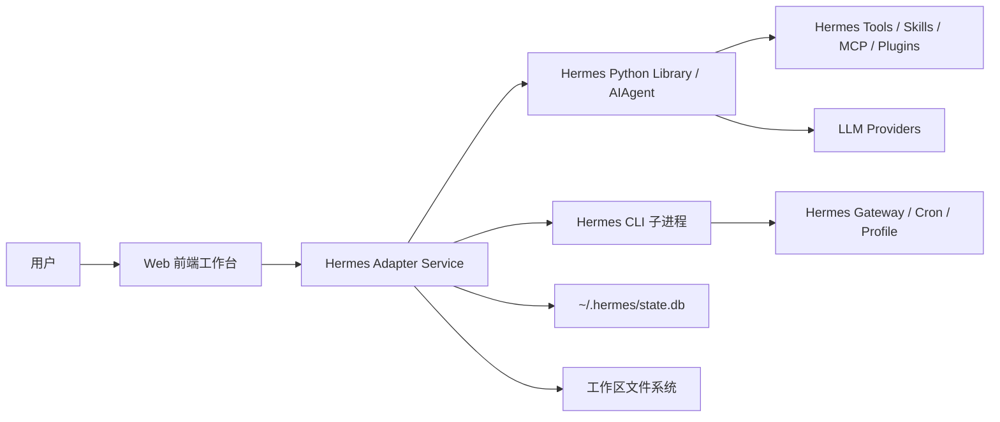

# Hermes 前端工作台开发文档

## 1. 产品定位

本产品不是重新实现一个 Agent 内核，而是作为开源 Hermes Agent 的 Web 前端和工作台，让用户在工作中用更可视化、更稳定的方式调用 Hermes。

产品应承担：

- 任务入口：用聊天式界面发起办公、研究、文件、自动化任务。
- Hermes 前端：展示 Hermes 的会话、工具调用、技能、模型、记忆、产物。
- 工作流控制台：管理任务进度、后台任务、文件产物、权限确认、外部授权。
- 工作资料中心：沉淀项目、文件、任务记录、常用 prompt 和自动化。

Hermes 负责：

- Agent 编排。
- 模型调用。
- 工具调用。
- 技能系统。
- 记忆和会话。
- Cron/后台任务。
- MCP/插件/终端等能力。

本产品负责：

- Web 交互体验。
- 任务可视化。
- 文件和产物预览。
- 工作区管理。
- Hermes API/CLI/Python Library 适配。
- 企业/个人使用场景下的安全边界。

## 2. 事实基础

根据 Hermes Agent 官方仓库与文档：

- Hermes 是 Nous Research 开源的 self-improving AI Agent，支持记忆、技能自进化、跨会话搜索、工具调用、后台任务和多平台 gateway。
- Hermes 主要入口包括 CLI/TUI、Messaging Gateway、Cron、ACP、Dashboard。
- Hermes 支持作为 Python Library 嵌入，核心类为 `AIAgent`。
- Hermes 的 session 存储在 SQLite 状态库中，并支持 FTS5 全文搜索。
- Hermes 有工具注册系统、技能系统、插件系统、MCP 集成、配置管理和 profile 隔离。
- 官方 `hermes dashboard` 更偏配置、API Key、session 管理，不等于一个完整的办公 Agent 工作台。

结论：推荐采用“Web 前端 + Hermes Adapter Service”的架构，而不是直接改 Hermes CLI 或只包一层终端。

## 3. 推荐架构



### 3.1 前端

建议技术栈：

- React + TypeScript。
- TanStack Query 管理服务端状态。
- Zustand 管理当前 UI 状态。
- SSE 或 WebSocket 接收任务事件。
- Monaco Editor 展示代码。
- PDF.js / docx-preview / xlsx 预览产物。

### 3.2 Hermes Adapter Service

建议使用 Python FastAPI，原因是 Hermes 官方支持 Python Library 嵌入，减少跨语言桥接成本。

职责：

- 封装 Hermes `AIAgent`。
- 管理 Web 任务与 Hermes session 的映射。
- 把 Hermes 输出转换成前端事件。
- 读取 Hermes session、skills、models、config。
- 处理文件上传、产物索引、预览转换。
- 做权限和安全控制。

### 3.3 Hermes 接入方式

优先级建议：

1. Python Library 接入：主路径，适合可控、可扩展、可做事件化。
2. CLI 子进程接入：MVP 或兜底方案，调用 `hermes chat --quiet -q "..."`。
3. Hermes Dashboard/API 复用：只用于配置页或参考，不作为主任务执行接口。
4. Gateway 接入：适合以后把 Web 与 Telegram/Slack/飞书等多渠道打通。

## 4. 核心使用场景

### 4.1 日常办公任务

用户在 Web 输入：

- “帮我整理这个文件夹。”
- “读取这个 Excel，输出销售问题和建议。”
- “把这个文档改成汇报版。”
- “根据这些资料生成 PPT 大纲。”

系统流程：

1. 前端创建任务。
2. Adapter 创建 Hermes session。
3. Hermes 执行工具/技能。
4. 前端实时展示思考、工具调用、待办、产物。
5. 任务完成后沉淀到项目。

### 4.2 工作区项目管理

用户按项目组织任务：

- 工作区：工作、客户、研究、个人。
- 项目：具体客户/主题。
- 任务：一次对话或一次自动化。
- 产物：Hermes 生成的 docx、xlsx、pdf、pptx、md、代码等。

### 4.3 Hermes 技能工作台

用户可以在 Web 中：

- 查看已安装技能。
- 启用/禁用技能。
- 查看技能说明。
- 触发技能命令。
- 上传或导入技能。
- 查看技能运行记录。

### 4.4 长任务和后台任务

Hermes 支持 background task 和 cron，本产品需要可视化：

- 当前运行中的后台任务。
- 任务日志。
- 完成通知。
- 失败重试。
- 定时任务列表。

### 4.5 外部授权与安全确认

当 Hermes 需要执行高风险操作时，Web 需要展示确认：

- 终端命令审批。
- 文件删除/覆盖确认。
- 外部服务授权。
- 工具/技能权限说明。
- 任务中断和继续。

## 5. 页面结构

### 5.1 主工作台

三栏布局：

- 左侧：工作区、项目、任务、技能入口、设置。
- 中间：Hermes 会话流、用户输入、Agent 输出、工具调用。
- 右侧：待办、后台任务、产物、参考信息、技能调用。

### 5.2 新建任务页

内容：

- 标题：`More Than Coding` 或自定义品牌。
- 常用任务模板。
- 多行输入框。
- 工作区选择。
- Hermes profile 选择。
- 模型选择。
- 工具集选择。
- 附件上传。

### 5.3 任务详情页

展示：

- 用户消息。
- Hermes 回复。
- 工具调用流。
- 命令执行记录。
- Agent 状态。
- 任务耗时。
- 产物卡片。
- 重新生成/停止/继续。

### 5.4 技能页

映射 Hermes skills：

- 已安装技能。
- 可安装技能。
- 技能详情。
- 技能权限。
- 技能启用状态。
- 技能调用入口。

### 5.5 设置页

映射 Hermes 配置：

- Profile 管理。
- 模型/Provider。
- Toolsets。
- MCP servers。
- Plugins。
- Gateway。
- Cron。
- 安全策略。
- 工作目录 allowlist。

## 6. Hermes Adapter API 草案

### 6.1 任务

```http
POST /api/tasks
GET /api/tasks
GET /api/tasks/:taskId
POST /api/tasks/:taskId/messages
POST /api/tasks/:taskId/stop
POST /api/tasks/:taskId/resume
POST /api/tasks/:taskId/retry
GET /api/tasks/:taskId/events
```

创建任务请求：

```ts
type CreateTaskRequest = {
  workspaceId: string
  profile: string
  title?: string
  initialMessage?: string
  model?: string
  provider?: string
  toolsets?: string[]
  skills?: string[]
  attachments?: string[]
}
```

### 6.2 Hermes Profile

```http
GET /api/hermes/profiles
POST /api/hermes/profiles
POST /api/hermes/profiles/:name/use
GET /api/hermes/profiles/:name/status
```

### 6.3 模型与 Provider

```http
GET /api/hermes/models
GET /api/hermes/providers
POST /api/hermes/model
POST /api/hermes/auth
```

### 6.4 技能

```http
GET /api/hermes/skills
GET /api/hermes/skills/:name
POST /api/hermes/skills/:name/enable
POST /api/hermes/skills/:name/disable
POST /api/hermes/skills/install
POST /api/hermes/skills/:name/run
```

### 6.5 文件与产物

```http
POST /api/workspaces/:id/files
GET /api/tasks/:taskId/artifacts
GET /api/artifacts/:artifactId/preview
GET /api/artifacts/:artifactId/download
DELETE /api/artifacts/:artifactId
```

### 6.6 定时任务

```http
GET /api/hermes/cron
POST /api/hermes/cron
POST /api/hermes/cron/:jobId/pause
POST /api/hermes/cron/:jobId/resume
DELETE /api/hermes/cron/:jobId
```

## 7. 任务事件协议

前端通过 SSE 或 WebSocket 订阅：

```ts
type HermesTaskEvent =
  | { type: 'task.started'; taskId: string }
  | { type: 'message.delta'; taskId: string; messageId: string; text: string }
  | { type: 'message.completed'; taskId: string; messageId: string }
  | { type: 'thinking.started'; taskId: string }
  | { type: 'tool.started'; taskId: string; toolName: string; preview?: string }
  | { type: 'tool.output'; taskId: string; toolName: string; output: string }
  | { type: 'tool.completed'; taskId: string; toolName: string; durationMs?: number }
  | { type: 'tool.failed'; taskId: string; toolName: string; error: string }
  | { type: 'approval.required'; taskId: string; approval: ApprovalRequest }
  | { type: 'artifact.created'; taskId: string; artifact: Artifact }
  | { type: 'background.started'; taskId: string; backgroundTaskId: string }
  | { type: 'background.completed'; taskId: string; backgroundTaskId: string; result: string }
  | { type: 'task.completed'; taskId: string; durationMs: number }
  | { type: 'task.failed'; taskId: string; error: string }
```

## 8. 数据模型

### Task

```ts
type Task = {
  id: string
  hermesSessionId?: string
  workspaceId: string
  profile: string
  title: string
  status: 'idle' | 'running' | 'waiting_approval' | 'completed' | 'failed' | 'stopped'
  model?: string
  provider?: string
  toolsets: string[]
  skills: string[]
  createdAt: string
  updatedAt: string
}
```

### Message

```ts
type Message = {
  id: string
  taskId: string
  hermesMessageId?: string
  role: 'user' | 'assistant' | 'tool' | 'system'
  content: string
  metadata?: Record<string, unknown>
  createdAt: string
}
```

### Artifact

```ts
type Artifact = {
  id: string
  taskId: string
  name: string
  path: string
  mimeType: string
  type: 'docx' | 'pdf' | 'pptx' | 'xlsx' | 'csv' | 'image' | 'code' | 'other'
  size: number
  previewStatus: 'pending' | 'ready' | 'failed'
  createdAt: string
}
```

### ApprovalRequest

```ts
type ApprovalRequest = {
  id: string
  taskId: string
  kind: 'command' | 'file_operation' | 'external_auth' | 'tool_permission' | 'custom'
  title: string
  description: string
  riskLevel: 'low' | 'medium' | 'high'
  payload: Record<string, unknown>
  options: Array<{
    id: string
    label: string
    description?: string
  }>
}
```

## 9. Hermes Adapter 实现建议

### 9.1 MVP：CLI 子进程方案

优点：

- 最快落地。
- 不需要改 Hermes 内部代码。
- 能快速验证 UI 和工作流。

实现：

```bash
hermes chat --quiet --source web-frontend -q "用户输入"
```

限制：

- 流式输出和工具事件较难结构化。
- 会话恢复、审批、工具细节需要额外解析。
- 并发和资源管理较弱。

适合第一周原型。

### 9.2 推荐：Python Library 方案

优点：

- 能直接使用 `AIAgent`。
- 易于和 FastAPI 集成。
- 易于维护 task/session 映射。
- 后续可以加事件回调、审批、产物扫描。

伪代码：

```python
from fastapi import FastAPI
from pydantic import BaseModel
from run_agent import AIAgent

app = FastAPI()

class ChatRequest(BaseModel):
    task_id: str
    message: str
    model: str | None = None
    toolsets: list[str] | None = None
    skills: list[str] | None = None

@app.post("/api/tasks/{task_id}/messages")
async def send_message(task_id: str, request: ChatRequest):
    agent = AIAgent(
        model=request.model,
        enabled_toolsets=request.toolsets,
        quiet_mode=True,
    )
    result = agent.run_conversation(
        user_message=request.message,
        task_id=task_id,
    )
    return {
        "final_response": result["final_response"],
        "messages": result["messages"],
        "task_id": result["task_id"],
    }
```

注意：

- 每个并发任务创建独立 `AIAgent` 实例。
- 不要在多线程共享同一个 agent。
- 对简单问答限制 `max_iterations`，防止 runaway tool loop。
- 工作场景不要默认关闭 memory 和 context files，除非做临时无状态任务。

### 9.3 进阶：事件化 Adapter

为匹配录屏中的体验，需要把 Hermes 的可观察执行过程事件化：

- LLM streaming -> `message.delta`
- 工具开始 -> `tool.started`
- 工具输出 -> `tool.output`
- 工具结束 -> `tool.completed`
- 危险命令 -> `approval.required`
- 文件生成 -> `artifact.created`

若 Hermes 当前公开 API 没有完全暴露这些事件，可以在 Adapter 层做两步：

1. 先解析 `result["messages"]` 和日志，做非实时展示。
2. 再向 Hermes 增加 callback/event sink 适配，做实时推送。

## 10. 安全设计

Hermes 具备终端、文件、网络、MCP、外部平台等能力，Web 化后必须加强边界。

建议：

- 每个工作用途使用单独 Hermes profile，例如 `work`。
- Web 只允许访问配置过的 workspace allowlist。
- 高风险命令必须走审批。
- 文件删除、覆盖、移动需要确认。
- 外部 token 只存在 Hermes/后端，不下发前端。
- 前端只展示脱敏后的命令、路径、错误。
- Adapter 记录审计日志：谁、何时、在哪个 workspace、让 Hermes 做了什么。
- 默认不开放公网，仅本机或内网访问。

## 11. MVP 路线

### 第一阶段：可用原型

- Web 三栏界面。
- 创建任务。
- 通过 CLI 子进程或 Python Library 调 Hermes。
- 展示最终回复。
- 保存任务历史。
- 文件上传到工作区。
- 产物扫描和下载。

### 第二阶段：工作台化

- SSE/WebSocket 任务事件。
- 工具调用展示。
- 右侧待办和产物。
- 技能列表。
- 模型/Profile 选择。
- 文件预览。
- 中断/继续/重试。

### 第三阶段：深度 Hermes 集成

- Hermes session 双向同步。
- 技能安装和管理。
- Cron 可视化。
- Gateway 状态管理。
- MCP 配置管理。
- 命令审批 UI。
- 多 profile 隔离。

### 第四阶段：工作自动化

- 常用工作流模板。
- 定时日报/周报。
- 飞书/邮件/表格/云文档集成。
- 团队共享任务。
- 权限和审计后台。

## 12. 开发优先级

最高优先级：

- Hermes Adapter Service。
- 任务会话模型。
- 消息发送与结果展示。
- 工作区文件管理。
- 产物识别。

第二优先级：

- 流式事件。
- 工具调用视图。
- 技能页。
- 文件预览。
- 停止/继续/重试。

第三优先级：

- Cron。
- Gateway。
- MCP/Plugins。
- 外部授权。
- 团队协作。

## 13. 验收标准

- 用户能在 Web 中选择 Hermes profile 并创建任务。
- 用户输入任务后，后端能调用 Hermes 并返回结果。
- 任务记录能持久化，刷新页面后仍可查看。
- Hermes 生成的文件能被识别为产物。
- 用户能下载或预览产物。
- 用户能查看当前使用的模型、技能、工具集。
- 后端能停止运行中的任务。
- 高风险操作能弹出前端审批。
- 所有 Hermes token/API key 不会出现在前端响应中。

## 14. 参考资料

- Hermes Agent GitHub: https://github.com/NousResearch/hermes-agent
- Hermes Architecture: https://hermes-agent.nousresearch.com/docs/developer-guide/architecture
- Hermes Python Library: https://hermes-agent.nousresearch.com/docs/guides/python-library
- Hermes CLI Commands: https://hermes-agent.nousresearch.com/docs/reference/cli-commands/
- Hermes Messaging Gateway: https://hermes-agent.nousresearch.com/docs/user-guide/messaging
- Hermes Security: https://hermes-agent.nousresearch.com/docs/user-guide/security
