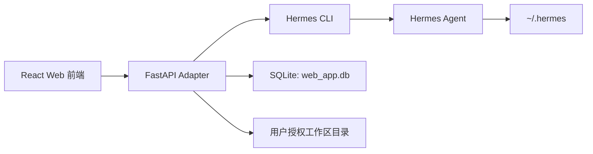

# Hermes 前端开发缺口与 MVP 计划

## 1. 结论

可以开发，而且你本机已经具备第一版开发条件：

- 已安装 Hermes：`/Users/lucas/.local/bin/hermes`
- 当前版本：`Hermes Agent v0.9.0 (2026.4.13)`
- 可用入口：`hermes chat -q`、`hermes sessions`、`hermes skills`、`hermes dashboard` 等
- Node 与 npm 可用，可开发 Web 前端

建议第一版目标：做一个名为 `Hermes Cowork` 的本地 Web 工作台，能创建任务、调用 Hermes、展示回复、保存任务历史、管理授权工作区文件和识别产物。

重要原则：不要在前端或 Adapter 中重新实现文件整理、文档生成、飞书操作、数据分析、网页调研等能力。这些能力应继续由 Hermes、Hermes skills、MCP、外部工具和模型完成。Hermes Cowork 只做“连接、展示、控制、授权、沉淀”。

## 2. 当前还缺什么

### 2.1 产品决策缺口

这些不影响开始开发，但需要尽快定：

- 产品名称：`Hermes Cowork`。
- 使用范围：第一版只本机使用；未来可安装到其他 Mac 电脑。
- 默认工作目录：管理用户授权给 Hermes 的文件夹，而不是固定扫描整个电脑。
- 主要方向：不按场景重做能力，优先打磨 Hermes 对接、任务控制、授权工作区、产物沉淀。
- 是否保留录屏里的三栏布局：建议保留，因为非常适合 Hermes 的任务可视化。

### 2.2 技术缺口

第一版可以用 CLI 适配，但后续要补：

- Hermes Python Library 的稳定调用方式。
- Hermes 运行过程事件流：工具开始、工具输出、工具完成、审批请求。
- Hermes session 与 Web task 的映射关系。
- 产物识别规则：Hermes 生成的文件如何归属到某个任务。
- 技能列表读取方式：先用 CLI，后续用更结构化 API。
- 中断任务能力：CLI 子进程可 kill，Python Library 需要 cooperative cancel。

### 2.3 安全缺口

必须补：

- 工作目录 allowlist，避免 Web 前端越权读写整个电脑。
- 高风险命令审批，例如删除、覆盖、大规模移动文件。
- 外部 token 不下发前端。
- Hermes stdout/stderr 日志脱敏。
- 本地服务默认只监听 `127.0.0.1`。

### 2.4 体验缺口

第一版可先简化，后续补：

- 流式输出。
- 工具调用折叠视图。
- 右侧待办自动生成。
- 文件预览。
- 技能市场/技能详情。
- cron/后台任务可视化。

## 3. MVP 范围

### 必做

- 本地 Web 前端。
- 后端 Adapter Service。
- 新建任务。
- 调用 `hermes chat --quiet -q`。
- 保存任务、消息、Hermes session id。
- 展示任务历史。
- 支持选择授权工作区。
- 支持上传附件到授权工作区。
- 任务完成后扫描新增文件并生成产物列表。
- 支持下载产物。

### 暂不做

- 完整 Hermes Dashboard 替代。
- 多用户团队权限。
- 完整技能市场。
- 高保真 docx/pptx 在线预览。
- 复杂任务实时工具事件。
- Cron/Gateway 管理。

## 4. 推荐第一版架构



第一版不直接修改 Hermes 源码，降低风险。

## 5. 第一版目录结构

```text
hermes-workbench/
  apps/
    web/
      src/
        components/
        pages/
        api/
        store/
    api/
      app/
        main.py
        config.py
        db.py
        models.py
        routers/
          tasks.py
          workspaces.py
          artifacts.py
          hermes.py
        services/
          hermes_cli.py
          artifact_scanner.py
          workspace_guard.py
  workspaces/
  data/
    web_app.db
  README.md
```

## 6. 关键实现策略

### 6.1 调 Hermes

第一版：

```bash
hermes chat --quiet --source web-frontend -q "<用户输入>"
```

可选参数：

```bash
--model <model>
--provider <provider>
--skills <skills>
--toolsets <toolsets>
--resume <session_id>
--max-turns <n>
```

### 6.2 会话映射

Web task 保存：

- `task_id`
- `hermes_session_id`
- `workspace_id`
- `title`
- `status`
- `created_at`
- `updated_at`

CLI 输出中如果包含 session 信息，解析后写入 `hermes_session_id`。

### 6.3 产物识别

任务开始前记录 workspace 文件快照，任务完成后再次扫描，新增或修改的文件归为本次任务产物。

支持类型：

- `docx`
- `pdf`
- `pptx`
- `xlsx`
- `csv`
- `md`
- `html`
- `png/jpg`
- `json`

### 6.4 工作区安全

所有文件 API 必须先做路径校验：

- 真实路径必须在 allowlist 内。
- 禁止 `..` 越权。
- 默认工作区可先放在项目内 `workspaces/default`，后续支持用户在界面中添加“授权给 Hermes 的文件夹”。
- 用户添加目录时需要显式确认，并写入本地配置。
- Adapter 只能把这些授权目录传给 Hermes 作为上下文或工作目录。

## 7. 开发里程碑

### Milestone 1：能跑通 Hermes

- 初始化前后端项目。
- FastAPI 提供 `/api/tasks`。
- 前端创建任务并发送消息。
- 后端调用 Hermes CLI。
- 前端展示最终回复。
- 支持配置本机 Hermes 命令路径。
- 支持添加一个授权工作区目录。

### Milestone 2：成为工作台

- 左侧任务列表。
- 三栏布局。
- 任务历史持久化。
- 右侧产物区。
- 工作区文件上传。
- 产物下载。

### Milestone 3：更像录屏产品

- 流式状态。
- 工具调用折叠展示。
- 技能页。
- 模型/Profile 选择。
- 文件预览。
- 人机审批弹窗。

### Milestone 4：深度 Hermes

- Python Library 集成。
- Hermes session 浏览。
- Cron 管理。
- Gateway 管理。
- MCP/Plugins 配置。
- 审计日志。

## 8. 开发前需要你确认的最少信息

真正开始写产品代码前，最少只需要确认 4 件事：

1. 产品名字：已定为 `Hermes Cowork`。
2. 使用范围：第一版只本机使用，未来可安装到其他 Mac。
3. 默认工作区目录：管理用户授权给 Hermes 的文件夹。
4. 第一版优先方向：不重做具体能力，优先打通 Hermes 对接和本地工作台体验。

如果不确认，也可以先按默认值启动：

- 名称：Hermes Cowork
- 访问：仅本机 `127.0.0.1`
- 工作区：项目内 `workspaces/default`，并支持添加授权目录
- 优先场景：自然语言任务 + Hermes 对接 + 文件产物
