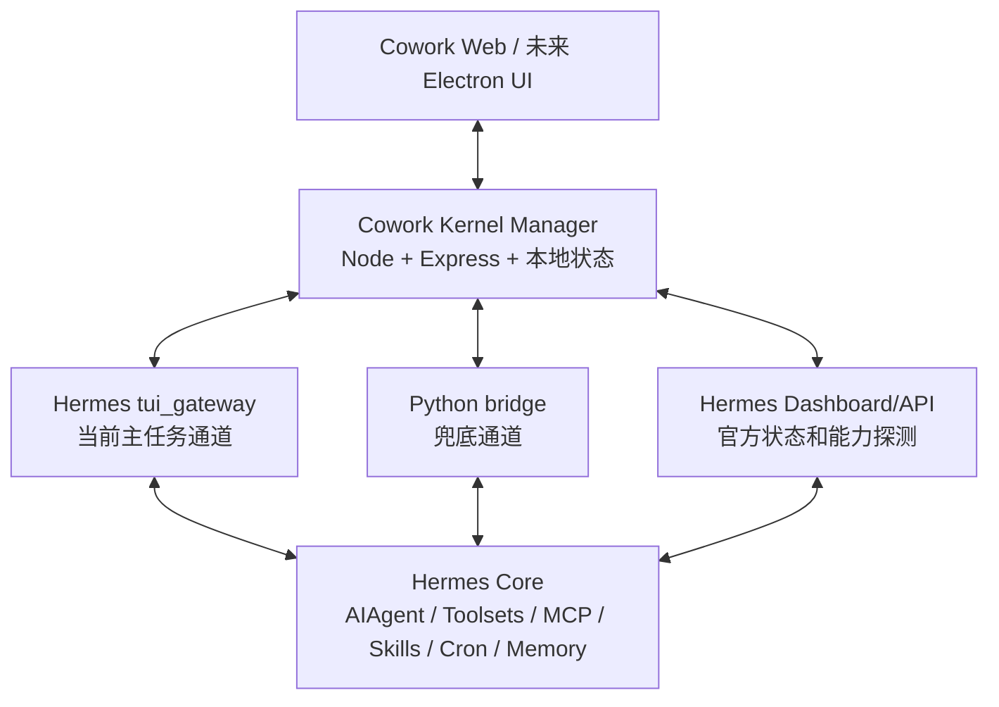

# Codex 开发手册

阅读对象：后续接手 Hermes Cowork 的 Codex。

更新日期：2026-05-04。

## 1. 先读结论

当前主开发目录：

```bash
/Users/lucas/.hermes/hermes-agent/cowork
```

Cowork 当前阶段：

```text
Hermes 能力释放规划阶段
```

开发原则：

- Cowork 是 Hermes 的本机客户端和可视化工作台，不是第二套 Agent。
- 不重写 Hermes Agent loop。
- 不用临时前端状态冒充后端能力。
- 不把工具日志伪装成任务计划。
- 工具、MCP、Skill 统一归入技能页 / 能力中心。
- 多入口必须复用同一套状态和 API。
- MCP 区域必须优先展示 Hermes 原生能力覆盖状态。使用 `/api/hermes/mcp/native-capabilities` 读取本机 Hermes CLI help 与 `config.yaml`，不要用静态文案伪装官方生态。
- MCP OAuth 重新授权已接 `POST /api/hermes/mcp/:serverId/login`，只对 `auth=oauth` 的 HTTP/SSE 服务显示入口；`hermes mcp configure` 需要 TTY，不能包装成普通 Web 表单。
- Hermes 官方命令不能直接等同于 Cowork 产品功能。只有明确了用户场景、Cowork 入口、后端写入/执行路径和验证方式，才允许放进主界面；否则写进 `hermes-capability-baseline.md` 的“未产品化能力清单”，客户端化前统一处理。

## 2. 每次开发的固定流程

1. 先读本手册。
2. 如果任务涉及 Hermes 官方能力，查 [`hermes-capability-baseline.md`](hermes-capability-baseline.md)。
3. 查本机 Hermes 代码、CLI help、Dashboard/API、测试或 release note，确认当前固定内核真实具备什么。
4. 找 Cowork 当前入口和 API。
5. 更新覆盖矩阵或产品说明中的结论。
6. 实现 UI/后端。
7. 跑真实验证，不用假数据证明功能完成。

判断一个功能是否完成：

```text
用户入口存在 + Cowork API 存在 + Hermes 后端能力真实可用 + 有验证命令或测试
```

四项缺一，不能算完成。

## 3. 架构边界



开发判断：

- 当前普通任务主链路仍是 `tui_gateway`。
- Python bridge 只做兜底和特殊能力接入。
- 官方 Dashboard/API 是能力探测和部分结构化状态入口。
- 官方 Runs API 还在并行评估，不能直接替换主链路。

## 4. 当前优先级

优先级 1：

- API Server / Runs API 能力评估：确认 runs、events、stop、approval、clarification、context usage 是否能覆盖当前 gateway bridge。
- Session 全量前端化：全文浏览、搜索、删除、重命名、来源平台、模型、工具调用历史、继续对话。
- Skills / MCP / Toolsets 统一技能页能力中心：特别注意 Hermes 原生 MCP 和 Skill 的市场、生态、安装、启停、权限和工具级能力。
- Cron 表单重做：周期选择、workdir、Skill 分类多选、运行产物、delivery target。

优先级 2：

- 模型系统：credential pools、fallback providers、auxiliary providers、provider routing。
- 安全系统：approval modes、永久 allowlist、checkpoint / rollback、YOLO 风险显示。
- Context 系统：context files、context references、附件、批注、工作区文件和压缩策略统一。

优先级 3：

- Electron 客户端与 Kernel Manager。
- Hermes 固定内核目录融合和回档机制。
- 语音输入、TTS 输出、图片视觉理解、浏览器自动化过程可视化。
- 手机端通过云端加密中转连接 Mac 主机。

## 5. 常用命令

启动：

```bash
cd /Users/lucas/.hermes/hermes-agent/cowork
npm run dev
```

文档或轻量 UI 变更：

```bash
git diff --check
```

前端/后端 TypeScript 变更：

```bash
npm run -s typecheck
npm run -s build
```

Hermes 消息连接：

```bash
npm run -s test:hermes-connection
npm run -s smoke:hermes-real
```

任务拆解展示：

```bash
npm run -s test:task-decomposition
```

官方 Hermes API 探测：

```bash
curl -s http://127.0.0.1:8787/api/hermes/official-api | python3 -m json.tool
```

## 6. 深入查证入口

- Hermes 能力基线：[`hermes-capability-baseline.md`](hermes-capability-baseline.md)
- 产品决策：[`product-decisions.md`](product-decisions.md)
- 工程细节：[`engineering-reference.md`](engineering-reference.md)

不要默认全文加载这些附录。只有当任务需要查能力、查产品原则或查实现细节时再打开。

## 7. 提交要求

开发完成后：

- 先确认 `git status --short`。
- 只提交本轮相关改动。
- 文档变更至少跑 `git diff --check`。
- 代码变更按影响范围跑 typecheck、build 和相关测试。
- 推送到当前 GitHub 远端后再告诉用户。
