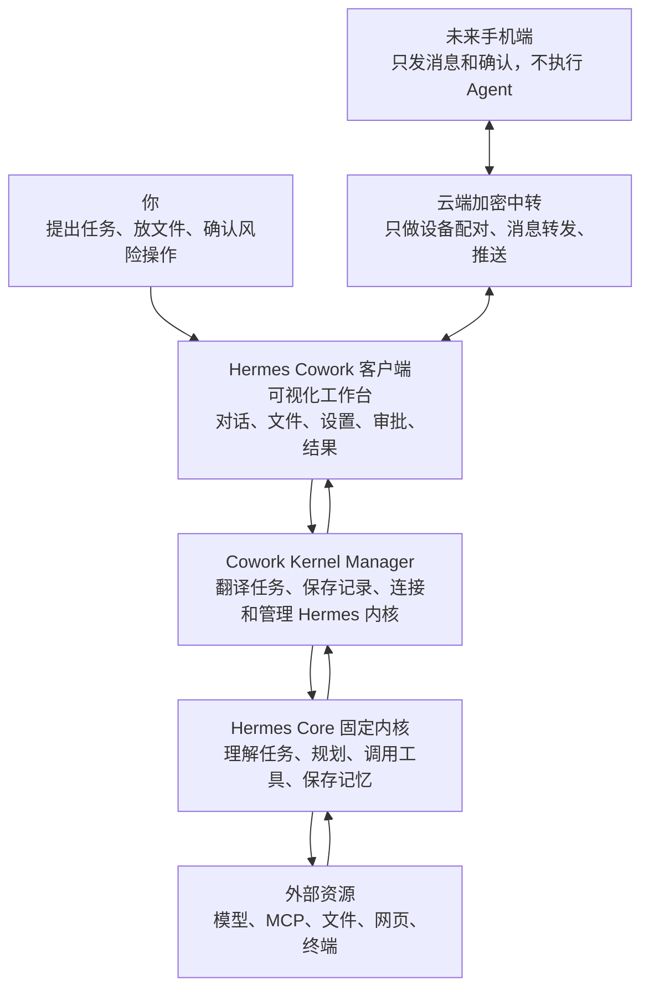
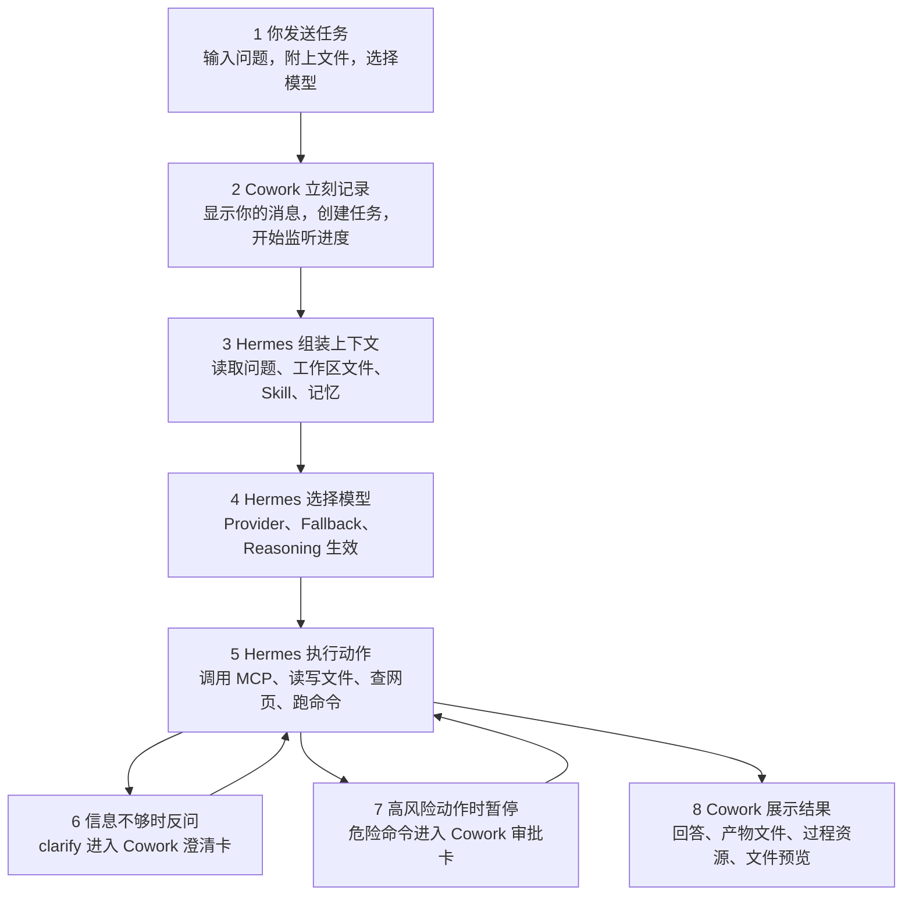
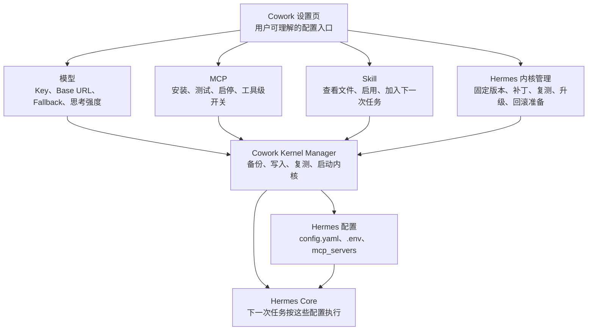

# Hermes 能力基线与覆盖矩阵
> 记录 2026-05-03 读取的 Hermes 官方能力、本机固定内核基线、Cowork 覆盖矩阵和长期能力释放路线。
> 主入口见 [`../Hermes_Cowork_开发文档.md`](../Hermes_Cowork_开发文档.md)。

## 3.0 Hermes 官网能力基线（2026-05-03）

本节是 Cowork 后续开发的能力基线。每次开发 Hermes 相关能力前，先按这里确认“官网说 Hermes 已经有什么”，再看本机 Hermes 代码、CLI help、Dashboard/API、测试和 release note 是否具备稳定入口，最后才决定 Cowork 要做成什么 UI。实际产品覆盖以“当前固定 Hermes 内核中可执行、可验证的官方能力”为准，不局限于官网当前页面描述。

读取来源：

- Hermes Architecture：`https://hermes-agent.nousresearch.com/docs/developer-guide/architecture`
- Agent Loop Internals：`https://hermes-agent.nousresearch.com/docs/developer-guide/agent-loop/`
- API Server：`https://hermes-agent.nousresearch.com/docs/user-guide/features/api-server`
- Context Files：`https://hermes-agent.nousresearch.com/docs/user-guide/features/context-files`
- Context References：`https://hermes-agent.nousresearch.com/docs/user-guide/features/context-references`
- AI Providers：`https://hermes-agent.nousresearch.com/docs/integrations/providers`
- Fallback Providers：`https://hermes-agent.nousresearch.com/docs/user-guide/features/fallback-providers/`
- Credential Pools：`https://hermes-agent.nousresearch.com/docs/user-guide/features/credential-pools/`
- Tools & Toolsets：`https://hermes-agent.nousresearch.com/docs/user-guide/features/tools`
- Skills System：`https://hermes-agent.nousresearch.com/docs/user-guide/features/skills`
- MCP：`https://hermes-agent.nousresearch.com/docs/user-guide/features/mcp`
- Scheduled Tasks：`https://hermes-agent.nousresearch.com/docs/user-guide/features/cron`
- Gateway Internals：`https://hermes-agent.nousresearch.com/docs/developer-guide/gateway-internals`
- Browser Automation：`https://hermes-agent.nousresearch.com/docs/user-guide/features/browser`
- Voice Mode：`https://hermes-agent.nousresearch.com/docs/user-guide/features/voice-mode`
- Security：`https://hermes-agent.nousresearch.com/docs/user-guide/security/`
- Checkpoints and Rollback：`https://hermes-agent.nousresearch.com/docs/user-guide/checkpoints-and-rollback`

本机 Hermes 版本基线：

- 本机源码目录：`/Users/lucas/.hermes/hermes-agent`
- 当前检测版本：`v2026.4.23-927-g58a6171bf-dirty`
- 当前 commit：`58a6171bfb0ba2ca10b1b08854511736cd77a623`
- 当前分支状态：本机 `main` 落后 upstream，且 Hermes 自身有未提交改动。后续融合内核前，必须先把这个版本作为 Cowork 固定内核快照处理，不能直接拉 upstream 覆盖。
- Cowork 仓库基线备份：`baselines/hermes-core/v2026.4.23-927-g58a6171bf`
- 基线 manifest：`baselines/hermes-core/BASELINE_MANIFEST.md`
- Cowork 主开发目录：`/Users/lucas/.hermes/hermes-agent/cowork`

能力树：

| 类别 | Hermes 官方能力 | Cowork 当前状态 | 产品判断 |
| --- | --- | --- | --- |
| 入口与运行时 | CLI、Gateway、API Server、ACP、Batch Runner、Python Library | 已有 gateway 优先、bridge 回退、Dashboard adapter；已新增官方 API Server / Runs API 源码与运行探测，尚未迁移主通道 | Cowork 是新的本机客户端入口，不能替代 Agent loop；Runs API 先做并行 smoke，确认审批/澄清/上下文事件覆盖后再决定迁移范围。 |
| Agent Loop | `AIAgent` 负责 prompt、provider、模型调用、工具执行、fallback、history、context、memory | 已把事件归类成正文、过程、审批、澄清、产物；仍有部分事件靠归一化推断 | Cowork 只展示 Agent loop，不重写 Agent loop。过程 UI 必须来自 Hermes 事件或可解释的归一化，不做假步骤。 |
| Prompt / Context | `SOUL.md`、`MEMORY.md`、`USER.md`、`.hermes.md`、`AGENTS.md`、`CLAUDE.md`、`.cursorrules`、`@file`、`@folder`、`@diff`、`@url` | 工作区、附件、文件批注、上下文资源已接入；压缩和 context files 管理仍不完整 | 工作区不是聊天分类，而是授权上下文边界。附件、文件引用和批注都应落到 Hermes context 能力。 |
| 模型与 Provider | 主模型、Provider Routing、Fallback Providers、Credential Pools、Auxiliary Providers | 已做模型配置、Key 重填、Fallback、reasoning；Credential Pools 和 Auxiliary Providers 还未完整产品化 | 模型页不能只是模型列表，要覆盖 Key 池、备用路线、辅助任务模型、失败修复和思考强度。 |
| 工具与 Toolsets | web、terminal、file、browser、vision、image、tts、todo、memory、session_search、cronjob、delegate_task、execute_code 等 | 技能页已合并 Skill/MCP/Toolsets；内置工具级开关、工具失败统计未完整覆盖 | 技能页是“能力中心”，工具、MCP、Skill 都在这里统一管理。 |
| Skills | 本地目录、外部目录、Hub、Agent 自动创建/修改 Skill | 已支持清单、启停、上传、文件树、加入下一次任务；Agent 自动沉淀 Skill 未完整产品化 | Skill 是工作方法系统，不是普通插件列表；后续要做分类、依赖、运行前预载和自动沉淀。 |
| MCP | stdio / HTTP server、自动发现、工具前缀、server filtering、Hermes 自身作为 MCP server | 已覆盖服务、市场、测试、启停、工具 include/exclude、Hermes MCP serve；OAuth/远程 MCP 权限仍需深化 | MCP 页要表达“外部能力管理”，而不是只展示配置。 |
| Cron / Automation | 自然语言任务、cron 表达式、skills、workdir、delivery target、pause/resume/edit/run/remove | 已接真实 Hermes Cron；周期选择器和 Skill 分类选择器已规划/部分落地；投递渠道还未完整 | Cron 是 Agent task，不是系统定时器。任务说明必须自包含，运行产物和失败恢复要进入 UI。 |
| Gateway / Messaging / Mobile | 长驻 gateway、多平台消息入口、授权、session routing、slash command、cron tick、background maintenance | 当前只做本机 gateway；移动端和云端中转未实现 | 未来移动端走“云端加密中转 + Mac 主机执行”，云端不跑 Agent、不接触工作区文件。 |
| 媒体与浏览器 | Browser Automation、Vision、Image Generation、Voice Mode、Voice & TTS | 文件/图片预览和批注已做；视觉理解、浏览器过程可视化、语音/TTS 未完整 | 这些能力应优先调用 Hermes 工具，Cowork 做入口、权限、过程展示和产物卡。 |
| 安全、审批与回滚 | 危险命令审批、YOLO、smart approval、容器隔离、MCP credential filtering、context scanning、checkpoint/rollback | 审批卡已接；澄清卡已接；checkpoint/rollback、allowlist、YOLO 风险说明未完整 | 安全不是错误提示，而是一等 UI：审批、回滚、检查点、权限解释必须可操作。 |

当前已前端化的重点能力：

- 对话任务、继续对话、停止、SSE 流式事件。
- 模型配置、Key 重填、Fallback、MiMo/DeepSeek 等模型入口。
- MCP 服务管理、市场推荐、工具级 include/exclude、Hermes MCP serve。
- Skill 清单、详情、文件树、启停、上传、加入下一次任务。
- Hermes Cron 真实任务列表和基础操作。
- 工作区授权、附件、文件预览、文件批注、产物卡片。
- 审批卡和澄清卡的 UI/事件链路。
- Dashboard adapter 的只读能力：status、skills、toolsets、cron、sessions、config、env、model-info。

仍只在 Hermes 后端存在、Cowork 尚未完整前端化的能力：

- 官方 Runs API / API Server 的完整任务创建、事件、停止和结果协议。当前已能通过 `/api/hermes/official-api` 探测本机 Hermes 是否具备 `/v1/runs`、events、stop、jobs、responses、dashboard sessions/logs/toolsets 等能力，但还没有把这些协议作为 Cowork 主任务通道。
- Session 全量浏览、搜索、重命名、删除、来源平台、模型、工具调用历史和从原生 session 继续对话已部分前端化；官方 Dashboard session 元数据、官方全文搜索覆盖状态和搜索命中定位已接入只读合并层，更多写入动作还未完整产品化。
- Credential Pools、Auxiliary Providers、Provider OAuth 和更细的 provider routing。
- 内置工具集的工具级策略、工具失败率、耗时统计和使用量分析。
- Agent 自动创建/修改 Skill、Skill Hub/外部目录的完整安装治理。
- MCP OAuth、远程 HTTP MCP 权限说明、Hermes 作为 MCP server 的生产级管理。
- Cron delivery target、运行产物卡片、运行失败恢复和投递渠道。
- Browser Automation 的过程可视化、Vision/Image/TTS/Voice 的产品入口。
- Checkpoint / Rollback、永久 allowlist、YOLO 风险提示、容器隔离状态、context scanning 结果。

暂不进入当前产品规划的能力：

- Hermes 官方 Dashboard 自身的主题、插件和 UI 定制。
- 面向大众用户的多平台消息全量接入。Cowork 只保留未来“手机端加密中转到本机 Mac”的路线。
- 直接把 Hermes upstream 每次更新自动合并进 Cowork。当前策略是固定内核、按需吸收补丁、升级前自动复测。

## 3.1 Cowork 与 Hermes 对应架构图

Hermes Cowork 的产品边界必须按下面这组图理解：Cowork 是本机客户端和可视化工作台，Cowork 本机后端是 Kernel Manager，Hermes 当前版本是固定 Agent 内核。Cowork 不替代 Hermes Agent，而是把 Hermes 后端已经具备但原本隐藏在 CLI/TUI、Dashboard、配置文件、session、事件流里的能力，变成用户能看到、能确认、能复测、能继续操作的产品入口。

官网依据：

- Hermes 官网把 Hermes 定位为“会长期运行、能记住经验、能通过多平台入口工作的自主 Agent”，不是单个聊天 API：`https://hermes-agent.nousresearch.com/`
- Hermes 官方架构把系统分成入口层、`AIAgent`、提示词组装、模型选择、工具派发、Session 存储和工具后端：`https://hermes-agent.nousresearch.com/docs/developer-guide/architecture`
- Hermes 官方 API Server 文档说明 Hermes 已经有面向本机/远程控制的 structured API 和 runs/events/stop 类能力：`https://hermes-agent.nousresearch.com/docs/user-guide/features/api-server`
- Hermes MCP 文档说明 MCP 是外接工具服务器能力，Hermes 会在启动时发现并注册工具：`https://hermes-agent.nousresearch.com/docs/user-guide/features/mcp`
- Hermes 安全文档说明危险命令审批、人类确认、隔离和上下文文件扫描是后端安全模型的一部分：`https://hermes-agent.nousresearch.com/docs/user-guide/security`

下面不再使用一张“大而全”的图。那种图适合工程师追代码，但在 GitHub 上会被缩得很小，第一次看 AI Agent 架构时基本不可读。这里拆成三张小图，每张只回答一个问题。

### 3.1.1 总览图：Cowork 和 Hermes 各自负责什么



用一句话理解：

```text
你在 Cowork 里开车；Cowork 是方向盘、仪表盘和刹车；Kernel Manager 是发动机管理系统；Hermes Core 是自动驾驶内核；模型、MCP、浏览器、文件和终端是 Hermes 可以调用的动力和工具。
```

### 3.1.2 任务图：一次对话怎么跑完



这张图对应主界面：

- 对话区显示 `T1`、`T2`、`T8`。
- 对话过程流显示 `T3`、`T4`、`T5` 的可读摘要。
- 澄清卡显示 `T6`：当用户目标缺少关键输入、多个方案需要用户选择时，Hermes 暂停并等待 Cowork 回答。
- 审批卡显示 `T7`：当 Hermes 准备执行危险命令或需要人工批准的动作时，Cowork 必须给出明确允许/拒绝入口。
- 右侧工作区显示产物、上下文资源和文件预览。

### 3.1.3 配置图：模型、MCP、Skill、更新在哪里生效



这张图对应设置页：

- 模型、MCP、更新最终都要落到 Hermes 自己的配置或 runtime 状态，但写入必须经过 Cowork Kernel Manager 做备份、归一化和复测。
- Skill 更像“工作方法说明书”，会进入下一次任务的上下文。
- Cowork 不应该维护另一套假的模型、MCP 或 Skill 状态。

### 3.1.4 新手术语翻译表

| 官网或代码里的词 | 用人话理解 | Cowork 里应该对应什么 |
| --- | --- | --- |
| Entry Points | Hermes 可以从哪里被叫醒。CLI、Gateway、API、消息平台都是入口。 | Cowork 当前主要使用本机 Gateway/bridge，未来客户端也会成为入口。 |
| Gateway | 常驻通道。让 Hermes 不必每次都重新启动，可以持续接收任务和返回事件。 | Cowork 的实时流式输出、停止任务、审批回复都应该优先走 Gateway。 |
| AIAgent | Hermes 的大脑。它负责决定下一步想什么、用什么模型、调什么工具。 | Cowork 不重写它，只展示它的过程和结果。 |
| Prompt Builder | 任务资料打包器。把系统规则、用户问题、文件、Skill、记忆组装给模型。 | Cowork 的附件、工作区文件、Skill 预载都要进入这里。 |
| Provider Resolution | 模型调度器。决定这次用哪个模型、哪个供应商、哪个备用模型。 | Cowork 的模型设置、Key 重填、Fallback 和思考强度入口。 |
| Tool Dispatch | 工具派发器。Hermes 决定要读文件、跑命令、查网页、用浏览器或调 MCP 时经过这里。 | Cowork 的过程流、右侧资源、MCP 管理和工具调用展示。 |
| MCP | 外接工具插座。让 Hermes 使用 GitHub、数据库、文件系统、内部 API 等外部工具。 | 技能页 > MCP 服务、设置 > MCP、过程资源里的工具调用。 |
| Session Storage | 工作记忆和历史记录。保存对话、任务状态、检索索引和上下文。 | 左侧会话、继续对话、上下文用量、手动压缩。 |
| Context Compression | 长对话压缩。对话太长时，把历史压缩成可继续使用的摘要。 | 右侧上下文资源里的用量、压缩建议和手动压缩按钮。 |
| Skills | 工作方法说明书。告诉 Hermes 某类任务应该怎么做。 | 技能页、Skill 文件预览、加入下一次任务。 |
| Clarify | 反问机制。Hermes 认为任务信息不足或需要用户选择方案时，先问清楚再继续。 | 对话区澄清卡，可选项按钮和自由输入，回答后回到同一轮 Hermes 任务。 |
| Approval | 安全刹车。危险命令执行前要求用户确认。 | 对话区审批卡，必须能允许一次、本会话允许、总是允许或拒绝。 |
| Sandbox | 隔离房间。让命令和代码在受控环境中运行，降低误伤本机风险。 | 设置和任务过程里只展示用户能处理的安全状态，不展示大量原始日志。 |

### 3.1.5 用户操作与 Hermes 后端能力的对应关系

| 你在 Cowork 做什么 | Cowork 要做什么 | Hermes 背后发生什么 | 如果没做 UI 会怎样 |
| --- | --- | --- | --- |
| 发一句任务 | 立刻显示你的消息，创建 Hermes task，订阅流式事件 | Gateway/Agent 开始一次任务循环 | 用户会以为消息丢了，或者长时间空白 |
| 拖入 PPT、Excel、Word、图片 | 先放进输入框附件，再上传到授权工作区 | Prompt Builder 把文件路径作为上下文给 Agent | 文件会变成后台上传，用户无法告诉 AI 要怎么处理 |
| 选择模型或重填 Key | 写入 Hermes 配置或 `.env`，刷新模型状态 | Provider Resolution 选择供应商、模型和备用路线 | Cowork 显示一个模型，Hermes 实际用另一个模型 |
| 添加 MCP | 写入 `mcp_servers`，测试连接，显示工具列表 | Hermes 启动时发现 MCP 工具并注册到工具派发器 | 用户不知道这个 MCP 能干什么，也不知道是否可用 |
| 打开 Skill | 展示 `SKILL.md` 和子文件，可加入下一次任务 | Skill 内容进入 Prompt Builder 或 Hermes skill 系统 | 用户不知道 Skill 具体做什么，也无法确认是否被用到 |
| 查看任务过程 | 把工具、网页、文件、审批、产物分成可读过程 | AIAgent 按“思考、行动、观察、继续”循环执行 | 原始日志会刷屏，用户看不到 Agent 当前在做哪一步 |
| 回答反问 | 弹出澄清卡，把选择或文字答案发回 Hermes | Hermes 的 `clarify` 工具解除阻塞，继续同一轮任务 | 任务会一直等待或超时，用户不知道 AI 在等自己补充什么 |
| 确认风险命令 | 弹出审批卡，把结果发回 Hermes | Hermes 的 Approval 层决定继续、拒绝或超时失败 | 任务会卡住或失败，用户不知道需要自己确认 |
| 继续追问 | 找到同一个 Hermes session 或按规则新开 session | Session Storage 继续同一上下文，或用新模型开新会话 | 上下文会错位，旧模型和新模型会混用 |
| 查看/打开产物 | 显示文件卡片、右侧预览、本机打开、Finder 定位 | 文件工具或 MCP 在工作区生成真实文件 | 结果只是一段文字，用户找不到生成物 |

架构约束：

- 前端多个入口只能消费同一套 API，不允许各自拼静态清单。
- 写 Hermes 配置只能通过后端 Adapter 做备份、归一化和敏感信息遮蔽。
- UI 文案可以按场景重组，但状态含义必须来自同一份后端数据。
- 新增入口时，必须先确认它复用哪个 API、哪个状态字段、哪个后端归一化函数。
- Hermes 的新增能力进入 Cowork 时，先补“覆盖矩阵”，再写 UI。审批能力漏开发就是因为没有先做这一步。

## 3.2 Hermes 能力覆盖矩阵

这张表是 Cowork 防止漏能力的主索引。后续任何新功能，都要先判断它是在覆盖哪一类 Hermes 官方能力，再确认 Cowork 当前入口和验证方式。

| Hermes 官方能力 | Cowork 用户入口 | 当前覆盖状态 | 下一步产品化动作 | 验证方式 |
| --- | --- | --- | --- | --- |
| 入口与运行时：CLI、Gateway、API Server、ACP、Batch Runner、Python Library | 对话区、启动流程、设置 > 运行环境、未来客户端壳 | 部分覆盖。当前 gateway 优先、bridge 回退、Dashboard adapter 可读；`/api/hermes/official-api` 已能探测官方 API Server / Runs API 源码和运行状态，但尚未成为主通道 | 先做 official-api adapter 并行 smoke：用 `/v1/runs`、`/v1/runs/{run_id}/events`、`/v1/runs/{run_id}/stop` 复刻创建任务、流式事件、停止任务；确认审批/澄清事件是否足够，再决定迁移范围 | `npm run test:hermes-official-api`、`GET /api/hermes/official-api`、`GET /api/hermes/runtime`、`npm run smoke:hermes-real` |
| Agent Loop：`AIAgent` 组装 prompt、选择 provider、调用模型、执行工具、fallback、history、context、memory | 主对话流、运行过程、右侧任务拆解、审批卡、澄清卡、产物卡 | 部分覆盖。已做事件归类和 message parts；产品级 plan/todo/reflection 仍依赖 Hermes 暴露程度 | 建立 Hermes 事件语义表：正文、过程、工具、计划、澄清、审批、产物、错误；禁止把工具清单伪装成任务拆解 | fake gateway 事件测试、真实任务观察、`test:task-decomposition`、运行中 UI smoke |
| Prompt / Context：Context files、context references、`@file`、`@folder`、`@diff`、`@url`、记忆文件 | 工作区、附件、文件批注、右侧上下文与资源、输入框上下文 chip | 部分覆盖。工作区/附件/批注已写入 prompt；context files 管理、references 可视化和压缩策略仍不完整 | 把工作区文件、附件、批注、Hermes context references、手动压缩合并成一套上下文管理；新增 context 文件列表、大小/占比和移除入口 | 发送带附件/批注任务后检查 Hermes prompt；`GET /api/tasks/:id/context`；文件引用点击预览 |
| 模型与 Provider：主模型、Provider Routing、Fallback Providers、Credential Pools、Auxiliary Providers | 设置 > 模型、输入框模型菜单、模型失败修复卡 | 部分覆盖。主模型、Key、Base URL、Fallback、reasoning 已做；credential pools、auxiliary providers、OAuth 还未完整 | 模型页改为“模型能力管理”：默认大脑、临时模型、Key 池、备用路线、辅助任务模型、OAuth/Key 两类授权、失败重填 | `/api/models`、保存后真实对话模型校验、401/invalid key repair smoke、配置备份检查 |
| 工具与 Toolsets：web、terminal、file、browser、vision、image、tts、todo、memory、session_search、cronjob、delegate_task、execute_code | 技能页 > 工具集、过程资源、设置 > 运行环境诊断 | 部分覆盖。Toolsets 已进入技能页；工具级策略、工具使用统计和失败诊断还缺 | 把 Toolsets 做成技能页的一级能力：分类、启停、凭据状态、内置工具列表、使用统计、失败原因；与 MCP/Skill 同页但语义分清 | Dashboard `/api/tools/toolsets`、启停后 config 检查、任务过程资源工具调用检查 |
| Skills：本地目录、外部目录、Hub、Agent 自动创建/修改 Skill | 技能页、Skill 详情、输入区预载 Skill、Skills Hub | 部分覆盖。清单、启停、上传、文件树、加入下一次任务、Hermes Skills Hub 浏览/搜索/安装已接；外部目录、Agent 自动沉淀还未完整 | 技能页继续做分类、依赖、运行前预载、安装前风险说明、Agent 自动创建/修改 Skill 的确认流 | `/api/skills`、`/api/skills/hub`、`hermes skills browse/search/install`、Skill toggle 写回 Hermes、点击 Skill 文件树、带 skill 任务 smoke |
| MCP：stdio/HTTP server、自动发现、工具前缀、per-server filtering、OAuth、Hermes 作为 MCP server | 技能页 > MCP 服务、设置 > MCP、过程资源 | 部分覆盖。已取消 Cowork 自建 GitHub 市场和每日推荐；当前固定 Hermes 内核未发现类似 Skills Hub 的 MCP 官方市场，`--preset` 接口位存在但 preset registry 当前为空；新增、测试、启停、工具 include/exclude、Hermes MCP serve、技能页 MCP 生态概览已接入 Hermes 原生命令与配置；`/api/hermes/mcp/native-capabilities` 已按本机 Hermes CLI help 和 `config.yaml` 显示 `add/list/test/configure/login/serve/remove` 覆盖状态；OAuth re-login、远程 MCP、sampling/resources/prompts 展示和权限说明仍需深化 | MCP 页按 Hermes 官方 `mcp add/list/test/configure/login/serve` 和本机源码继续产品化：补齐 OAuth login、configure 原生命令交互、preset registry 自动探测、远程 HTTP/SSE 指引、动态工具刷新、工具级权限说明、resources/prompts/sampling 可视化和 Hermes MCP server 生产化。只有 Hermes 官方提供 Hub/API/registry 时才新增“官方 MCP 生态”，不恢复 Cowork 自建市场 | `GET /api/hermes/mcp/native-capabilities`、`hermes mcp add/list/test/configure/login/serve`、源码 `_MCP_PRESETS`/MCP server capability 检查、安装/删除后 config 检查、工具列表展示、任务中 MCP 调用事件 |
| Cron / Automation：自然语言、cron 表达式、skills、workdir、delivery target、pause/resume/edit/run/remove | 左侧定时任务页、未来产物区、未来投递设置 | 部分覆盖。真实 Hermes Cron 基础管理已接；周期选择、Skill 分类多选、delivery target、输出产物还需完善 | 定时任务页只管理 Hermes Cron：周期选择器、工作区绑定、Skill 类目多选、运行产物、失败处理和投递渠道 | `test:hermes-cron`、Dashboard cron jobs、`~/.hermes/cron/output`、gateway/tick 运行检查 |
| Gateway / Messaging / Mobile：长驻 gateway、平台消息、session routing、slash command、cron tick、background maintenance | 本机 gateway、未来 Electron 常驻、未来手机端 | 未完整覆盖。当前只有本机 gateway；移动端和云端中转未实现 | 设计“云端加密中转 + Mac 主机执行”：云端只做账号/设备配对、消息路由和推送；Hermes/files/tools 只在 Mac 执行 | gateway 连接测试、多设备协议设计文档、移动端发任务到 Mac 的端到端 smoke |
| 媒体与浏览器：Browser Automation、Vision、Image Generation、Voice Mode、Voice & TTS | 文件预览、图片/文件批注、未来语音入口、未来浏览器过程面板 | 未完整覆盖。文件/图片预览已做；视觉理解、浏览器自动化可视化、TTS/Voice 还未产品化 | 新增语音输入/TTS 输出、图片视觉理解入口、浏览器任务过程可视化；执行仍走 Hermes 工具，不在 Cowork 重写工具 | Browser tool smoke、图片任务 smoke、Voice/TTS 本机权限检查、过程事件展示 |
| 安全、审批与回滚：危险命令审批、YOLO、smart approval、容器隔离、MCP credential filtering、context scanning、checkpoint/rollback | 审批卡、设置 > 安全/运行环境、文件变更摘要、未来回滚面板 | 部分覆盖。审批卡和澄清卡已接；checkpoint/rollback、allowlist、YOLO 风险、隔离状态仍缺 | 把安全做成一等 UI：审批、永久 allowlist、风险模式、checkpoint 列表、diff 预览、rollback、一键恢复、敏感信息扫描结果 | approval fake/real gateway 测试、checkpoint list/diff/rollback smoke、危险命令审批恢复测试 |

覆盖状态定义：

- “已覆盖”表示已有用户入口、Adapter API 和基本验证，不表示没有体验问题。
- “部分覆盖”表示能用，但还有 Hermes 原生能力没有完整映射，或多入口一致性仍有风险。
- “未覆盖”必须写清是 Hermes 没有该能力，还是 Cowork 尚未对接。

## 3.5 Hermes 能力释放路线图（2026-05-03）

路线图目标：不再“开发一点写一点”，而是按 Hermes 能力树把 Cowork 从本机 Web 工作台推进到固定内核客户端。每一阶段都必须有后端真源、用户入口、验证方式和文档说明。

### 第一阶段：真实后端能力补齐

目标：把 Cowork 仍然靠私有桥接、半成品入口或 Dashboard 只读代理的能力，补成能真实操作 Hermes 的产品入口。

优先任务：

1. Hermes API Server / Runs API 评估：确认官方 runs、events、stop、session 协议是否能替换 Cowork 现有私有 gateway/bridge 的一部分能力。
2. Session 全量前端化：全文浏览、搜索、删除、重命名、来源平台、模型、工具调用历史、继续对话和任务映射。
3. Logs / Analytics 前端化：只展示用户能处理的信息，例如失败原因、模型消耗、工具失败率、最近异常；原始日志进入诊断折叠。
4. Skills / MCP / Toolsets 统一能力中心：技能页承担 Skill、MCP、Hermes 内置工具集三类能力；设置页只放配置和授权。
5. Cron 表单重做：周期选择、workdir、Skill 分类多选、运行产物、delivery target、失败恢复。

已完成的第一刀：

- 新增 `apps/api/src/hermes_official_api.ts`，从本机 Hermes 固定内核目录读取官方 API Server 文档和源码，确认是否具备 Chat Completions、Responses、Runs、Run Events、Run Stop、Jobs、Dashboard Sessions/Logs/Skills/Toolsets、MCP session events 等能力。
- 新增 `/api/hermes/official-api`，同时探测 `http://127.0.0.1:8642` 的 `/health`、`/health/detailed`、`/v1/models`。这只是能力探测，不会替换当前任务通道。
- `/api/hermes/runtime` 已把 `officialApi` 一并返回，后续设置页或运行环境页可以直接显示“官方 API Server 是否运行、是否配置 Key、哪些能力可迁移”。
- 新增 `apps/api/src/hermes_official_runs.ts` 和 `npm run test:hermes-official-runs`，已经把 `/v1/runs`、`/v1/runs/{run_id}/events`、`/v1/runs/{run_id}/stop` 做成并行适配层，能把官方事件归一为 Cowork 现有 `message.delta`、`tool.started/completed`、`task.completed/failed`、`context.updated`。
- 当前判断：不立即把主通道从 `tui_gateway` 切到 Runs API。原因是本机 Hermes 当前 Runs API 没有读取 `workdir/cwd`，也没有 `approval.request / approval.respond` 和 `clarify.request / clarify.respond` 协议；Cowork 的授权工作区、危险命令审批、任务反问仍必须保留在 `tui_gateway` 主链路。
- Session 全量前端化第二步已完成：`/api/hermes/sessions?q=` 已能扫描 Hermes 原生 session 消息全文并返回命中片段；前端“会话”页改为服务端全文搜索，并增加来源和模型筛选。
- Session 全量前端化第三步已完成：Cowork 会话标题优先读取 Hermes `state.db.sessions.title`，前端详情页提供“重命名会话”，后端通过 Hermes 原生 `SessionDB.set_session_title()` 写入，不直接改 SQLite。验证点是重命名后 `/api/hermes/sessions` 和 `/api/hermes/sessions/:sessionId` 都显示同一 Hermes 标题。
- Session 全量前端化第四步已完成：前端详情页提供“删除会话”确认卡，后端通过 Hermes 原生 `SessionDB.delete_session()` 删除数据库记录和消息，同时删除 `session_*.json` transcript 文件；删除前会把 DB 行、messages 和 transcript 文件备份到 `data/backups/hermes-sessions/`。删除不会碰工作区文件，也不会删除 Cowork 任务记录。
- Session 全量前端化第五步已完成：新增 `POST /api/hermes/sessions/:sessionId/continue`，能把 Hermes 原生 session 打开为 Cowork 任务；如果已有 Cowork 任务，则标记为显式 resume 并打开原任务；如果没有，则导入原生消息、创建本机任务并绑定 `hermesSessionId`。下一次用户追问会通过 gateway `session.resume` 继续同一个 Hermes session，前端打开这类任务时默认切回“使用 Hermes 默认模型”，避免误用旧模型覆盖原会话。
- Session 全量前端化第六步已完成：`/api/hermes/sessions` 和 `/api/hermes/sessions/:sessionId` 会在不自动启动 Dashboard 的前提下，尝试读取 Hermes 官方 Dashboard `/api/sessions`、`/api/sessions/{id}`、`/api/sessions/{id}/messages` 和 `/api/sessions/search`，把 `source`、`is_active`、`tool_call_count`、token、`last_active`、`ended_at`、`end_reason`、compression lineage 等官方元数据合并进 Cowork 会话。Dashboard 不可用时继续回退本地 transcript。
- Session 全量前端化第七步已完成：搜索响应新增 `search.sources`，前端会显示本地 transcript 和 Hermes 官方全文索引分别是否参与搜索、各自命中数量、Dashboard 未运行时的回退状态。搜索命中片段也会标注来自“本地”还是“官方索引”，避免用户误以为只搜了单一来源。
- Session 全量前端化第八步已完成：搜索结果在左侧会话列表中可展开，点击某条命中会打开对应会话并滚动高亮到对应消息；右侧详情里的“搜索命中”也可点击定位。本地 transcript 命中使用本地消息 id 精确定位；官方 Dashboard 如果返回 `message_id`，Cowork 会映射到官方消息 id，否则按搜索片段和关键词在详情消息中兜底定位。
- Session 全量前端化第九步已完成：`/api/hermes/official-api` 新增 `sessionActions` 决策表，明确官方 Dashboard Session action 覆盖边界。当前本机 Hermes 已暴露 session 读取、搜索、详情、messages 和 `DELETE /api/sessions/{session_id}`；未暴露 rename、resume、export 的 Dashboard REST。Cowork 因此继续保留：`SessionDB.set_session_title()` 重命名、带备份的本机删除、gateway `session.resume` 继续对话。验证点是 `npm run test:hermes-official-api` 会检查这些 action 的官方状态和 Cowork 决策。
- 当前 Session 缺口：更多 Dashboard 写入动作仍需随 Hermes upstream 观察。只有当官方 REST 同时覆盖用户确认、备份/回滚、错误恢复和前端可解释状态时，Cowork 才考虑替换现有安全链路。
- Logs / Analytics 用户化第一步已完成：新增 `apps/api/src/hermes_diagnostics.ts` 和 `/api/hermes/diagnostics`，聚合 Hermes Dashboard `/api/analytics/usage`、`/api/logs?file=errors`、`/api/logs?file=agent`、`/api/logs?file=gateway`，输出用户能看懂的状态、最近使用、近期异常和下一步动作。前端入口落在设置 > 诊断，不放进主工作区；主工作区仍只承载当前任务的步骤、产物和上下文资源。验证点是 `npm run test:hermes-diagnostics`。
- Logs / Analytics 用户化第二步已完成：`/api/hermes/diagnostics` 继续接入 Cowork 本地任务事件，新增 `taskHealth`，能把最近任务、失败任务、等待人工审批/澄清、工具调用次数、工具失败率和可用时的平均耗时汇总到设置 > 诊断。这里不伪造 Hermes 官方尚未提供的任务关联；如果本地没有 Cowork 任务，页面明确显示“暂无可关联任务”，只展示 Dashboard 日志和使用统计。
- Logs / Analytics 用户化第三步已完成：`/api/hermes/diagnostics` 会解析 Dashboard 日志中的时间和 Hermes session id，并尽量按 session 或时间窗口回链到 Cowork 任务；设置 > 诊断的近期异常会显示“关联任务”和关联方式。无法匹配时不伪造任务，只保留可操作的异常说明或 session 提示。验证点仍是 `npm run test:hermes-diagnostics`。

阶段验收：

- 任一能力都能指向 Hermes 官方能力、Cowork API、前端入口和测试命令。
- 不再新增只靠前端静态状态支撑的 Hermes 能力。
- Dashboard/API/Gateway 不可用时，界面只显示用户可操作的下一步。

### 第二阶段：文件、上下文、批注、产物、回滚完整产品化

目标：把“文件作为 Agent 工作材料”做扎实。用户要能把主流文件交给 Hermes，也能看到文件如何进入上下文、产物在哪里、出错后如何恢复。

优先任务：

1. Context 系统补齐：context files、context references、附件、批注、工作区文件和压缩策略统一展示。
2. 文件批注升级：PDF 绑定页码和文字选区；HTML 绑定 DOM 选区；Word 绑定段落/页；Excel 绑定工作表和单元格范围；PPT 绑定幻灯片和区域。
3. 产物体系升级：Hermes 输出文档、图片、表格、代码、压缩包时都以产物卡展示，并可预览、本机打开、Finder 定位、加入下一轮上下文。
4. Checkpoint / Rollback：展示每轮文件变更、checkpoint 列表、diff 预览、单文件回滚和整轮回滚。
5. 文件编辑第一版：只在授权目录内编辑，先做文本/Markdown/CSV，Office 编辑优先通过本机应用和产物回收。

阶段验收：

- 用户能清楚知道“哪些文件进入了上下文、占多少、能否移除、是否已压缩”。
- 文件批注能进入 Hermes 实际 prompt，并在对话中保留编号和引用。
- 任一可写文件任务都有 checkpoint 或备份策略。

### 第三阶段：Electron 客户端、Kernel Manager、固定 Hermes 内核目录

目标：从本机 Web 工作台升级为可安装 Mac 客户端，把当前 Hermes 版本作为 Cowork 固定内核一起管理。

优先任务：

1. Electron 客户端壳：复用现有 React/Vite UI 和 Node Adapter，增加窗口、菜单、托盘、系统通知、启动项。
2. Kernel Manager：管理 Hermes Core 固定目录、Python venv、环境变量、配置备份、启动/停止、健康检查、兼容性复测。
3. 内核目录融合：把当前 Hermes 版本以独立目录纳入 Cowork 仓库或安装包，保留 MIT license、upstream commit、补丁记录和升级复测脚本。
4. 数据存储升级：把 `data/state.json` 迁移到 SQLite，支持多窗口、历史检索和更稳定的任务/文件索引。
5. 更新策略：Cowork 优先更新自己的客户端和 Kernel Manager；Hermes Core 只按固定内核策略吸收补丁。

阶段验收：

- 用户可以在多台 Mac 上安装 Cowork，不需要手工安装 Hermes。
- Hermes Core 版本、补丁、配置、复测结果在设置页可解释。
- 升级失败不会破坏当前可用 Hermes 内核。

### 第四阶段：语音、移动端、云端加密中转

目标：让 Cowork 从 Mac 本机工作台扩展到多入口工作流，但 Agent 执行仍保持在用户 Mac。

优先任务：

1. 语音输入与 TTS 输出：调用 Hermes Voice/TTS 工具，本机麦克风/扬声器权限由客户端管理。
2. 图片视觉理解和浏览器过程可视化：把 Vision、Browser Automation、Image Generation 的过程和产物做成可读卡片。
3. 手机端入口：手机只发送任务、查看状态、确认审批、接收结果，不直接访问本机文件。
4. 云端加密中转：只做设备配对、消息路由、推送和离线提示；不跑 Agent，不保存工作区文件，不保存明文任务内容。
5. 多通道任务投递：Cron delivery target、飞书/邮件/手机推送逐步合并到统一“投递渠道”设置。

阶段验收：

- 手机端发起任务后，Mac Hermes Core 执行，Cowork 能回传状态、审批和产物摘要。
- 云端断开时，本机 Cowork 仍可独立工作。
- 语音、视觉、浏览器自动化都能回到对话区和右侧资源体系，而不是新开孤立页面。

### 暂缓项

- 不重写 Hermes Agent loop。
- 不在云端运行 Hermes Agent。
- 不做面向大众用户的通用 SaaS 多租户后台。
- 不把 upstream Hermes 自动更新作为默认策略。

## 13. 参考资料

- 桌面截图资料：`/Users/lucas/Desktop/Hermes_Cowork_录屏关键截图`
- 外部开源参考：`https://github.com/ComposioHQ/open-claude-cowork`
  - 结构：Electron 桌面壳 + Node/Express 后端 + Claude Agent SDK / Opencode Provider + Composio Tool Router / MCP。
  - 可借鉴：桌面化外壳、SSE 流式事件、Provider 抽象、工具调用可视化、会话恢复、中止任务。
  - 不照搬：Composio/Claude SDK 不是 Hermes Cowork 的后端真源；本项目仍以本机 Hermes 配置、模型、MCP、session 和执行日志为准。
